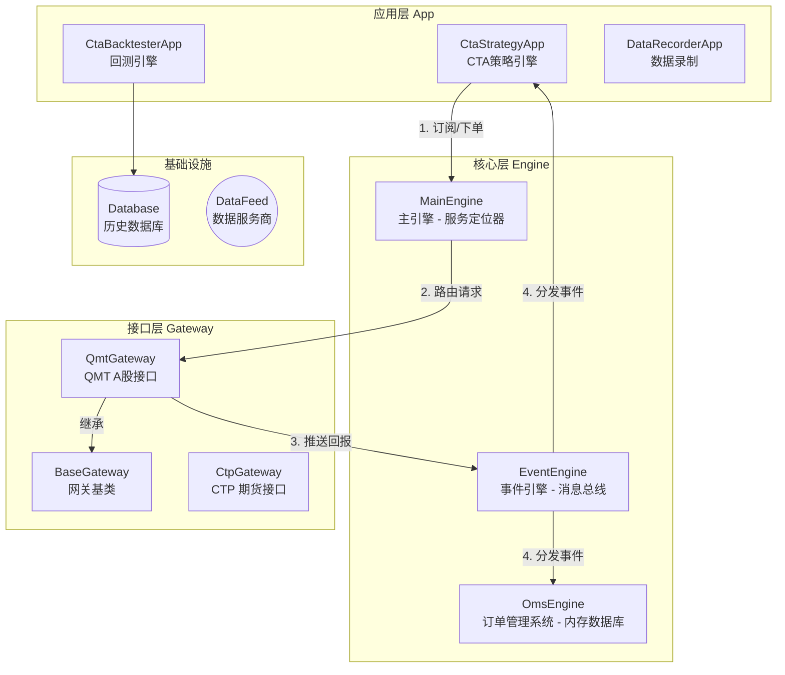
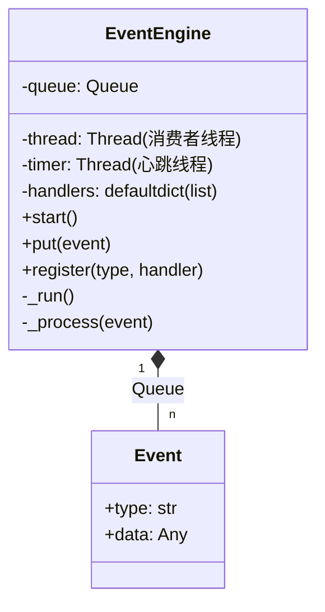
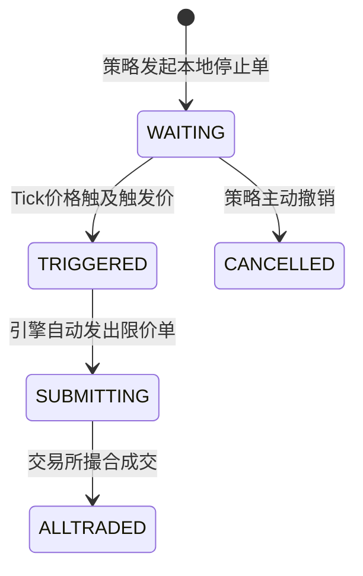
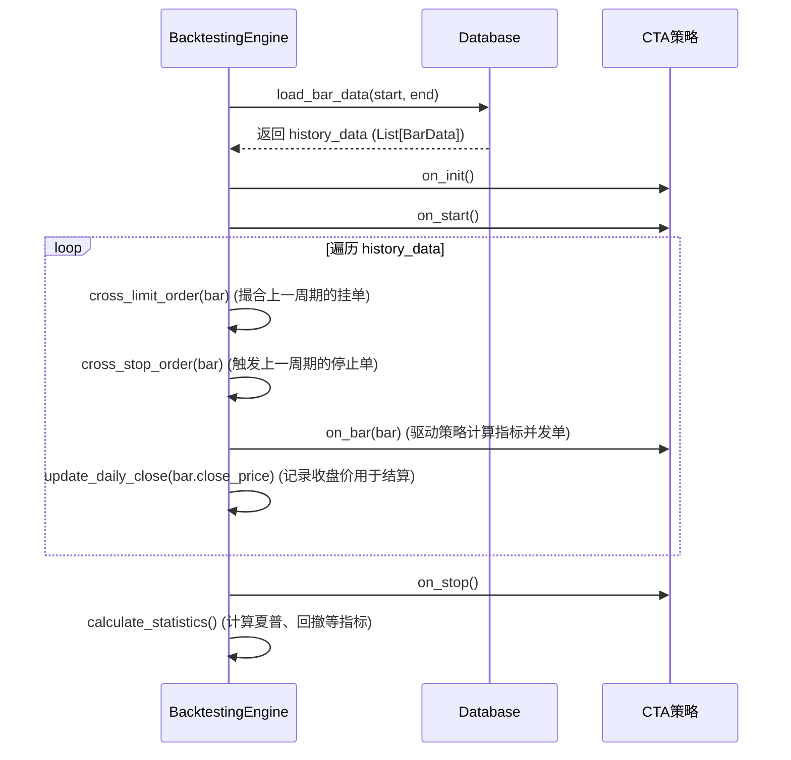

# VeighNa (vn.py) 深度软件原理分析

本文档基于 `vnpy_strategy_dev` 工程源码，对 VeighNa 量化交易框架的底层实现原理进行深度剖析。与常规的模块介绍不同，本文旨在挖掘系统内部的并发模型、状态同步机制、撮合算法以及针对 A 股交易的特殊设计，辅以 UML 类图与时序图，帮助高阶开发者理解其架构精髓。

---

## 1. 系统总体架构 (System Architecture)

VeighNa 采用了经典的 **微内核 + 插件 (Microkernel + Plugins)** 架构。系统的核心非常轻量，仅负责事件分发（EventEngine）和模块管理（MainEngine）。所有的业务逻辑——包括连接柜台（Gateway）和交易策略（App）——都作为插件挂载到内核上。

### 1.1 分层架构图

---

## 2. 核心内核原理 (Core Engines)

### 2.1 EventEngine：事件驱动与并发模型

`EventEngine` 是整个系统的“心脏”，它实现了一个**基于多线程的生产者-消费者模型**，是解耦底层网关与上层策略的关键。

#### 2.1.1 内部机制深度剖析
- **无锁化设计 (Lock-free processing)**：
  - 生产者（如 `QmtGateway` 的网络回调线程）调用 `put(event)` 将事件压入线程安全的 `queue.Queue`。
  - 消费者是一个独立的后台线程 `_run()`，它不断从队列中阻塞获取事件，并调用 `_process()` 分发给对应的 Handler。
  - **重点**：因为所有事件（行情、成交、日志）最终都在这**唯一**的消费者线程中串行执行，所以上层策略（如 `on_tick`, `on_bar`）内部是**绝对线程安全**的，开发者编写策略时完全不需要加锁。
- **内置定时器 (Timer)**：
  - `_run_timer()` 是另一个独立线程，每隔 1 秒（默认）向队列压入一个 `EVENT_TIMER` 事件。
  - 这个机制非常巧妙，它被用作系统的“心跳”。例如 `QmtGateway` 利用它来定期轮询资金持仓，策略利用它来做定时任务。

### 2.2 OmsEngine：内存状态机与平仓转换

`OmsEngine` (Order Management System) 随着 `MainEngine` 启动而启动，充当系统的内存数据库。

#### 2.2.1 状态同步逻辑
`OmsEngine` 监听所有的行情、委托、成交、持仓事件，并实时更新内部的 `dict`（如 `self.ticks`, `self.orders`, `self.positions`）。这使得策略随时可以通过 `main_engine.get_tick()` 获取最新快照，而无需自己维护。

#### 2.2.2 OffsetConverter (开平仓转换器)
在期货交易（特别是上期所 SHFE 和能源中心 INE）中，平今仓 (`CLOSETODAY`) 和平昨仓 (`CLOSEYESTERDAY`) 是严格区分的。
- `OmsEngine` 内部持有一个 `OffsetConverter`。
- 当策略发送一个单纯的“平仓”请求时，转换器会根据当前的 `PositionHolding`（包含 `long_td`, `long_yd` 等实时字段），计算出最优的拆单方案。
- 例如：需要平仓 10 手，但今天只开了 4 手，昨天有 10 手。转换器会自动将 1 个请求拆分为：4 手 `CLOSETODAY` 和 6 手 `CLOSEYESTERDAY`。

---

## 3. CTA 策略引擎深度解析 (CtaStrategy)

`vnpy_ctastrategy` 是量化交易的核心业务模块，分为实盘引擎 (`CtaEngine`) 和回测引擎 (`BacktestingEngine`)。

### 3.1 实盘引擎 (CtaEngine) 数据路由

在实盘中，可能同时运行几十个策略，引擎必须极其高效地将行情路由给正确的策略。

- **快速映射表 (Maps)**：
  - `symbol_strategy_map`：`vt_symbol` -> `[StrategyA, StrategyB]`。收到 Tick 时，引擎直接通过 `O(1)` 时间复杂度找到订阅该合约的策略，触发 `on_tick`。
  - `orderid_strategy_map`：`vt_orderid` -> `StrategyA`。底层网关推送订单回报时，引擎据此将回报精准推送给发起该订单的策略的 `on_order`。

### 3.2 本地停止单 (Local Stop Order) 的精妙实现

并非所有交易所和柜台都原生支持停止单（如 CTP、QMT 均不支持）。`CtaEngine` 在本地完美模拟了这一功能。

**工作原理**：
1. 策略调用 `self.buy(price, vol, stop=True)`。
2. 引擎生成一个前缀为 `STOP.` 的 `stop_orderid`，将其存入本地 `self.stop_orders` 字典，**并不向底层柜台发单**。
3. **触发检查**：在 `process_tick_event` 中，引擎每次收到最新 Tick，都会遍历对应合约的 `stop_orders`。
   - **多头触发**：`tick.last_price >= stop_order.price`
   - **空头触发**：`tick.last_price <= stop_order.price`
4. **转换为限价单**：一旦触发，引擎立即调用 `send_limit_order`。为了保证成交，通常会以**涨跌停价**（`tick.limit_up / limit_down`）或五档最优价（`ask_price_5`）发出真实的限价单。

### 3.3 回测引擎 (BacktestingEngine) 的仿真机制

回测引擎的核心区别在于：**它不是事件驱动的，而是基于历史数据数组的同步循环**。

#### 3.3.1 撮合算法 (Matching Logic)
在 `cross_limit_order` 方法中，引擎假设“对手盘无限”，只要价格触及即全部成交。以 Bar（K线）回测为例：
- **买入限价单 (Long)**：
  - 检查条件：`bar.low_price <= order.price`。只要 K 线的最低价穿透了委托价，即可成交。
  - 成交价：`min(order.price, bar.open_price)`。这是一个极其严谨的处理：如果开盘价已经低于委托价（例如跳空低开），真实市场中会以开盘价成交，而不是委托价，从而避免了“回测未来函数”和夸大收益。
- **卖出限价单 (Short)**：
  - 检查条件：`bar.high_price >= order.price`。
  - 成交价：`max(order.price, bar.open_price)`。

#### 3.3.2 回测执行时序

---

## 4. QMT 网关与 A 股实盘特性 (QmtGateway)

本项目中的 `QmtGateway` 是针对 A 股和迅投 MiniQMT 终端深度定制的，包含诸多解决实际痛点的设计。

### 4.1 异步下单与订单追踪 (TD 模块)
A 股实盘对速度有要求。`QmtGateway` 的交易模块 (`TD`) 采用了 `xttrader.order_stock_async` 异步下单接口。
- **难点**：异步接口不会立刻返回真实的订单号，如何将后续的订单回报与当前的策略匹配？
- **解决方案 (Remark ID 机制)**：
  - 在初始化时生成唯一的 `session_id`（如当前时间 `HHMMSS`）。
  - 每次发单，生成自定义的 `order_remark`（格式：`session_id#count`）。
  - 在发单时将 `order_remark` 传给 QMT。
  - 当 QMT 的 `on_stock_order` 回调触发时，从中提取 `order_remark`，并将其作为 vn.py 体系内的 `vt_orderid`，从而完美闭环了订单追踪链路。

### 4.2 双重状态同步机制
由于国内部分券商柜台存在推送延迟或漏推的情况，单纯依赖事件推送是不可靠的。
- `QmtGateway` 巧妙利用了 `EventEngine` 的 `EVENT_TIMER`（1秒1次）。
- 内部维护了一个计数器 `self.count`：
  - 每 5 秒 (`count % 5 == 0`)：主动调用 `query_order()` 轮询订单状态。
  - 每 7 秒 (`count % 7 == 0`)：主动调用 `query_account()` 和 `query_position()` 同步资金和持仓。
- 这种**“推送 + 轮询”**的双重机制，确保了系统的最终一致性，防止策略因状态不同步而产生错误的交易信号。

### 4.3 合约自动发现 (MD 模块)
不同于期货市场固定且数量较少的合约，A 股合约多达 5000+。
- 在 `connect` 时，`MD` 模块会自动遍历 QMT 内置的板块字典（如 "上证A股", "创业板", "沪市ETF" 等）。
- 批量调用 `get_instrument_detail`，提取涨跌停价格 (`UpStopPrice`, `DownStopPrice`) 并缓存。
- 自动将所有符合条件的标的实例化为 `ContractData` 推送给 `OmsEngine`，策略无需手动配置合约乘数和最小变动价位。
