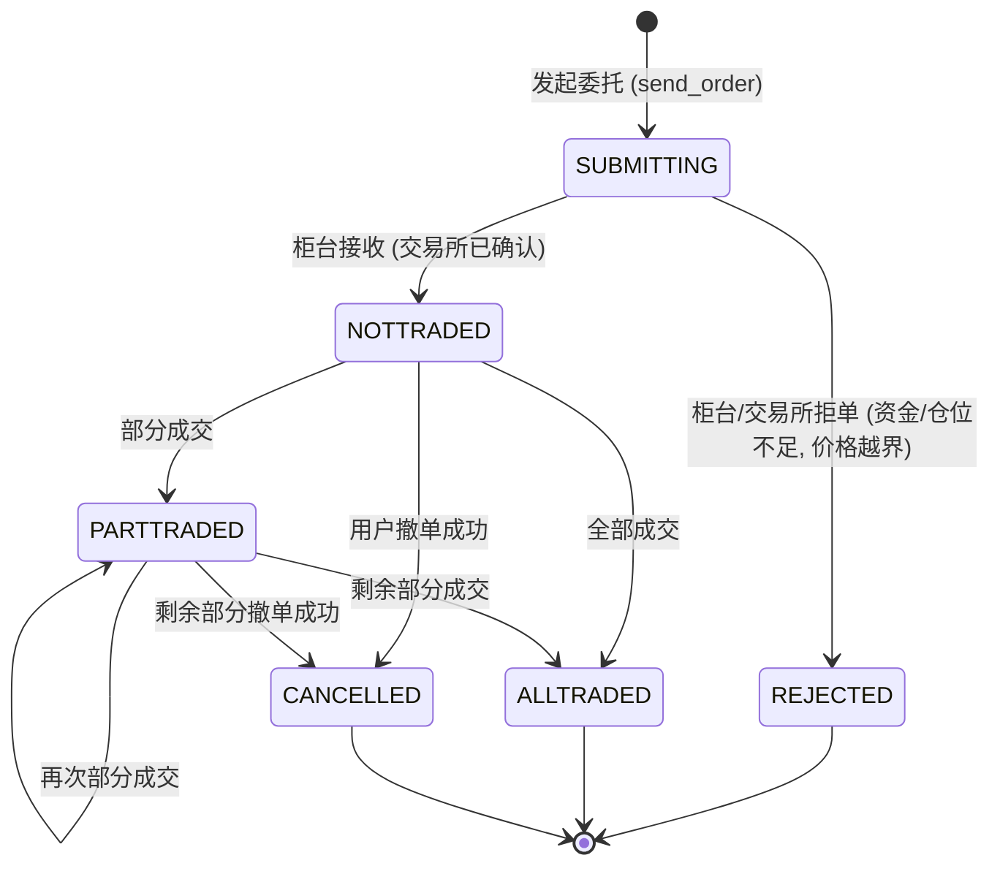
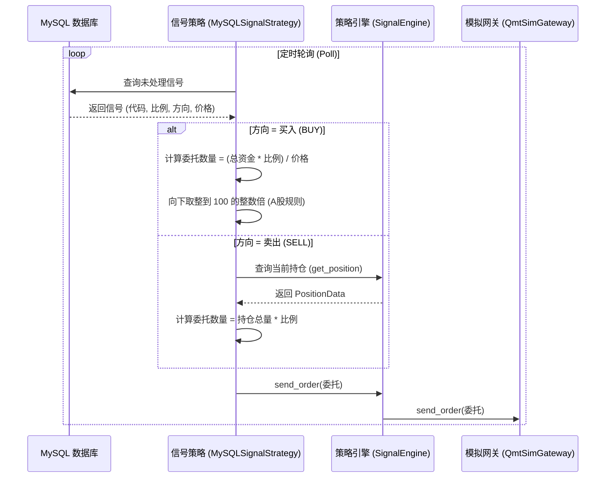
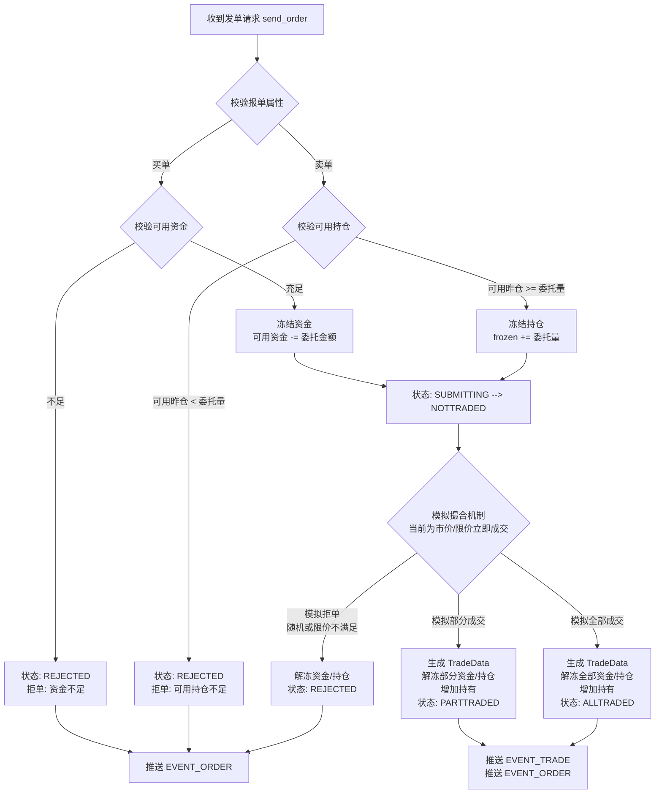
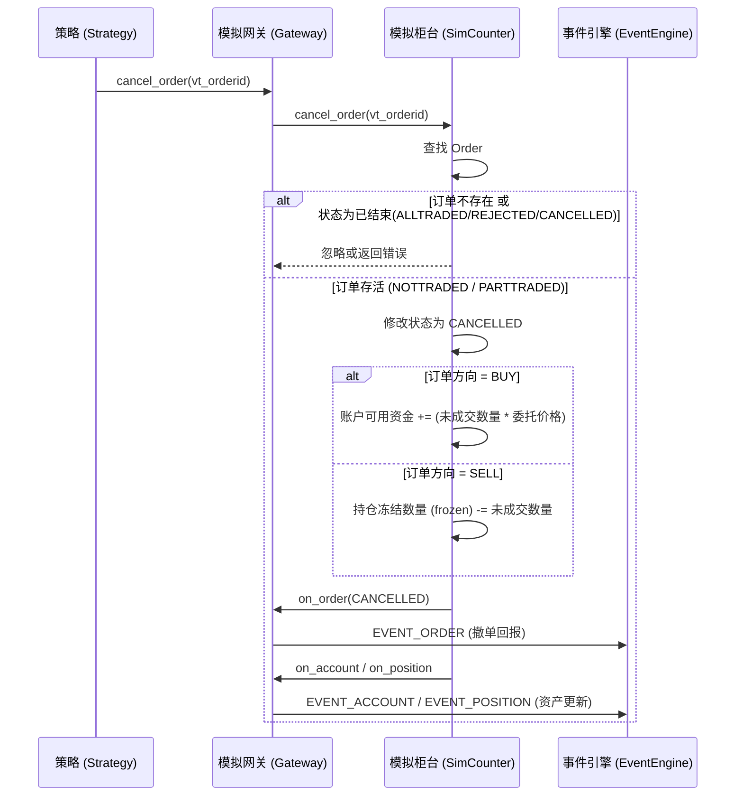

# A 股模拟交易逻辑深度 Review 与分析

本文档旨在针对 A 股交易的特殊规则（如 T+1、涨跌停板、订单数量限制等），对本项目中的 `vnpy_signal_strategy`（信号策略层）和 `vnpy_qmt_sim`（模拟柜台网关层）中的报单、撤单、拒单及部分成交等逻辑进行深度的 Review 与分析，并提出改进建议。

## 1. A 股实盘交易核心规则概述

在进行模拟交易系统设计时，必须充分考虑 A 股的以下核心交易规则：

1. **交易时间**：
   - 集合竞价：09:15 - 09:25
   - 连续竞价：09:30 - 11:30，13:00 - 14:57
   - 收盘集合竞价：14:57 - 15:00
2. **T+1 交收制度**：
   - **资金**：卖出股票后的资金当日可用（可用于买入其他股票），次日可取。
   - **持仓**：当日买入的股票（`volume`）当日不可卖出，必须等到下一个交易日转为可用持仓（`yd_volume`，即昨仓）后方可卖出。
3. **价格限制（涨跌停板）**：
   - 主板通常为上一交易日收盘价的 ±10%（ST 股为 ±5%），创业板和科创板为 ±20%。
   - 委托价格超出涨跌停限制的报单将被交易所视为废单（拒单）。
4. **报单数量限制**：
   - 买入：必须是 100 股（1 手）的整数倍。
   - 卖出：单笔申报可以包含零股，但如果卖出，必须将该股票的零股一次性卖出（或者按照 100 股的整数倍卖出，剩余零股最后一次性卖出）。

---

## 2. 报单生命周期与状态流转

在 VeighNa (vn.py) 框架中，一笔委托（Order）的典型状态流转如下：

---

## 3. `vnpy_signal_strategy` 策略层逻辑 Review

当前策略（如 `MySQLSignalStrategy`）负责从数据库轮询信号并进行发单。

### 3.1 报单逻辑 (Order Placement)
策略读取到 `BUY` 或 `SELL` 信号后，会计算目标数量并调用 `send_order`。

**✅ 已实现的优化**：
- **资金不足延时重挂**：策略引入 `AutoResubmitMixinPlus`，识别买单“可用资金不足/260200”拒单后采用退避延时重试，避免拒单死循环。

---

## 4. `vnpy_qmt_sim` 模拟柜台逻辑 Review

`SimulationCounter` 负责模拟真实的 QMT 柜台行为。

### 4.1 模拟报单与撮合逻辑

模拟柜台收到报单后，需要进行合法性校验，并模拟撮合过程。

### 4.2 撤单逻辑 (Cancel Order)

撤单是解除冻结资金或持仓的关键步骤。

### 4.3 核心问题：T+0 与 T+1 模拟的差距

目前 `SimulationCounter` 在处理成交时，采用的是 **T+0** 逻辑。这意味着买入成交后，立即增加了 `volume`，而卖出时仅校验 `volume`。

**要完全模拟 A 股，需在 `SimulationCounter` 层面实现以下 T+1 逻辑**：

1. **持仓数据结构扩展**：
   明确区分 `volume`（总持仓）、`yd_volume`（昨仓，即当前可卖持仓）、`frozen`（挂单冻结持仓）。
2. **买入成交 (Buy Fill)**：
   - 增加总持仓：`volume += traded_volume`。
   - **不增加** `yd_volume`。
3. **卖出委托 (Sell Order)**：
   - 校验条件：`order_volume <= (yd_volume - frozen)`。
   - 委托成功后，冻结增加：`frozen += order_volume`。
4. **卖出成交 (Sell Fill)**：
   - 扣减总持仓与昨仓：`volume -= traded_volume`, `yd_volume -= traded_volume`。
   - 扣减冻结：`frozen -= traded_volume`。
5. **日终结算 (End of Day Settlement)**：
   - 模拟网关需提供一个日切接口，在每个交易日结束（或启动时），将当日的 `volume` 结转为次日的 `yd_volume`：
   - `yd_volume = volume`

---

## 5. 总结

当前的 `vnpy_signal_strategy` 和 `vnpy_qmt_sim` 已经具备了完整的异步事件驱动架构，能够正确处理委托、成交、拒单等基本流转。

然而，针对 A 股实盘的严苛要求，当前的模拟层还需在以下几点进行加固：
1. **策略层**：计算卖出数量时，应优先查询并使用 `yd_volume - frozen` 作为最大可卖数量。
2. **模拟柜台层**：引入 T+1 的持仓隔离机制与日终结转机制，完善资金与持仓的“冻结->解冻/扣减”生命周期，以真实反映 A 股的清算规则。
