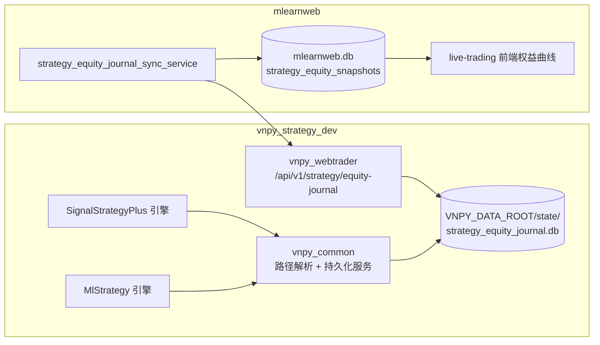
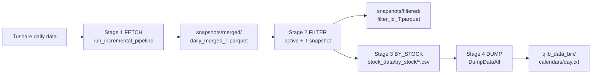
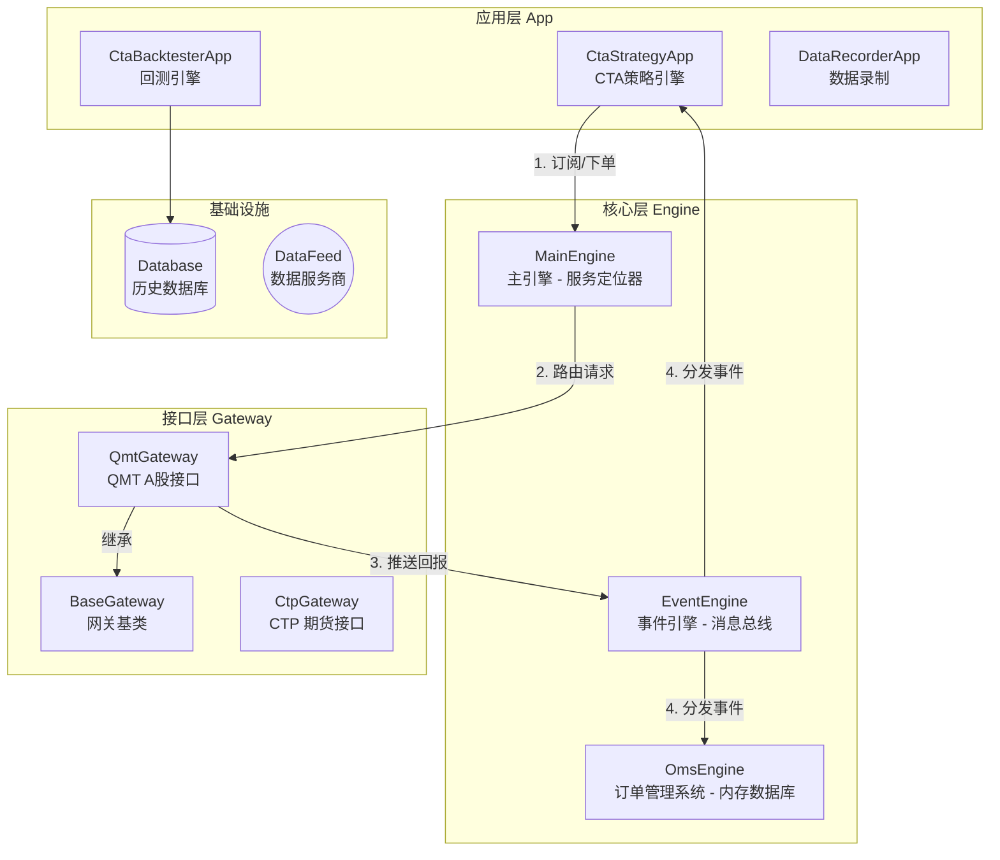
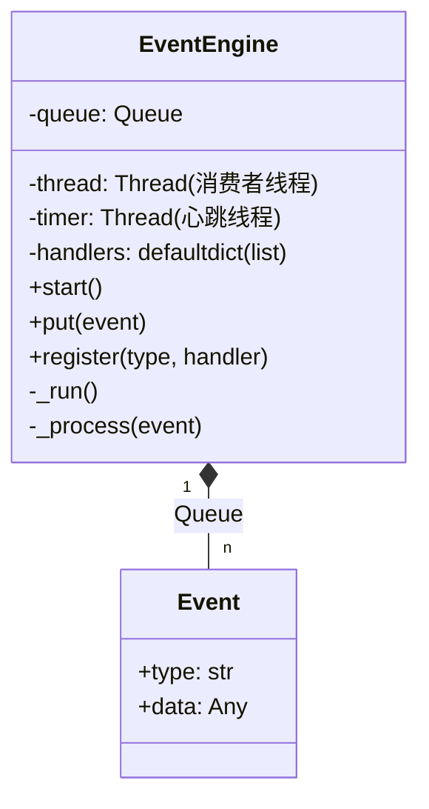
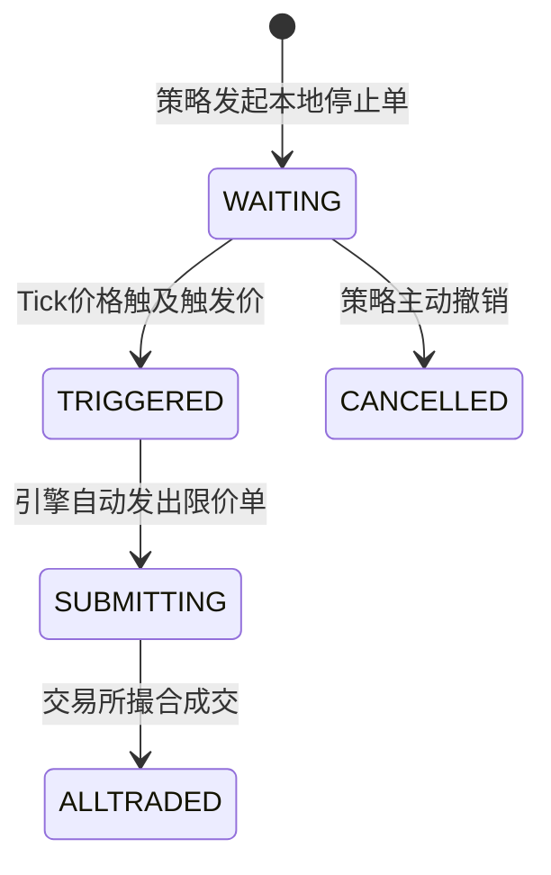
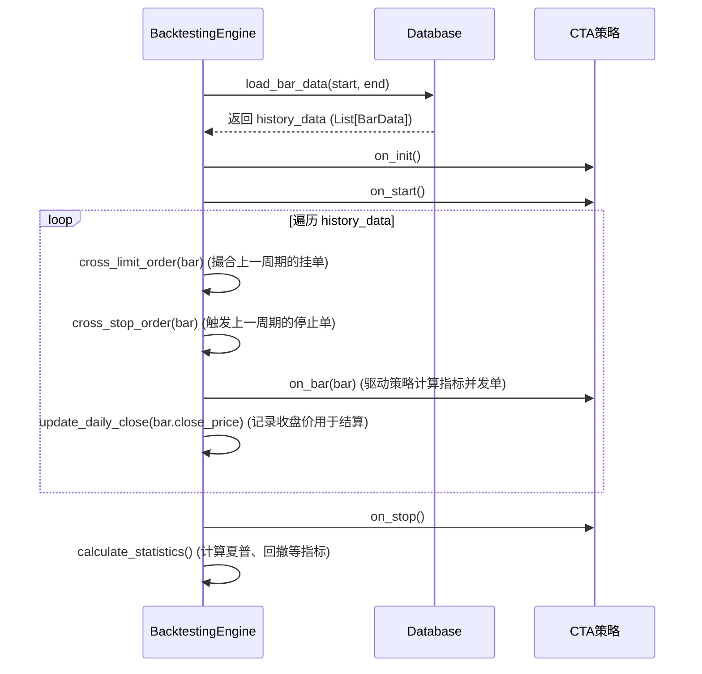
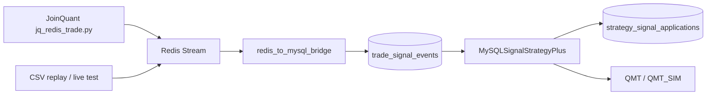

# VeighNa (vn.py) 深度软件原理分析

本文档基于 `vnpy_strategy_dev` 工程源码，对 VeighNa 量化交易框架的底层实现原理进行深度剖析。与常规的模块介绍不同，本文旨在挖掘系统内部的并发模型、状态同步机制、撮合算法以及针对 A 股交易的特殊设计，辅以 UML 类图与时序图，帮助高阶开发者理解其架构精髓。

---

## 1. 系统总体架构 (System Architecture)

VeighNa 采用了经典的 **微内核 + 插件 (Microkernel + Plugins)** 架构。系统的核心非常轻量，仅负责事件分发（EventEngine）和模块管理（MainEngine）。所有的业务逻辑——包括连接柜台（Gateway）和交易策略（App）——都作为插件挂载到内核上。

### 1.0 本工程运行时边界与数据目录

本工程在标准 vn.py 微内核之上增加了三个工程化边界：

1. **策略引擎边界**：`vnpy_ml_strategy`、`vnpy_signal_strategy_plus`、CTA 等策略引擎都只负责本引擎内策略生命周期、订单路由和策略变量，不直接写监控端数据库。
2. **webtrader 边界**：`vnpy_webtrader` 是 mlearnweb 唯一允许访问 vnpy 运行态的 HTTP/RPC 门面，负责鉴权、统一路由和跨策略引擎适配。
3. **监控端边界**：mlearnweb 不 import vnpy 模块，不直连 vnpy SQLite 文件；它只通过 webtrader API 拉取事实源，再写自己的展示库。

部署时默认只配置一个根目录：

| 根目录 | 关键子路径 | 说明 |
|---|---|---|
| `VNPY_DATA_ROOT` | `state/strategy_equity_journal.db` | 所有策略引擎共用的权益事实源 |
| `VNPY_DATA_ROOT` | `state/sim_<gateway>.db` | QMT_SIM 模拟柜台资金、持仓、订单、成交 |
| `VNPY_DATA_ROOT` | `state/event_journal.db` | webtrader 事件/日志 journal |
| `VNPY_DATA_ROOT` | `ml_output/` | ML 策略推理输出 |
| `VNPY_DATA_ROOT` | `snapshots/`、`models/`、`logs/`、`backups/` | 行情快照、模型、日志、备份 |

旧的 `QS_DATA_ROOT`、`ML_OUTPUT_ROOT` 等变量只作为高级覆盖或迁移提示，不再是默认部署入口；`REPLAY_HISTORY_DB` 与 `replay_history.db` 已退出运行时契约。

### 1.0.1 ML 日更数据链路与 qlib Provider 发布

`DailyIngestPipeline` 是 ML 策略实盘推理使用的市场数据发布器，不只是下载器。每次 `ingest_today(T)` 成功跑完都会把本地数据冻结为日期 `T` 的视图，并原子替换 `<VNPY_DATA_ROOT>/qlib_data_bin`，因此会更新 `calendars/day.txt`。

入口包括：

| 入口 | 是否会更新 qlib calendar | 说明 |
|---|---:|---|
| `run_ml_headless.py` | 是 | 生产 headless 进程会构造 `DailyIngestPipeline`，20:00 cron 或手动触发会发布 provider |
| `smoke_full_pipeline.py` | 是 | 默认 `TRIGGER_INGEST_ON_STARTUP=True`，会直接调用 `run_daily_ingest_now(LIVE_DATE)` |
| webtrader/运维手动 ingest | 是 | 最终同样进入 `TushareProEngine.run_daily_ingest_now()` |
| 只运行 ML 推理 `run_pipeline_now()` | 否 | 只读取现有 qlib provider 与 filter snapshot，不发布 provider |

发布不变量：

- `calendars/day.txt` 的末尾必须严格等于本次目标交易日 `T`；如果 dump 结果超出或落后于 `T`，视为快照污染或 dump bug，必须拒绝发布。
- 发布前会检查当前 provider 的 `calendars/day.txt` 和最新 `snapshots/merged/daily_merged_*.parquet`。若任何一个日期大于 `T`，说明本次是倒退发布，默认抛出 `IncrementalDumpError`。
- `ML_INGEST_ALLOW_QLIB_ROLLBACK=1` 是人工确认后的应急逃生开关，只用于明确要回滚 qlib provider 的场景。它不应进入 `.env`、`.env.production`、服务环境或长期计划任务；使用后必须立即取消，并记录原因、目标日期和恢复步骤。
- 如果 smoke/e2e 只是验证流程而不想影响生产 provider，应使用隔离的 `VNPY_DATA_ROOT`，或至少将 `ML_QLIB_DIR`、`ML_SNAPSHOT_DIR`、`ML_MERGED_PARQUET_PATH` 覆盖到临时目录。

这条规则解决的典型问题是：凌晨 `smoke_full_pipeline.py` 已把 provider 发布到 2026-05-15，但后续某次 headless/smoke 以 2026-05-13 为目标日再次运行 `ingest_today(20260513)`。旧实现只做全量重建和原子替换，没有比较“当前 provider/最新 snapshot 是否比目标日更新”，因此会把 5.15 provider 覆盖成 5.13。现在该行为默认会被 rollback guard 阻断。

### 1.0.2 通用策略权益 Journal

`strategy_equity_journal.db` 是 vnpy 侧可重建监控曲线的事实源。它不是 ML 专属表，而是所有策略引擎共享的日终权益 journal。

| 字段 | 含义 |
|---|---|
| `engine` | 策略引擎名，例如 `MlStrategy`、`SignalStrategyPlus` |
| `strategy_name` | 策略实例名 |
| `source_label` | 来源：`replay_settle`、`sim_live_settle`、`broker_live_close` |
| `ts` | 交易逻辑日时间戳，通常为当日 15:00 |
| `strategy_value` / `account_equity` | 用于曲线展示与收益计算的权益值 |
| `raw_variables_json` | 策略变量、settle_date、gateway 等诊断信息 |

写入入口统一为 `vnpy_common.persistence.strategy_equity_journal.write_snapshot()`：

- **回放**：`SimReplayController` 或策略模板在每日 settle 后写 `replay_settle`。
- **模拟实时**：`StrategyEquityJournalService` 监听 timer，在 QMT_SIM 的 `last_settle_date` 更新后写 `sim_live_settle`。
- **真实柜台**：`StrategyEquityJournalService` 在交易日 `VNPY_BROKER_LIVE_EOD_JOURNAL_TIME` 后写 `broker_live_close`。默认时间为 `16:00`，用于避开券商柜台 15:00 后资金/持仓延迟同步窗口。

真实柜台的账户是 broker 级别，同一个资金账号可能被多个策略共享。为了让每条策略曲线可解释，服务按以下优先级归因：

1. 如果订单带有 `OrderRequest.reference={strategy_name}:{seq}`，QMT 网关会把 broker order id 与 reference 写入 `strategy_order_refs`，成交回报再写入 `strategy_trade_journal`。
2. 对每个策略读取 `strategy_trade_journal`，以 `VNPY_STRATEGY_INITIAL_CAPITALS` 或策略参数中的 `initial_capital` / `allocated_capital` / `strategy_capital` 为起点，按成交方向累计现金和持仓。
3. 用 `MainEngine.get_all_positions()` 的真实柜台持仓市值做收盘 mark-to-market，得到该策略的 `strategy_value`。
4. `account_equity` 保留真实柜台账户总权益，便于诊断共享账户口径；如果缺少策略初始资金或成交流水，则 `strategy_value` 也回退为账户级权益，并在 `raw_variables_json.attribution_method=account_equity_fallback` 中标记原因。

`VNPY_STRATEGY_INITIAL_CAPITALS` 使用 JSON 对象配置，key 支持 `gateway:engine:strategy`、`engine:strategy`、`strategy` 三种粒度；可选的 `VNPY_DEFAULT_STRATEGY_INITIAL_CAPITAL` 只适合所有策略等额初始资金的临时环境。当前 `TradeData` 没有手续费/印花税字段，因此精确归因里的现金默认不扣交易费用，风险会记录在 `raw_variables_json.fee_note` 中。

读取入口统一为 webtrader `/api/v1/strategy/equity-journal`。mlearnweb 的 `strategy_equity_journal_sync_service` 按 `(node_id, engine, strategy_name, source_label)` 增量拉取，并写入监控端 `strategy_equity_snapshots`。因此 mlearnweb 重启、换服务器或清空展示库后，只要 vnpy 节点与 `VNPY_DATA_ROOT` 还在，就可以重新补拉历史权益曲线。

关键不变量：

- journal 主身份必须包含 `(engine, strategy_name, source_label, ts)`，不能只用策略名。
- vnpy 不能直接写 mlearnweb.db；跨工程同步只走 webtrader HTTP/RPC。
- 前端和 mlearnweb 后端不解析 vnpy 原始订单/日志来推断权益；权益事实由 vnpy 后端归一后提供。
- 多策略共享真实账户时，前端展示必须使用 vnpy 已归因后的策略 journal，不能按账户总权益做平均、按持仓比例临时拆分或在 mlearnweb 二次推断。
- 旧 `vnpy_ml_strategy/replay_history.py`、`REPLAY_HISTORY_DB`、`/api/v1/ml/strategies/{name}/replay/equity_snapshots` 不再使用。

### 1.1 分层架构图

---

## 2. 核心内核原理 (Core Engines)

### 2.1 EventEngine：事件驱动与并发模型

`EventEngine` 是整个系统的“心脏”，它实现了一个**基于多线程的生产者-消费者模型**，是解耦底层网关与上层策略的关键。

#### 2.1.1 内部机制深度剖析
- **无锁化设计 (Lock-free processing)**：
  - 生产者（如 `QmtGateway` 的网络回调线程）调用 `put(event)` 将事件压入线程安全的 `queue.Queue`。
  - 消费者是一个独立的后台线程 `_run()`，它不断从队列中阻塞获取事件，并调用 `_process()` 分发给对应的 Handler。
  - **重点**：因为所有事件（行情、成交、日志）最终都在这**唯一**的消费者线程中串行执行，所以上层策略（如 `on_tick`, `on_bar`）内部是**绝对线程安全**的，开发者编写策略时完全不需要加锁。
- **内置定时器 (Timer)**：
  - `_run_timer()` 是另一个独立线程，每隔 1 秒（默认）向队列压入一个 `EVENT_TIMER` 事件。
  - 这个机制非常巧妙，它被用作系统的“心跳”。例如 `QmtGateway` 利用它来定期轮询资金持仓，策略利用它来做定时任务。

### 2.2 OmsEngine：内存状态机与平仓转换

`OmsEngine` (Order Management System) 随着 `MainEngine` 启动而启动，充当系统的内存数据库。

#### 2.2.1 状态同步逻辑
`OmsEngine` 监听所有的行情、委托、成交、持仓事件，并实时更新内部的 `dict`（如 `self.ticks`, `self.orders`, `self.positions`）。这使得策略随时可以通过 `main_engine.get_tick()` 获取最新快照，而无需自己维护。

#### 2.2.2 OffsetConverter (开平仓转换器)
在期货交易（特别是上期所 SHFE 和能源中心 INE）中，平今仓 (`CLOSETODAY`) 和平昨仓 (`CLOSEYESTERDAY`) 是严格区分的。
- `OmsEngine` 内部持有一个 `OffsetConverter`。
- 当策略发送一个单纯的“平仓”请求时，转换器会根据当前的 `PositionHolding`（包含 `long_td`, `long_yd` 等实时字段），计算出最优的拆单方案。
- 例如：需要平仓 10 手，但今天只开了 4 手，昨天有 10 手。转换器会自动将 1 个请求拆分为：4 手 `CLOSETODAY` 和 6 手 `CLOSEYESTERDAY`。

---

## 3. CTA 策略引擎深度解析 (CtaStrategy)

`vnpy_ctastrategy` 是量化交易的核心业务模块，分为实盘引擎 (`CtaEngine`) 和回测引擎 (`BacktestingEngine`)。

### 3.1 实盘引擎 (CtaEngine) 数据路由

在实盘中，可能同时运行几十个策略，引擎必须极其高效地将行情路由给正确的策略。

- **快速映射表 (Maps)**：
  - `symbol_strategy_map`：`vt_symbol` -> `[StrategyA, StrategyB]`。收到 Tick 时，引擎直接通过 `O(1)` 时间复杂度找到订阅该合约的策略，触发 `on_tick`。
  - `orderid_strategy_map`：`vt_orderid` -> `StrategyA`。底层网关推送订单回报时，引擎据此将回报精准推送给发起该订单的策略的 `on_order`。

### 3.2 本地停止单 (Local Stop Order) 的精妙实现

并非所有交易所和柜台都原生支持停止单（如 CTP、QMT 均不支持）。`CtaEngine` 在本地完美模拟了这一功能。

**工作原理**：
1. 策略调用 `self.buy(price, vol, stop=True)`。
2. 引擎生成一个前缀为 `STOP.` 的 `stop_orderid`，将其存入本地 `self.stop_orders` 字典，**并不向底层柜台发单**。
3. **触发检查**：在 `process_tick_event` 中，引擎每次收到最新 Tick，都会遍历对应合约的 `stop_orders`。
   - **多头触发**：`tick.last_price >= stop_order.price`
   - **空头触发**：`tick.last_price <= stop_order.price`
4. **转换为限价单**：一旦触发，引擎立即调用 `send_limit_order`。为了保证成交，通常会以**涨跌停价**（`tick.limit_up / limit_down`）或五档最优价（`ask_price_5`）发出真实的限价单。

### 3.3 回测引擎 (BacktestingEngine) 的仿真机制

回测引擎的核心区别在于：**它不是事件驱动的，而是基于历史数据数组的同步循环**。

#### 3.3.1 撮合算法 (Matching Logic)
在 `cross_limit_order` 方法中，引擎假设“对手盘无限”，只要价格触及即全部成交。以 Bar（K线）回测为例：
- **买入限价单 (Long)**：
  - 检查条件：`bar.low_price <= order.price`。只要 K 线的最低价穿透了委托价，即可成交。
  - 成交价：`min(order.price, bar.open_price)`。这是一个极其严谨的处理：如果开盘价已经低于委托价（例如跳空低开），真实市场中会以开盘价成交，而不是委托价，从而避免了“回测未来函数”和夸大收益。
- **卖出限价单 (Short)**：
  - 检查条件：`bar.high_price >= order.price`。
  - 成交价：`max(order.price, bar.open_price)`。

#### 3.3.2 回测执行时序

---

## 4. QMT 网关与 A 股实盘特性 (QmtGateway)

本项目中的 `QmtGateway` 是针对 A 股和迅投 MiniQMT 终端深度定制的，包含诸多解决实际痛点的设计。

### 4.1 异步下单与订单追踪 (TD 模块)
A 股实盘对速度有要求。`QmtGateway` 的交易模块 (`TD`) 采用了 `xttrader.order_stock_async` 异步下单接口。
- **难点**：异步接口不会立刻返回真实的订单号，如何将后续的订单回报与当前的策略匹配？
- **解决方案 (Remark ID 机制)**：
  - 在初始化时生成唯一的 `session_id`（如当前时间 `HHMMSS`）。
  - 每次发单，生成自定义的 `order_remark`（格式：`session_id#count`）。
  - 在发单时将 `order_remark` 传给 QMT。
  - 当 QMT 的 `on_stock_order` 回调触发时，从中提取 `order_remark`，并将其作为 vn.py 体系内的 `vt_orderid`，从而完美闭环了订单追踪链路。

### 4.2 双重状态同步机制
由于国内部分券商柜台存在推送延迟或漏推的情况，单纯依赖事件推送是不可靠的。
- `QmtGateway` 巧妙利用了 `EventEngine` 的 `EVENT_TIMER`（1秒1次）。
- 内部维护了一个计数器 `self.count`：
  - 每 5 秒 (`count % 5 == 0`)：主动调用 `query_order()` 轮询订单状态。
  - 每 7 秒 (`count % 7 == 0`)：主动调用 `query_account()` 和 `query_position()` 同步资金和持仓。
- 这种**“推送 + 轮询”**的双重机制，确保了系统的最终一致性，防止策略因状态不同步而产生错误的交易信号。

### 4.3 合约自动发现 (MD 模块)
不同于期货市场固定且数量较少的合约，A 股合约多达 5000+。
- 在 `connect` 时，`MD` 模块会自动遍历 QMT 内置的板块字典（如 "上证A股", "创业板", "沪市ETF" 等）。
- 批量调用 `get_instrument_detail`，提取涨跌停价格 (`UpStopPrice`, `DownStopPrice`) 并缓存。
- 自动将所有符合条件的标的实例化为 `ContractData` 推送给 `OmsEngine`，策略无需手动配置合约乘数和最小变动价位。

### 1.0.3 SignalStrategyPlus v2 信号事实源与模拟账户重建

SignalStrategyPlus 不再以 `stock_trade` 作为运行时信号契约。旧表的全局 `processed` 只适合单消费者临时脚本；在多策略、双轨 shadow、重启重放和模拟账户恢复场景下，它无法表达“哪个账户/网关/策略已经消费了哪条信号”。

新的信号链路如下：

核心表：

| 表 | 角色 | 关键不变量 |
|---|---|---|
| `trade_signal_events` | append-only 信号事实 | `signal_uid` 唯一；`pct_semantics=trade_value_pct_of_total_portfolio`；保留 raw payload |
| `strategy_signal_applications` | 每策略消费 checkpoint | 唯一键包含 `account_id + gateway_name + engine + strategy_name + signal_event_id` |

字段语义：

- `pct` 只表示“本次交易金额 / 组合总资产”，不是目标权重，也不是可用现金比例或持仓比例。
- `empty=1` 表示卖出后聚宽侧该标的已清仓，vnpy 策略可将其解释为清掉当前可卖持仓。
- `signal_uid` 由生产端显式提供；若没有，bridge 会使用 source id、Redis id 或 payload hash 兜底。
- Redis 是传输层，不是事实源；重建时以 MySQL v2 journal 为准。

QMT_SIM 的账户重建依赖 `<VNPY_DATA_ROOT>/state/sim_<account>.db`。除账户、持仓、订单、成交外，`sim_meta` 还保存：

| key | 用途 |
|---|---|
| `order_count` / `trade_count` | 防止重启后本地订单号/成交号复用 |
| `last_settle_date` | 防止重复日终结算或跨日漏结算 |
| `today_buy_json` | 恢复 A 股 T+1 当日买入冻结与当日买入 mark-to-market 口径 |

策略订单归因继续使用 `OrderRequest.reference={strategy_name}:{seq}`。策略启动时会从 QMT_SIM 持久化订单中扫描最大 seq，恢复 `_order_seq`，避免 vnpy 重启后 reference 从 1 重新开始导致成交归因串号。

边界规则：

- `redis_to_mysql_bridge.py` 不再写 `stock_trade`。
- `MySQLSignalStrategyPlus` 不再读取 `stock_trade.processed`。
- 新增生产者或测试注入脚本必须写 v2 payload，并声明 `pct_semantics`。
- 新模拟账户重建应从 v2 signal journal 回放，不应从 Redis backlog 或旧 `stock_trade` 反推。
