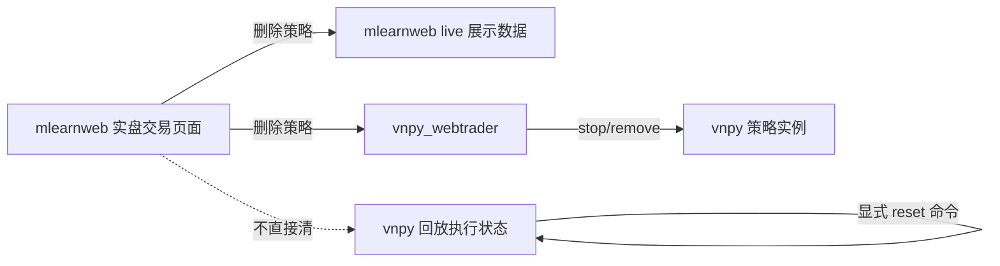

# 实盘交易页面回放重测流程

本文只描述 **mlearnweb 实盘交易页面** 相关的策略删除、展示清理和回放重测流程，不覆盖训练记录、研究记录或模型实验记录。

## 设计边界

实盘交易页面的“删除策略”与 vnpy 侧“重置回放状态”必须分离：



推荐语义：

| 动作 | 入口 | 处理范围 |
|---|---|---|
| 删除实盘页面策略 | mlearnweb live-trading 删除按钮 | 停止/删除 vnpy 策略实例，并清理 live 页面可见快照，让卡片、指标总览、权益曲线消失 |
| 重置聚宽/CSV 回放 | vnpy_signal_strategy_plus 测试 reset 命令 | 清 Redis stream、MySQL `stock_trade`、QMT_SIM 状态库、`replay_history.db` 对应策略数据 |
| 重置 ML 回放 | `scripts/reset_sim_state.py` | 清 QMT_SIM 状态库；`--all` 时同时清 `ml_output` 和 `replay_history.db` |

不变量：

- mlearnweb 实盘页面删除按钮不直接连接 Redis、MySQL `stock_trade`、QMT_SIM SQLite 或 `replay_history.db`。
- vnpy 普通 `remove_strategy` 不隐式 purge 订单、成交、持仓、账户或回放数据。
- 所有回放重测都必须显式执行 reset 命令，避免误删实盘审计数据。

## 通用顺序

每次重新测试聚宽、CSV 或 ML 回放时，按以下顺序执行：

1. 在 mlearnweb 实盘交易页面删除对应策略卡片。
2. 执行对应场景的 vnpy 侧 reset 命令。
3. 启动对应 runner 或 headless 进程。
4. 启动外部信号源或等待回放执行完成。
5. 使用 `vnpy_qmt_sim.replay.acceptance` capture/compare 验收结果。

## 聚宽 Redis 链路重测

适用链路：

```text
聚宽回测 -> Redis stream(etf_rotation_basic)
  -> redis_to_mysql_bridge -> MySQL stock_trade
  -> vnpy signal strategy -> QMT_SIM
  -> replay_history.db -> mlearnweb live-trading 页面
```

步骤：

1. 在 mlearnweb 实盘交易页面删除 `etf_rotation_basic` 策略卡片。

2. 清理 vnpy 侧聚宽链路测试状态：

```powershell
F:/Program_Home/vnpy/python.exe -m vnpy_signal_strategy_plus.test.purge_test_strategy --config F:/Quant/vnpy/vnpy_strategy_dev/vnpy_signal_strategy_plus/test/redis_live_sim_setting.json
```

3. 启动 vnpy QMT_SIM、策略和 WebTrader。若需要 mlearnweb 前端直接看到卡片，使用生产端口：

```powershell
F:/Program_Home/vnpy/python.exe -m vnpy_signal_strategy_plus.test.run_sim_e2e --config F:/Quant/vnpy/vnpy_strategy_dev/vnpy_signal_strategy_plus/test/redis_live_sim_setting.json --use-production-ports
```

4. 另开终端启动 Redis 到 MySQL bridge：

```powershell
F:/Program_Home/vnpy/python.exe -m vnpy_signal_strategy_plus.scripts.redis_to_mysql_bridge --config F:/Quant/vnpy/vnpy_strategy_dev/vnpy_signal_strategy_plus/scripts/redis_bridge_setting.local.json
```

5. 等 runner 和 bridge 都进入等待状态后，开启聚宽回测。

6. 聚宽回测结束，并等待 vnpy 侧最后一个交易日结算完成后，采集验收快照：

```powershell
F:/Program_Home/vnpy/python.exe -m vnpy_qmt_sim.replay.acceptance capture --label jq_etf_rotation_basic --strategies etf_rotation_basic
```

## CSV 链路重测

适用链路：

```text
本地 position.csv / transaction.csv
  -> vnpy signal test runner -> QMT_SIM
  -> replay_history.db -> mlearnweb live-trading 页面
```

步骤：

1. 在 mlearnweb 实盘交易页面删除对应 CSV 测试策略卡片。

2. 清理 CSV 场景 vnpy 状态：

```powershell
F:/Program_Home/vnpy/python.exe -m vnpy_signal_strategy_plus.test.purge_test_strategy --config F:/Quant/vnpy/vnpy_strategy_dev/vnpy_signal_strategy_plus/test/test_setting.json
```

3. 启动 CSV runner：

```powershell
F:/Program_Home/vnpy/python.exe -m vnpy_signal_strategy_plus.test.run_sim_e2e --config F:/Quant/vnpy/vnpy_strategy_dev/vnpy_signal_strategy_plus/test/test_setting.json --use-production-ports
```

4. 回放完成后采集验收快照：

```powershell
F:/Program_Home/vnpy/python.exe -m vnpy_qmt_sim.replay.acceptance capture --label csv_replay --strategies etf_intra_test
```

## 机器学习回放重测

适用链路：

```text
run_ml_headless.py
  -> ML 策略推理 / selections
  -> QMT_SIM_csi300 / QMT_SIM_csi300_2
  -> replay_history.db -> mlearnweb live-trading 页面
```

### 只重新撮合

保留已有 `D:/ml_output/{strategy}` 推理产物，只清模拟柜台状态：

```powershell
F:/Program_Home/vnpy/python.exe scripts/reset_sim_state.py --gateway QMT_SIM_csi300
F:/Program_Home/vnpy/python.exe scripts/reset_sim_state.py --gateway QMT_SIM_csi300_2
```

### 从推理产物开始重跑

清 QMT_SIM 状态、`ml_output` 和 `replay_history.db`：

```powershell
F:/Program_Home/vnpy/python.exe scripts/reset_sim_state.py --all
```

### 启动和验收

启动 ML headless：

```powershell
F:/Program_Home/vnpy/python.exe run_ml_headless.py
```

回放完成后采集验收快照：

```powershell
F:/Program_Home/vnpy/python.exe -m vnpy_qmt_sim.replay.acceptance capture --label ml_replay --strategies csi300_lgb_headless,csi300_lgb_headless_2
```

## 修改前后验收对比

如果需要比较重构前后的结果，先在修改前采集 baseline：

```powershell
F:/Program_Home/vnpy/python.exe -m vnpy_qmt_sim.replay.acceptance capture --label pre_refactor --strategies etf_rotation_basic,csi300_lgb_headless,csi300_lgb_headless_2
```

修改后运行三策略并比较：

```powershell
F:/Program_Home/vnpy/python.exe -m vnpy_qmt_sim.replay.acceptance run --baseline <pre_refactor_dir> --scenario three_strategy_live_page --compare
```

通过标准：

- 最终持仓一致。
- 成交序列一致，比较交易日、代码、方向、价格和数量，忽略数据库自增 id。
- 账户资金和总权益误差不超过 `0.01`。
- 权益曲线日期数量一致，无交易日也有权益点。
- `empty=1` 信号不产生清仓残留。

## 常见误区

| 误区 | 正确做法 |
|---|---|
| 删除实盘页面卡片后，认为 Redis/MySQL/sim db 已清空 | 删除卡片只清 live 页面展示和策略实例；重测必须执行 vnpy reset 命令 |
| 用 mlearnweb 去删 vnpy 测试数据库 | mlearnweb 不越界清 vnpy 执行状态；由 vnpy 提供 reset 脚本或 API |
| 把 `remove_strategy` 改成隐式 purge | 保持 `remove_strategy` 只做策略实例删除；purge 是单独、显式、受保护的测试动作 |
| 重新跑 ML 时总是 `--all` | 只想验证撮合时用 `--gateway`，需要重跑推理产物时才用 `--all` |
