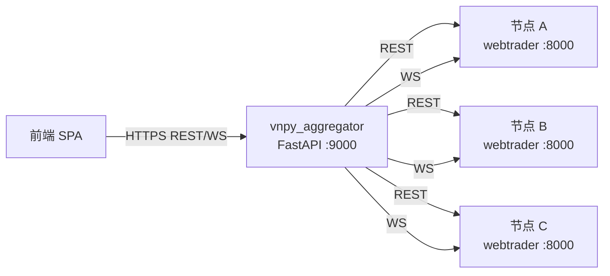
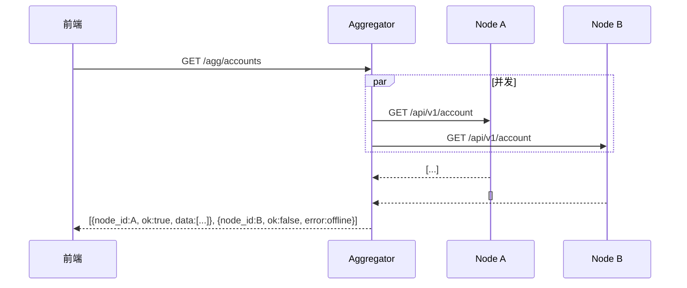
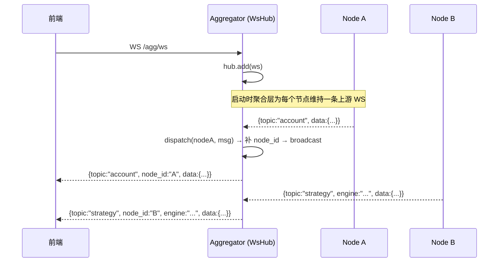

# vnpy_aggregator 工程文档

> 目标读者: 参与 `vnpy_aggregator` 开发、维护、部署的工程师 / AI Agent。
> 文档版本: **v0.1** (2026-04)

`vnpy_aggregator` 是**多节点 vnpy 交易进程的统一控制面**。它独立部署、无状态、作为前端唯一入口,把多个 [vnpy_webtrader](../../vnpy_webtrader/) 节点聚合成一个统一视图。

---

## 一分钟速览



核心职责:

- **注册表**: 管理节点列表 (配置 + REST 动态)
- **心跳**: 周期性检查每个节点存活与 gateway 状态
- **扇出**: 前端一次 `GET /agg/accounts` → 并发调所有节点 → 聚合返回
- **透传**: 前端一次 `POST /agg/nodes/{id}/proxy/...` → 精准转发到单个节点
- **WS 汇流**: 为每个节点维持一条上游 WS,收到消息补 `node_id` 后广播给前端
- **独立鉴权**: 聚合层用自己的管理员账号 + JWT,与节点凭据解耦

---

## 文档目录

| 文档 | 主题 | 谁该读 |
|---|---|---|
| [architecture.md](./architecture.md) | 系统架构,与节点/前端的交互 | 所有人 |
| [design.md](./design.md) | 模块详细设计,类图,时序图 | 后端开发 |
| [deployment.md](./deployment.md) | 部署配置,反向代理,HA | 运维 |
| [development.md](./development.md) | 扩展指南: 加路由, 自定义扇出, 自定义心跳 | 二次开发 |
| [../../docs/api.md](../../docs/api.md) | 对外 API (与节点层合并在一个文件) | 前端 |

---

## 目录结构

```
vnpy_aggregator/
├── __init__.py
├── main.py              # FastAPI 入口 + lifecycle
├── config.py            # 配置加载 (YAML / JSON + 环境变量)
├── config.yaml          # 默认配置
├── auth.py              # 聚合层独立 JWT 鉴权
├── client.py            # NodeClient: 单节点 HTTP+WS 封装
├── registry.py          # NodeRegistry: 多节点管理 + 心跳 + fanout
├── ws_hub.py            # WsHub: WS 广播中心
└── docs/                # 本目录
```

---

## 核心数据流

### REST 扇出



### WS 汇流



---

## 快速上手

```bash
# 1. 配置
cp vnpy_aggregator/config.yaml.example vnpy_aggregator/config.yaml
# 编辑节点列表 + 改管理员密码

# 2. 启动
export AGG_JWT_SECRET=$(python -c "import secrets; print(secrets.token_urlsafe(48))")
"F:/Program_Home/vnpy/python.exe" -m uvicorn vnpy_aggregator.main:app \
    --host 0.0.0.0 --port 9000

# 3. 访问 Swagger
# http://localhost:9000/docs

# 4. 拿 token
curl -X POST -d "username=admin&password=admin" http://localhost:9000/agg/token
```

详细部署见 [deployment.md](./deployment.md)。

---

## 与 `vnpy_webtrader` 的关系

| 角色 | 地位 | 数据持有 |
|---|---|---|
| `vnpy_webtrader` | **节点** (节点自治, 有状态) | 当前节点的交易数据 |
| `vnpy_aggregator` | **控制面** (无状态, 只做转发与汇流) | 只缓存节点注册表 + 上次心跳结果 |

聚合层不持久化业务数据 —— 账户、持仓、委托都是实时从节点拉。聚合层挂了不影响节点继续交易,只影响前端看板。
