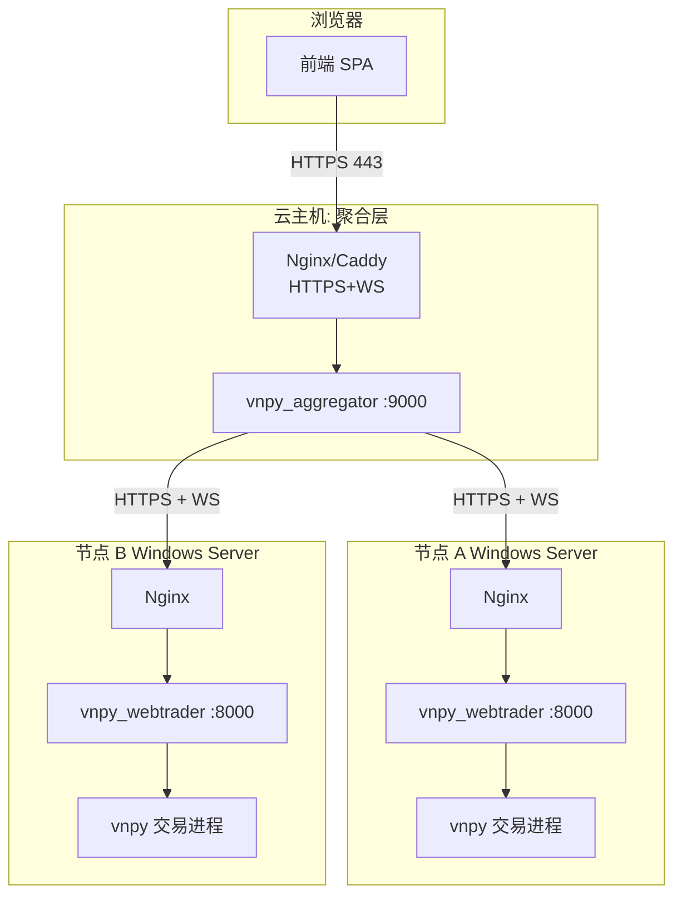
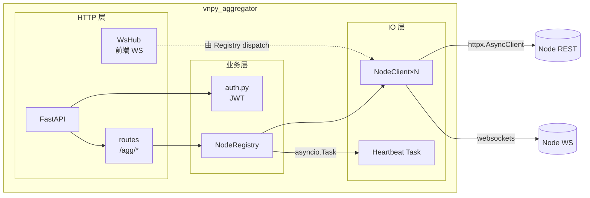
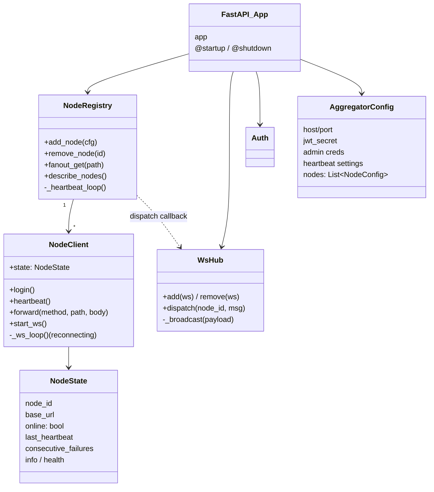
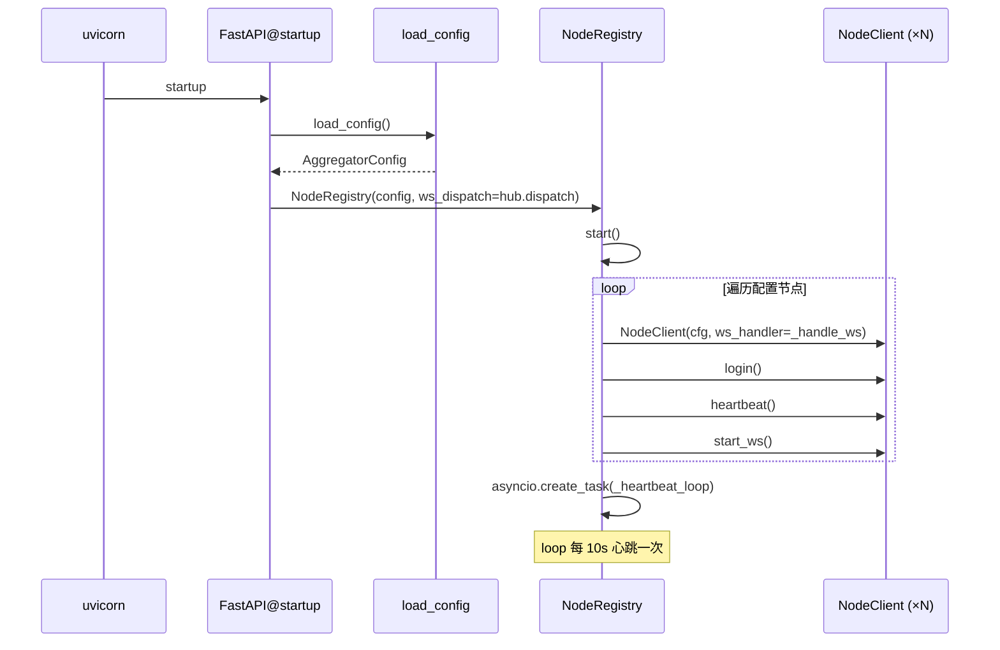
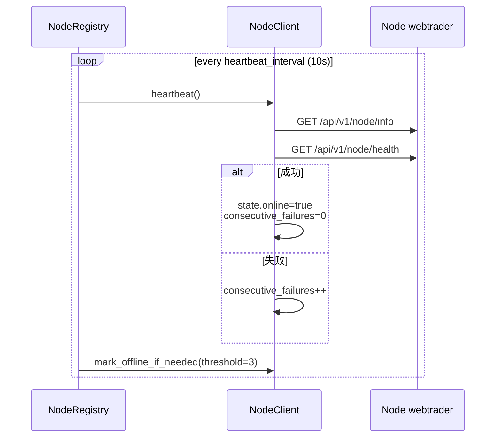
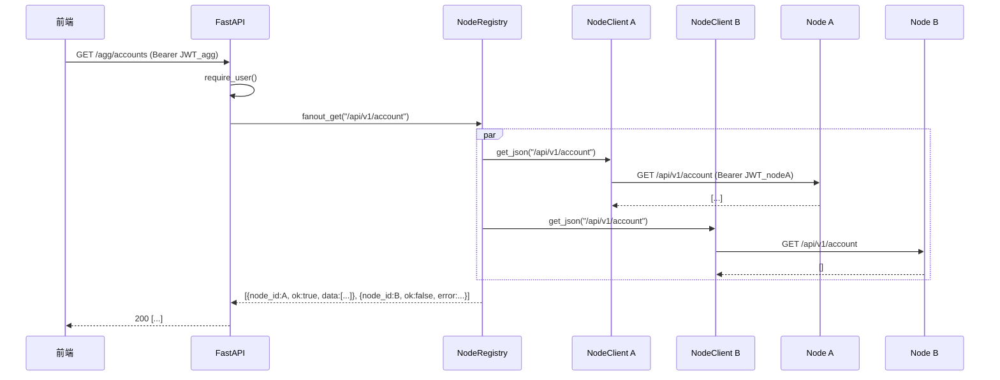
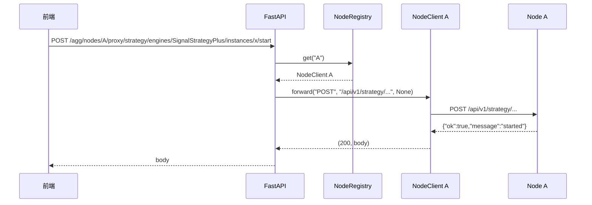
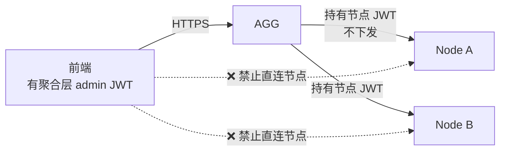

# 架构说明

## 1. 设计目标与原则

| 目标 | 落地 |
|---|---|
| 多节点统一视图 | 注册表 + REST 扇出 + WS 汇流 |
| 前端单入口 | 前端只需连 `/agg/*` 一组 URL 和一条 WS |
| 节点自治 | 聚合层故障/升级不影响节点继续交易 |
| 凭据解耦 | 聚合层有独立管理员账号, 不把节点密码泄露给前端 |
| 简单可靠 | 无持久化, 无数据库, 重启即归零 (节点是 source of truth) |
| 易水平扩展 | 增加节点只改配置, 不改代码 |

**非目标 (本期不做)**:

- 历史数据持久化 (交给时序库, Phase 5)
- 跨节点订单路由/风控 (各节点自治)
- 多租户隔离 (本期单租户, admin 一个人)

---

## 2. 上下文视图



**所有跨主机通讯走 HTTPS + JWT**。聚合层到节点的 JWT 存在聚合层内存里,不下发前端。

---

## 3. 进程模型

单进程 FastAPI 应用,内部结构:



---

## 4. 静态组件关系



---

## 5. 关键流程

### 5.1 启动



### 5.2 心跳循环



### 5.3 前端 REST 扇出



### 5.4 前端 WS 汇流

```mermaid
sequenceDiagram
    participant F as 前端
    participant H as WsHub
    participant C as NodeClient
    participant N as Node WS

    Note over C,N: 聚合层启动时每个 NodeClient 跑一条 _ws_loop
    F->>H: WS /agg/ws?token=xxx
    H->>H: hub.add(ws)
    N-->>C: {topic:"trade", data:{...}}
    C->>H: dispatch(node_id="A", msg)
    H->>H: msg.node_id="A"; broadcast
    H-->>F: {topic:"trade", node_id:"A", data:{...}}
```

### 5.5 前端透传写操作



---

## 6. 状态与持久化

**零持久化**。聚合层不写任何数据库,所有状态:

| 状态 | 存储位置 | 生命周期 |
|---|---|---|
| 节点列表 | `config.yaml` + 内存 `NodeRegistry._clients` | 进程生命周期 |
| JWT token (给节点) | 内存 `NodeClient._token` | 节点侧 JWT 过期前 (30 分钟) |
| 节点在线状态 | 内存 `NodeClient.state` | 进程生命周期 |
| 前端 WS 连接 | 内存 `WsHub._clients` | TCP 生命周期 |
| 业务数据 (账户/持仓/...) | **不缓存**, 每次 fanout 回节点实时查 | - |

好处:

- 聚合层重启零数据迁移成本
- 故障时不会出现"聚合层数据与节点数据不一致"
- 简化运维,无需考虑 schema 迁移

代价:

- 前端每次打开页面都要等一次 fanout 延迟 (通常 < 500ms)
- 聚合层挂了前端看不到任何数据 (但节点仍在正常交易)

---

## 7. 安全边界



- 节点层不对公网开放 (或仅允许聚合层 IP)
- 聚合层对前端只暴露 `/agg/*`, 不泄露节点原始 URL
- 聚合层持有节点密码/JWT, 前端不知情
- 审计点集中在聚合层 (未来可加 access log)

---

## 8. 故障模型

| 故障 | 影响 | 恢复 |
|---|---|---|
| 某节点 webtrader 挂 | 该节点 offline, 其他节点正常 | 节点恢复, 下次心跳自动回 online |
| 某节点网络断 | 同上, 10-30s 后标 offline | 网络恢复即可 |
| 聚合层挂 | 前端全黑, 节点**仍在交易** | 重启聚合层, 自动重新 login 所有节点 |
| 节点 JWT 过期 | `_request` 收到 401 → 自动 login 重试 | 内置 |
| 节点 WS 断开 | `_ws_loop` 指数退避重连 | 内置 |
| 前端 WS 断 | 前端自己重连 | - |

---

## 9. 性能与容量

### 9.1 并发能力

- 聚合层 FastAPI + httpx.AsyncClient, 单进程异步, 默认 uvicorn 1 worker 即可满足几十个节点
- 每个 NodeClient 一条 httpx 连接池 + 一条 WS, 对节点服务器压力可控

### 9.2 心跳开销

- 每个节点每 10s 2 次 HTTP GET (info + health), 10 节点 = 2 req/s, 可忽略

### 9.3 WS 消息吞吐

- 聚合层是中转, 不生产消息; 吞吐 = Σ(各节点 WS 出口速率)
- 广播给 N 个前端则放大 N 倍
- 典型 10 节点 + 5 前端: < 5k msg/s, 单 uvicorn worker 轻松

### 9.4 扩容方向

- 若节点增加到数百,考虑 sharding: 多个 aggregator,每个管一部分节点,上面再套 L7 负载均衡
- 若前端连接很多,考虑 aggregator 水平扩容 + Redis pub/sub 做跨实例 WS 广播

---

## 10. 与其他模块关系

- **上游**: 前端 SPA (见 [../../docs/frontend_requirements.md](../../docs/frontend_requirements.md))
- **下游**: 每个 vnpy_webtrader 节点 (见 [../../vnpy_webtrader/docs/](../../vnpy_webtrader/docs/))
- **不依赖**: 数据库、消息队列、Redis

**依赖的外部库**:

- `fastapi` + `uvicorn`
- `httpx` (REST 扇出)
- `websockets` (上游 WS client)
- `pyyaml` (配置)
- `python-jose[cryptography]` + `passlib` (JWT 鉴权)
