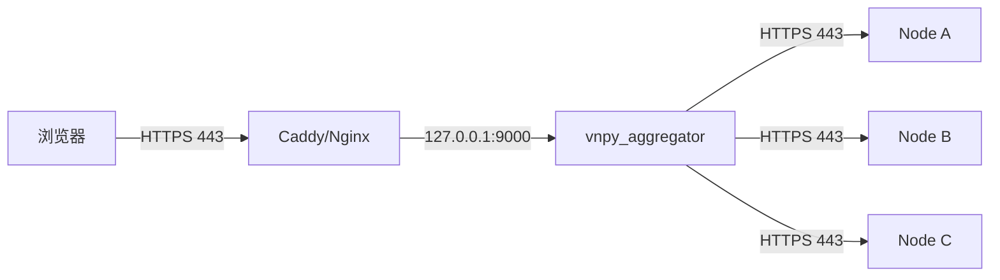
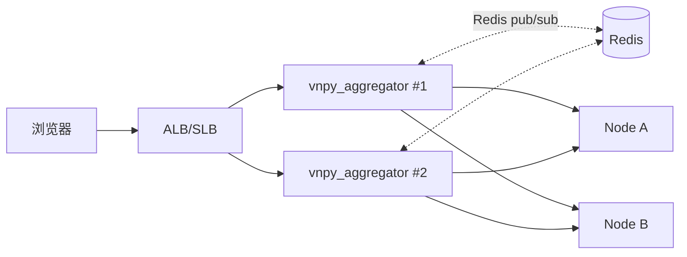

# 部署与运维

---

## 1. 前置要求

| 项目 | 说明 |
|---|---|
| OS | Linux / Windows 均可 (聚合层无 QMT 依赖) |
| Python | 3.10+ |
| 依赖 | `fastapi`, `uvicorn`, `httpx`, `websockets`, `pyyaml`, `python-jose[cryptography]`, `passlib` |
| 网络 | 能访问所有被管理节点的 HTTPS + WS 端口 |
| 证书 | 反向代理前置 HTTPS 证书 (推荐 Let's Encrypt) |

依赖安装:

```bash
"F:/Program_Home/vnpy/python.exe" -m pip install fastapi uvicorn httpx websockets pyyaml python-jose[cryptography] passlib
```

本工程的 python 环境已预装这些包,可以直接运行。

---

## 2. 配置文件

默认位置: `vnpy_aggregator/config.yaml`
也可用 `AGG_CONFIG` 环境变量指定其他路径。

完整示例:

```yaml
aggregator:
  host: 0.0.0.0
  port: 9000
  # 生产环境通过环境变量注入, 配置文件里的 jwt_secret 仅作占位
  jwt_secret_env: AGG_JWT_SECRET
  jwt_secret: change-me
  token_expire_minutes: 60
  admin_username: admin
  admin_password_env: AGG_ADMIN_PWD
  admin_password: admin
  heartbeat_interval: 10
  heartbeat_fail_threshold: 3

nodes:
  - node_id: bj-qmt-01
    base_url: https://node1.example.com
    username: vnpy
    password_env: NODE1_PWD       # 从环境变量 NODE1_PWD 读真实密码
    password: vnpy                # fallback 占位
    verify_tls: true
  - node_id: sh-ctp-02
    base_url: https://node2.example.com
    username: vnpy
    password_env: NODE2_PWD
    verify_tls: true
```

### 2.1 字段说明

| 字段 | 作用 |
|---|---|
| `host` / `port` | FastAPI 监听 |
| `jwt_secret` | JWT 签名密钥 (强烈建议用环境变量) |
| `token_expire_minutes` | 聚合层 token 过期时间 |
| `admin_username` / `admin_password` | 唯一管理员凭据 |
| `heartbeat_interval` | 心跳间隔 (秒) |
| `heartbeat_fail_threshold` | 连续失败几次标 offline |
| `nodes[].node_id` | 节点唯一 id |
| `nodes[].base_url` | 节点 webtrader 地址, 不带尾斜杠 |
| `nodes[].username/password` | 访问该节点的凭据 |
| `nodes[].verify_tls` | 是否校验 TLS 证书 (内网自签可 false) |

### 2.2 生产环境强制项

1. **`AGG_JWT_SECRET`** 环境变量必须注入, 且每个聚合层实例不同
2. **`admin_password`** 使用 `AGG_ADMIN_PWD` 环境变量
3. 所有节点用 `password_env`, 配置文件里绝不保存明文
4. 配置文件权限 `chmod 600`
5. 节点的 `verify_tls: true`, 生产 CA 签发的证书

---

## 3. 典型拓扑

### 3.1 单实例 (推荐起步)



- 聚合层和反代同机, 前端直连反代
- 节点分布在不同云主机, 通过公网或专线访问

### 3.2 高可用双活 (Phase 5+)



注意: 多实例时需要 Redis 做跨实例 WS 广播 (本期未实现,见 development.md)。

---

## 4. 启动方式

### 4.1 开发/调试

```bash
export AGG_JWT_SECRET=dev-secret-32-chars-xxxxxxxxxxxxxxxxxxxxxxxxxx
export AGG_ADMIN_PWD=admin123

"F:/Program_Home/vnpy/python.exe" -m uvicorn vnpy_aggregator.main:app \
    --host 0.0.0.0 --port 9000 --reload
```

`--reload` 会在文件改动时自动重启,不要在生产用。

### 4.2 生产 (Linux systemd)

`/etc/systemd/system/vnpy-aggregator.service`:

```ini
[Unit]
Description=vnpy aggregator
After=network.target

[Service]
User=vnpy
Group=vnpy
WorkingDirectory=/opt/vnpy
EnvironmentFile=/etc/vnpy/aggregator.env
ExecStart=/opt/vnpy/python/bin/python -m uvicorn \
    vnpy_aggregator.main:app --host 127.0.0.1 --port 9000
Restart=always
RestartSec=5

[Install]
WantedBy=multi-user.target
```

`/etc/vnpy/aggregator.env` (权限 640, 属主 root:vnpy):

```
AGG_JWT_SECRET=<随机 48 字节>
AGG_ADMIN_PWD=<强密码>
NODE1_PWD=...
NODE2_PWD=...
AGG_CONFIG=/etc/vnpy/aggregator.yaml
```

然后:

```bash
sudo systemctl daemon-reload
sudo systemctl enable --now vnpy-aggregator
sudo journalctl -u vnpy-aggregator -f
```

### 4.3 生产 (Windows NSSM)

```powershell
nssm install vnpy-aggregator "F:\Program_Home\vnpy\python.exe" "-m uvicorn vnpy_aggregator.main:app --host 127.0.0.1 --port 9000"
nssm set vnpy-aggregator AppEnvironmentExtra "AGG_JWT_SECRET=xxx" "AGG_ADMIN_PWD=xxx" "NODE1_PWD=xxx"
nssm set vnpy-aggregator AppStdout "F:\logs\agg-stdout.log"
nssm set vnpy-aggregator AppStderr "F:\logs\agg-stderr.log"
nssm start vnpy-aggregator
```

---

## 5. 反向代理

### 5.1 Caddy (推荐)

```
agg.example.com {
    reverse_proxy /agg/ws 127.0.0.1:9000 {
        header_up Host {host}
    }
    reverse_proxy 127.0.0.1:9000
}
```

Caddy 自动处理 WebSocket Upgrade,无需额外配置。证书自动签发。

### 5.2 Nginx

```nginx
server {
    listen 443 ssl http2;
    server_name agg.example.com;

    ssl_certificate /etc/letsencrypt/live/agg.example.com/fullchain.pem;
    ssl_certificate_key /etc/letsencrypt/live/agg.example.com/privkey.pem;

    location /agg/ws {
        proxy_pass http://127.0.0.1:9000;
        proxy_http_version 1.1;
        proxy_set_header Upgrade $http_upgrade;
        proxy_set_header Connection "upgrade";
        proxy_read_timeout 86400;
    }

    # 前端静态 (未来)
    location / {
        root /var/www/vnpy_front/dist;
        try_files $uri $uri/ /index.html;
    }

    # 聚合层 API
    location /agg/ {
        proxy_pass http://127.0.0.1:9000;
        proxy_set_header Host $host;
        proxy_set_header X-Forwarded-For $proxy_add_x_forwarded_for;
    }
}
```

---

## 6. 运维日常

### 6.1 添加节点 (运行时)

方式 A: 改 `config.yaml` → 重启聚合层 (节点会在启动时自动加入)。
方式 B: 用 API 动态添加 (不改配置文件, 重启后消失):

```bash
TOKEN=$(curl -s -X POST -d "username=admin&password=admin" https://agg/agg/token | jq -r .access_token)
curl -X POST -H "Authorization: Bearer $TOKEN" \
     -H "Content-Type: application/json" \
     -d '{"node_id":"new-node","base_url":"https://new.example.com","username":"vnpy","password":"xxx"}' \
     https://agg/agg/nodes
```

### 6.2 移除节点

```bash
curl -X DELETE -H "Authorization: Bearer $TOKEN" https://agg/agg/nodes/bj-qmt-01
```

### 6.3 查看节点状态

```bash
curl -H "Authorization: Bearer $TOKEN" https://agg/agg/nodes | jq
```

输出示例:

```json
[
  {
    "node_id": "bj-qmt-01",
    "base_url": "https://node1.example.com",
    "online": true,
    "last_heartbeat": 1715000000.0,
    "info": {"gateways": [{"name":"QMT","connected":true}], ...},
    "health": {"status":"ok","uptime":12345, ...}
  }
]
```

### 6.4 Swagger UI

`https://agg.example.com/docs` — 所有 `/agg/*` 路由可交互调用。

---

## 7. 日志

聚合层用 stdlib logging,默认 INFO。

### 7.1 开启 DEBUG

```bash
export PYTHONLOGLEVEL=DEBUG
# 或在代码里改: logging.basicConfig(level=logging.DEBUG)
```

### 7.2 关注事件

| 日志 | 含义 |
|---|---|
| `[nodeX] ws connected` | 到某节点的 WS 上游连上了 |
| `[nodeX] ws loop error: ..., retry in 5s` | WS 断开, 5s 后重连 |
| `[nodeX] heartbeat failed: ...` | 心跳失败计数 +1 |
| `add_node X initial login failed: ...` | 首次登录失败 (密码错/节点离线) |

---

## 8. 故障排查

### 8.1 前端 WS 不通

顺序排查:

1. `curl https://agg/openapi.json` 聚合层是否起来了
2. 浏览器 DevTools Network, WS 请求返回 1008 → token 无效 → 检查 `AGG_JWT_SECRET`
3. 反代日志, 是否正确转发 Upgrade 头
4. 聚合层日志, 是否有 `require_user` 异常

### 8.2 `/agg/accounts` 全 offline

顺序排查:

1. 聚合层到节点是否连通: `curl -k https://node1/api/v1/node/health`
2. 凭据是否正确: 看聚合层日志有无 `login failed: 401`
3. verify_tls: 内网自签证书但没关校验

### 8.3 聚合层启动就崩

常见原因:

- `AGG_JWT_SECRET` 没设, 默认值虽然能起但启动日志有 warning
- `config.yaml` 语法错误 → 看启动日志的 yaml 解析异常
- Python 依赖缺失 (例如 `ModuleNotFoundError: No module named 'yaml'`) → `pip install pyyaml`

### 8.4 某节点 WS 一直重连

日志里连续出现 `ws loop error: ..., retry in 5s`:

- 节点 webtrader 未启动
- 节点密码错 (login 返回 401, 触发 WS loop 异常 5s 重试)
- 节点 TLS 证书问题, 在 config 里 `verify_tls: false` 临时绕过

---

## 9. 监控建议

手动检查:

```bash
# 聚合层存活
curl -f https://agg/openapi.json >/dev/null || echo "DOWN"

# 所有节点在线
TOKEN=$(curl -s -X POST -d "username=admin&password=$AGG_ADMIN_PWD" https://agg/agg/token | jq -r .access_token)
OFFLINE=$(curl -s -H "Authorization: Bearer $TOKEN" https://agg/agg/nodes | jq '[.[] | select(.online == false)] | length')
[ "$OFFLINE" -gt 0 ] && echo "OFFLINE: $OFFLINE"
```

可以接入 Prometheus blackbox-exporter 或自己写脚本加到 crontab。

---

## 10. 升级

```bash
# 1. 停服
sudo systemctl stop vnpy-aggregator

# 2. 拉新代码
cd /opt/vnpy/strategy_dev && git pull

# 3. 新依赖?
/opt/vnpy/python/bin/pip install -r requirements.txt

# 4. 配置迁移 (如有 breaking change)
# 参考 CHANGELOG.md

# 5. 起服
sudo systemctl start vnpy-aggregator
sudo journalctl -u vnpy-aggregator -f
```

聚合层重启对节点无影响 (节点仍在交易)。前端会收到一次短暂 502/WS 断开,断线重连后恢复。

---

## 11. 备份

**聚合层无状态, 无需业务备份**。只需备份:

- `/etc/vnpy/aggregator.yaml` (节点配置)
- `/etc/vnpy/aggregator.env` (密钥, 强烈建议加密存储)

所有交易数据由节点自己持久化。
