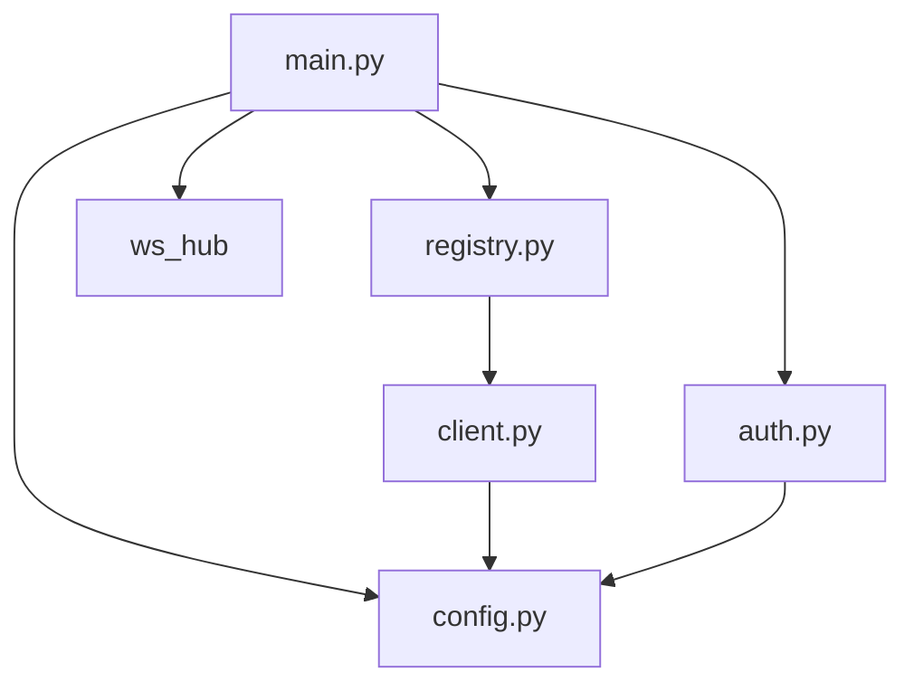
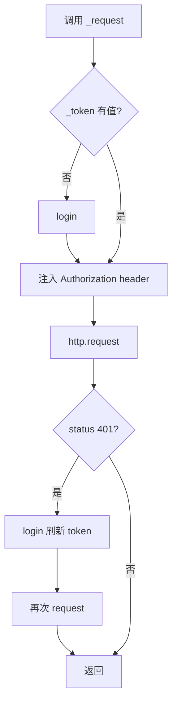
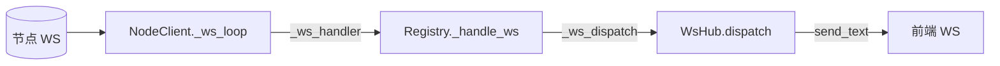
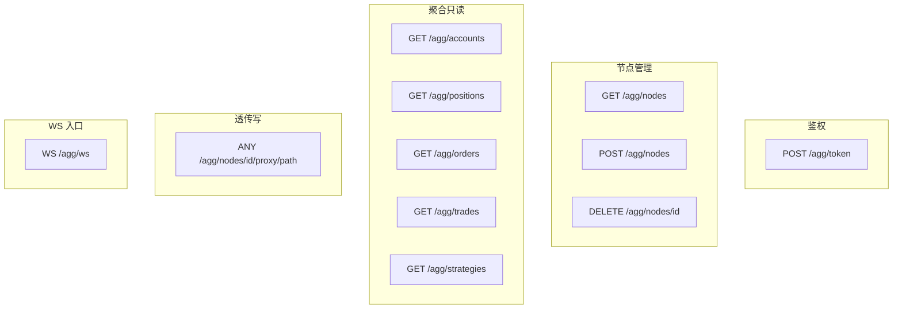

# 详细设计

本章打开 `vnpy_aggregator/` 每个模块的"内部机制"。配合源码阅读。

---

## 1. 模块依赖拓扑



无循环,无环,链路清晰:

- `config.py` 纯数据,无依赖
- `auth.py` 只依赖 config
- `client.py` 只依赖 config
- `registry.py` 组合多个 client
- `ws_hub.py` 无依赖,纯 FastAPI WS 广播器
- `main.py` 最顶层,把 config / auth / registry / ws_hub / FastAPI 串起来

---

## 2. `config.py`

### 2.1 数据类

```python
@dataclass
class NodeConfig:
    node_id: str
    base_url: str          # https://node1.example.com
    username: str = "vnpy"
    password: str = "vnpy"
    verify_tls: bool = True

@dataclass
class AggregatorConfig:
    host: str = "0.0.0.0"
    port: int = 9000
    jwt_secret: str = "change-me"
    token_expire_minutes: int = 60
    admin_username: str = "admin"
    admin_password: str = "admin"
    heartbeat_interval: float = 10.0
    heartbeat_fail_threshold: int = 3
    nodes: List[NodeConfig] = []
```

### 2.2 加载优先级

```
load_config(path=None):
    1. 显式 path 参数
    2. $AGG_CONFIG 环境变量
    3. vnpy_aggregator/config.yaml
    4. vnpy_aggregator/config.json
    5. 全部不存在 → 全默认值 (空 nodes 列表)
```

### 2.3 敏感信息环境变量覆盖

配置文件里可写 `jwt_secret_env: AGG_JWT_SECRET`,加载时读 `os.environ["AGG_JWT_SECRET"]` 覆盖 `jwt_secret`。节点密码同理 (`password_env`)。这样 git 里的 config.yaml 可以只放占位符。

---

## 3. `auth.py`

### 3.1 初始化

main.py 在 `@startup` 里调用 `auth.set_config(cfg)`, auth 模块持有 AggregatorConfig 引用。

### 3.2 方法

```python
authenticate_admin(username, password) -> Optional[str]
    # 对比 config.admin_username / admin_password, 使用 secrets.compare_digest

create_access_token(sub: str) -> str
    # jwt.encode({"sub": sub, "exp": ...}, jwt_secret, algorithm="HS256")

require_user(token = Depends(oauth2_scheme)) -> str
    # jwt.decode → 返回 sub
    # 失败抛 HTTPException(401)
```

### 3.3 与节点鉴权对比

| 维度 | 聚合层 | 节点层 |
|---|---|---|
| 用户模型 | 单管理员 admin | 单用户 vnpy |
| 密码 hash | 明文对比 (未来可改 passlib) | passlib sha256_crypt |
| JWT secret | `jwt_secret` | `secret_key` |
| token 过期 | 默认 60 分钟 | 默认 30 分钟 |
| 应用路由 | `/agg/*` | `/api/v1/*` |

---

## 4. `client.py` - `NodeClient`

### 4.1 职责

每个 `NodeClient` 实例对应一个节点。负责:

- 管理对该节点的 JWT token (自动续期)
- REST 方法封装 (get_json / post_json / forward)
- 心跳 (heartbeat)
- WS 上游订阅 + 断线重连

### 4.2 内部状态

```python
self.config: NodeConfig        # 来自 AggregatorConfig.nodes
self.state: NodeState          # 对外展示的节点快照
self._token: Optional[str]     # 节点 JWT, 懒加载
self._http: httpx.AsyncClient  # 连接池, 复用 TCP
self._ws_handler: EventHandler # Registry 注入的回调
self._ws_task: asyncio.Task    # _ws_loop 协程
self._ws_stop: asyncio.Event   # 优雅停止信号
```

### 4.3 REST 调用封装



### 4.4 forward 方法 (透传写操作用)

```python
async def forward(self, method, path, json_body=None) -> tuple[int, Any]:
    resp = await self._request(method, path, json=json_body)
    body = resp.json() if resp 能解析 else resp.text
    return resp.status_code, body
```

返回的 `(status_code, body)` 让 aggregator main.py 的 proxy 路由决定如何响应前端。

### 4.5 WS 重连逻辑

```python
async def _ws_loop(self):
    while not self._ws_stop.is_set():
        try:
            if not self._token: await self.login()
            async with websockets.connect(ws_url, ping_interval=20) as ws:
                while not self._ws_stop.is_set():
                    raw = await ws.recv()
                    msg = json.loads(raw)
                    msg["node_id"] = self.config.node_id
                    await self._ws_handler(self.config.node_id, msg)
        except asyncio.CancelledError: break
        except Exception:
            await asyncio.sleep(5)  # 固定 5s 重连间隔
```

**注意**: 当前是**固定 5s 重连**, 未加指数退避。若节点长期不可用, 会每 5s 产生一次连接尝试日志。可接受 (节点离线时心跳一样会每 10s 打印一次), 未来可以改成指数退避到最多 60s。

---

## 5. `registry.py` - `NodeRegistry`

### 5.1 职责

- 节点 CRUD (add/remove/get)
- 启动心跳循环 task
- 协调 WS dispatch 到 ws_hub
- 对外暴露扇出方法 `fanout_get(path)`

### 5.2 心跳循环

```python
async def _heartbeat_loop(self):
    while not self._stop.is_set():
        for client in self._clients.values():
            await client.heartbeat()
            client.mark_offline_if_needed(threshold=3)
        try:
            await asyncio.wait_for(self._stop.wait(), timeout=heartbeat_interval)
        except asyncio.TimeoutError:
            pass   # 正常循环等待
```

为什么用 `asyncio.wait_for` 而不是 `asyncio.sleep`?

- 为了让 `stop()` 能**立即中止**等待, 而不是硬等到下一次心跳。
- `self._stop: asyncio.Event` 被 set 后, `wait_for` 立即唤醒。

### 5.3 扇出

```python
async def fanout_get(self, path: str) -> List[Dict]:
    async def _one(client):
        if not client.state.online:
            return {"node_id":..., "ok":False, "error":"offline"}
        try:
            data = await client.get_json(path)
            return {"node_id":..., "ok":True, "data":data}
        except Exception as e:
            return {"node_id":..., "ok":False, "error":str(e)}
    return await asyncio.gather(*[_one(c) for c in self._clients.values()])
```

`asyncio.gather` 并发,不会因某节点慢拖累其他节点 (除非 httpx 超时设得很长)。

### 5.4 WS dispatch 链



`NodeRegistry` 的构造函数接受 `ws_dispatch` 回调,在 main.py 里传入 `_hub.dispatch`。

---

## 6. `ws_hub.py` - `WsHub`

### 6.1 设计

单例,一个 `List[WebSocket]` 保护在 `asyncio.Lock` 后。方法:

```python
async add(ws)       # 新连接加入
async remove(ws)    # 断开移除
async dispatch(node_id, msg)   # 由 registry 调用
async _broadcast(payload)      # 内部: 遍历客户端 send_text
```

### 6.2 为什么要 Lock?

前端连接 add/remove 可能发生在 dispatch 广播期间。Lock 保证:

- 不会在遍历时被并发 remove 改动列表导致异常
- 断开的客户端在 broadcast 里批量收集后在同一把锁内移除

### 6.3 dead connection 清理

```python
async _broadcast(payload):
    async with lock:
        dead = []
        for ws in clients:
            try: await ws.send_text(payload)
            except: dead.append(ws)
        for ws in dead:
            clients.remove(ws)
```

优势:单次 dispatch 内同时完成广播 + 清理,不需要单独的 GC 任务。

---

## 7. `main.py`

### 7.1 启动/关闭钩子

```python
@app.on_event("startup")
async def _startup():
    global _config, _registry
    _config = load_config()
    set_auth_config(_config)
    _registry = NodeRegistry(_config, ws_dispatch=_hub.dispatch)
    await _registry.start()

@app.on_event("shutdown")
async def _shutdown():
    if _registry is not None:
        await _registry.stop()
```

### 7.2 路由分组



### 7.3 响应模型 (Pydantic)

```python
class FanoutItem(BaseModel):
    node_id: str
    ok: bool
    data: Any = None
    error: Optional[str] = None
```

FastAPI 根据 `response_model=` 参数自动做校验 + 生成 OpenAPI schema。

### 7.4 WS 鉴权

```python
@app.websocket("/agg/ws")
async def agg_ws(websocket: WebSocket):
    token = websocket.query_params.get("token")
    if not token:
        await websocket.close(code=1008)
        return
    try:
        await require_user(token)    # 复用 HTTP 鉴权, 复用 JWT
    except HTTPException:
        await websocket.close(code=1008)
        return
    await websocket.accept()
    await _hub.add(websocket)
    try:
        while True: await websocket.receive_text()
    except WebSocketDisconnect: pass
    finally: await _hub.remove(websocket)
```

注意: `require_user(token)` 作为 FastAPI dependency 原本需要 Request,直接传 token 调用 type: ignore。未来可拆成底层函数 + FastAPI 包装。

### 7.5 proxy 路由

```python
@app.api_route("/agg/nodes/{node_id}/proxy/{path:path}",
               methods=["GET","POST","DELETE","PATCH"])
async def proxy(node_id, path, payload=None, user=Depends(require_user)):
    client = _reg().get(node_id)
    if not client: raise HTTPException(404)
    method = "POST" if payload else "GET"   # 简化版, 未来改成更准
    status, body = await client.forward(method, f"/api/v1/{path}", payload)
    if status >= 400: raise HTTPException(status, body)
    return body
```

**简化点**: 当前 `method` 根据 `payload` 是否为 None 推断,不是读取请求原生方法。这在目前的 API 设计下够用 (GET 无 body / POST 有 body / DELETE 无 body) 但不理想, 后续应该从 `Request` 对象读 `request.method`。TODO 在 development.md 里。

---

## 8. 典型请求全链路

### 8.1 `GET /agg/accounts`

```
uvicorn worker
  ├─ FastAPI app
  ├─ Dependency: require_user(JWT_agg) → "admin"
  ├─ agg_accounts() handler
  └─ _fanout("/api/v1/account")
        └─ registry.fanout_get(...)
             └─ asyncio.gather:
                   ├─ client_A.get_json("/api/v1/account")
                   │    ├─ _request("GET", ...)
                   │    ├─ (_token 为空) login() → POST node_A/token
                   │    └─ GET node_A/api/v1/account
                   └─ client_B.get_json("/api/v1/account")
  ← [FanoutItem, FanoutItem]
```

### 8.2 `POST /agg/nodes/A/proxy/strategy/engines/X/instances/y/start`

```
uvicorn worker
  ├─ require_user → "admin"
  ├─ proxy(node_id="A", path="strategy/engines/X/instances/y/start")
  ├─ _reg().get("A") → NodeClient A
  └─ client_A.forward("POST", "/api/v1/strategy/.../start", payload=None)
        ├─ 因为 payload=None, method 变成 "GET" (⚠ 见上注)
        └─ 实际这里应该是 POST!
```

⚠️ 这是上面第 7.5 节提到的 bug:POST 无 body 时会被推断成 GET。开发 development.md 里给了修复方案。目前workaround: 前端可以传一个空 dict `{}` 作为 payload, 从而触发 POST。实际当前只读接口 + strategy 写接口里,`/start/stop/init` 是无 body 的 POST, 前端需要传 `{}`。

---

## 9. 并发模型

- FastAPI + uvicorn 单 worker 跑 asyncio loop
- 所有 IO (httpx / websockets) 都是异步
- 心跳循环、N 条 NodeClient WS loop 都是 `asyncio.Task`
- WsHub 广播在 loop 里串行, 但 send_text 之间是非阻塞的

**不用多线程**, 不用多进程。单 worker 足够应付几十节点 + 几十前端。

### 9.1 扩容到多 worker 的注意事项

uvicorn `--workers N > 1` 时每个 worker 自己启动 registry,会出现:

- N 套心跳轰节点
- 前端 WS 随机命中某个 worker, 事件只在那个 worker 的 WsHub 里, 无法广播到其他 worker 的客户端

解决:

1. 用 Gunicorn + 单 worker + 多实例 LB (每个实例独立聚合层)
2. 或引入 Redis pub/sub 做跨 worker 广播

本期**不推荐 multi-worker**,保持单 worker + vertical scale。

---

## 10. 错误处理矩阵

| 错误来源 | 表现 | 客户端影响 |
|---|---|---|
| 配置文件缺失 | 启动时 `_config = AggregatorConfig()` 空节点 | 空列表 `/agg/nodes` |
| 节点 URL 无效 | 心跳失败, `online=false` | fanout 返回 `{ok:false, error:...}` |
| 节点 401 | NodeClient 自动 login 重试 | 透明 |
| 节点密码错 | login 一直 401 → heartbeat 失败 → 标 offline | fanout `ok:false` |
| 节点 500 | `get_json` 抛 httpx.HTTPStatusError | fanout `ok:false, error:str` |
| WS 节点断 | `_ws_loop` 5s 后重连 | 消息中断 5s |
| WS 前端断 | `_broadcast` 内清理 | 无影响 |
| 聚合层 JWT 过期 | 前端收到 401 | 跳 login |

---

## 11. 可观测性

### 11.1 日志

用 stdlib `logging`, 默认 `INFO` 级别。关键点:

- `NodeRegistry.add_node` 初次登录失败 → WARN
- `NodeClient.heartbeat` 失败 → WARN
- `NodeClient._ws_loop` 重连 → WARN
- `NodeClient.start_ws connected` → INFO
- `_handle_ws` 回调异常 → ERROR + traceback

### 11.2 指标 (未实现, 建议扩展)

可以加 Prometheus metrics:

| metric | type | 说明 |
|---|---|---|
| `agg_nodes_online` | gauge | 在线节点数 |
| `agg_heartbeat_failures` | counter | 心跳失败计数 |
| `agg_fanout_duration_seconds` | histogram | fanout 延迟 |
| `agg_ws_clients` | gauge | 前端 WS 连接数 |
| `agg_ws_upstream_messages` | counter | 上游 WS 消息量 |

通过 `prometheus_client` 加几行即可,见 development.md。

---

## 12. 已知技术债务

1. `proxy` 方法推断 HTTP method 的方式不准确 (见 §8.2)
2. `_ws_loop` 没有指数退避
3. 聚合层没有持久化, 重启后节点注册动态添加的丢失 (只能从 config.yaml 加载)
4. 没有审计日志 (谁在什么时候启动了哪个策略)
5. 不支持多租户 / RBAC
6. 没有 Prometheus 指标

以上在 [development.md](./development.md) 里列出对应的修复建议。
