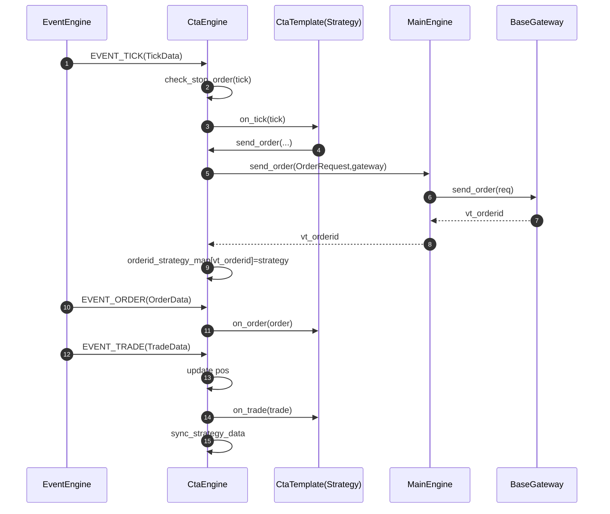
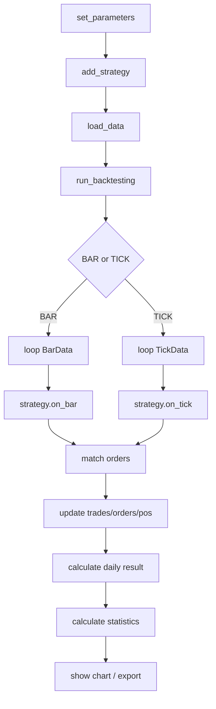
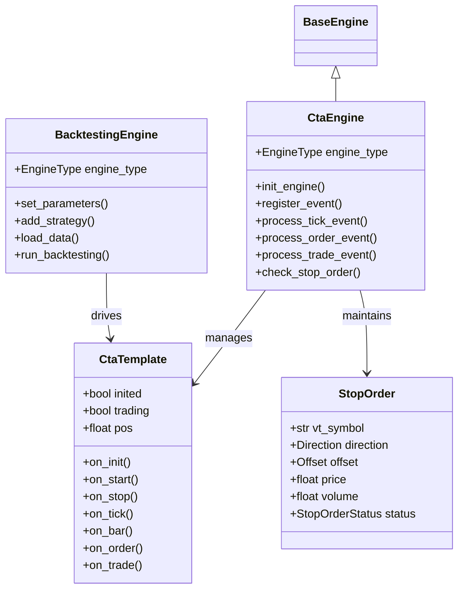
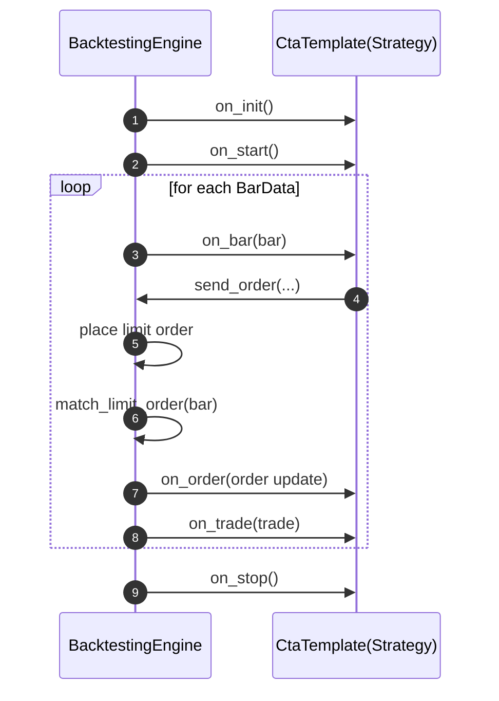

# vnpy_ctastrategy 架构与功能详解

本文档面向二次开发与长期维护，解释 vnpy_ctastrategy 的模块边界、核心数据结构、事件驱动流程、实盘/回测/优化的实现方式，并提供 UML/流程图/时序图（Mermaid）作为可版本化的架构图谱。

## 1. 组件总览

### 1.1 分层视角

- **框架层（vnpy.trader）**：`EventEngine`、`MainEngine`、`BaseGateway`、`BaseEngine`、对象模型（OrderData/TradeData/PositionData/AccountData/TickData/BarData）。
- **应用层（vnpy_ctastrategy）**：`CtaStrategyApp` + `CtaEngine`（实盘策略引擎）+ `BacktestingEngine`（回测/优化引擎）+ `CtaTemplate`（策略基类）。
- **基础设施（可插拔）**：数据库 `BaseDatabase`、数据服务 `BaseDatafeed`、优化器（BF/GA）。

### 1.2 模块清单与职责

- [base.py](file:///f:/Quant/vnpy/vnpy_strategy_dev/vnpy_ctastrategy/base.py)
  - 常量：`APP_NAME`、停止单前缀 `STOPORDER_PREFIX`
  - 枚举：`EngineType(LIVE/BACKTESTING)`、`BacktestingMode(BAR/TICK)`、`StopOrderStatus`
  - 数据对象：`StopOrder`（本地停止单模型）
  - 事件类型：`EVENT_CTA_LOG`、`EVENT_CTA_STRATEGY`、`EVENT_CTA_STOPORDER`
- [engine.py](file:///f:/Quant/vnpy/vnpy_strategy_dev/vnpy_ctastrategy/engine.py)
  - `CtaEngine(BaseEngine)`：实盘 CTA 引擎，实现策略加载/生命周期、事件路由、停止单管理、下单与撤单、数据持久化等。
- [template.py](file:///f:/Quant/vnpy/vnpy_strategy_dev/vnpy_ctastrategy/template.py)
  - `CtaTemplate`：策略基类（on_init/on_start/on_stop/on_tick/on_bar/on_trade/on_order…）
  - `TargetPosTemplate`：目标持仓模板（策略以目标持仓为中心，内部做订单追踪与调整）
- [backtesting.py](file:///f:/Quant/vnpy/vnpy_strategy_dev/vnpy_ctastrategy/backtesting.py)
  - `BacktestingEngine`：回测引擎（历史数据加载、回放驱动、撮合、绩效统计、图表、优化）
- [__init__.py](file:///f:/Quant/vnpy/vnpy_strategy_dev/vnpy_ctastrategy/__init__.py)
  - `CtaStrategyApp(BaseApp)`：应用注册入口，供主界面加载。

## 2. 核心对象模型与映射关系

### 2.1 引擎内部的三张映射表

在实盘模式下，`CtaEngine` 需要把“市场数据/订单回报/成交回报”路由到具体策略实例，主要依赖三张映射：

- `symbol_strategy_map: vt_symbol -> [strategy]`
  - 用于 Tick/Bar 分发。
- `orderid_strategy_map: vt_orderid -> strategy`
  - 用于订单/成交回报反查所属策略。
- `strategy_orderid_map: strategy_name -> {vt_orderid}`
  - 用于策略维度管理活动订单（例如停止/撤单、清理活动集合）。

### 2.2 StopOrder（本地停止单）

StopOrder 是“客户端侧停止单”抽象，用于在 Tick 触发条件满足时转化为真实委托：

- 状态：WAITING / CANCELLED / TRIGGERED
- 触发：`CtaEngine.check_stop_order(tick)` 每个 tick 扫描匹配 vt_symbol 的 stop orders
- 转委托：触发后使用限价/对手价逻辑计算 price，然后调用 `send_limit_order`

## 3. 实盘模式（LIVE）工作流

### 3.1 实盘生命周期

实盘引擎初始化由 `init_engine()` 完成，包含：

- 初始化数据服务（datafeed）
- 加载策略类（扫描策略目录/动态 import）
- 加载策略配置（setting）与策略变量数据（data）
- 注册事件：Tick/Order/Trade

### 3.2 实盘事件路由

#### Tick → Strategy

`EVENT_TICK` 到达后：
- 找到 `symbol_strategy_map[tick.vt_symbol]`
- 先 `check_stop_order(tick)`（本地停止单触发）
- 再对每个策略调用 `strategy.on_tick(tick)`

#### Order → Strategy

`EVENT_ORDER` 到达后：
- `orderid_strategy_map[order.vt_orderid] -> strategy`
- 若订单已不再 active，则从 `strategy_orderid_map` 中移除
- 若 `order.type == STOP`，构造 `StopOrder` 并调用 `strategy.on_stop_order`
- 最后调用 `strategy.on_order(order)`

#### Trade → Strategy

`EVENT_TRADE` 到达后：
- 去重 trade（`vt_tradeids`）
- 找到 `orderid_strategy_map[trade.vt_orderid]`
- 先更新策略 pos（LONG 加，SHORT 减）
- 调用 `strategy.on_trade(trade)`
- 同步变量到 data 文件（`sync_strategy_data`）

### 3.3 实盘时序图

## 4. 回测模式（BACKTESTING）工作流

### 4.1 BacktestingEngine 的核心职责

`BacktestingEngine` 是“离线执行器”，主要做四件事：

1. **数据加载**：按日期分片加载历史 bar/tick 数据，支持进度输出。
2. **回放驱动**：逐条把 bar/tick 推给策略 callback（BAR 模式 `on_bar`，TICK 模式 `on_tick`）。
3. **撮合模型**：维护 active 限价单/停止单，依据行情触发成交并生成 TradeData/OrderData。
4. **结果评估**：日度收益、绩效指标（Sharpe/MaxDrawdown 等）、图表输出、参数优化。

### 4.2 回测流程图

### 4.3 回测撮合（概念）

回测引擎维护两类订单：
- **停止单（stop orders）**：满足触发条件时转为限价单或直接成交。
- **限价单（limit orders）**：满足价格穿越条件时成交。

成交后会产生：
- `OrderData.status` 更新（NOTTRADED → PARTTRADED → ALLTRADED / CANCELLED）
- `TradeData` 记录成交量、成交价、成交时间
- 策略的 `pos` 更新，并触发 `on_order/on_trade`

## 5. 参数优化（Optimization）

`vnpy.trader.optimize` 提供两类优化方式：
- BF：穷举遍历参数网格
- GA：遗传算法搜索

CTA 的优化流程通常是：
- 对每组参数：创建 BacktestingEngine → set_parameters → add_strategy(setting) → run_backtesting → calculate_statistics
- 汇总结果并排序输出

## 6. UML 图谱（Mermaid）

### 6.1 类图（核心类关系）

### 6.2 时序图（回测：bar 回放触发成交）

## 7. 关键扩展点（工程化建议）

### 7.1 策略扩展
- 新策略只需继承 `CtaTemplate`，实现 `on_tick/on_bar` 与交易逻辑即可。
- 通用能力可放在 Template 子类（如 TargetPosTemplate）。

### 7.2 数据源扩展
- 实盘依赖网关提供 tick。
- 回测依赖数据库或 datafeed（`get_datafeed()`），可替换为 TuShare/RQData 等。

### 7.3 风控与交易规则
- 风控通常在网关或交易引擎层实现（不建议散落在策略内）。
- 回测撮合模型是“研究假设的一部分”，需要明确费率、滑点、撮合规则与市场机制差异。

## 8. 与 SignalStrategy 的对比（为 SignalStrategyPlus 做铺垫）

- CTA：策略以行情驱动，强调持仓管理、止损止盈、回测与优化体系完善。
- SignalStrategy：策略更多是“信号→下单”，天然适合把“重挂/撤单策略”做成 mixin，并可借鉴 CTA 的 EngineType/BacktestingEngine 体系补齐回测能力。

