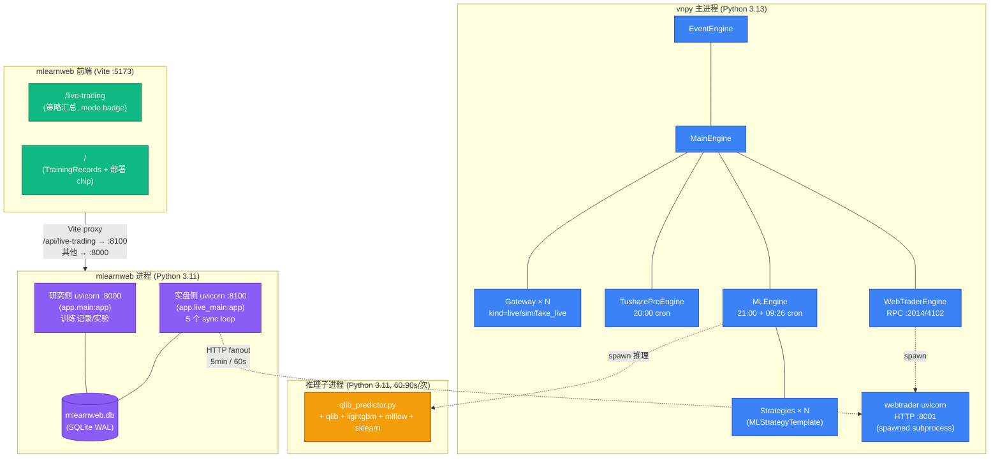
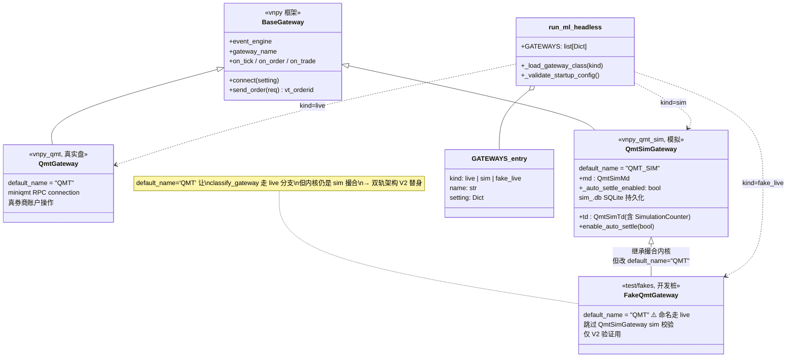
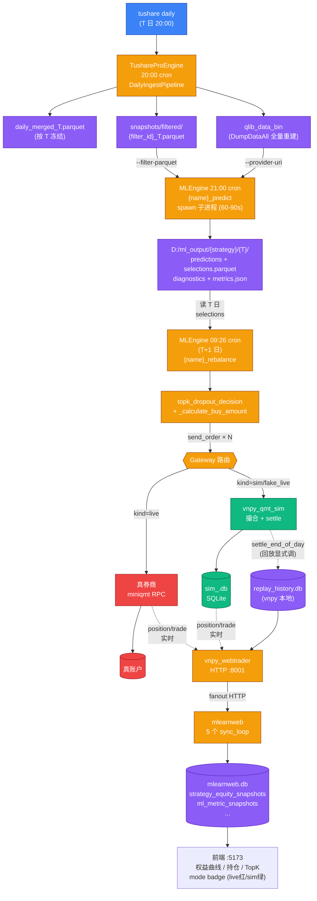

# 整体架构

vnpy_ml_strategy 是 **跨进程协作 + 多 gateway 并存 + 双 cron 调度** 的 ML 策略
框架. 本文档讲清楚: (1) 进程拓扑, (2) 数据流, (3) 调度时序, (4) 关键解耦设计.

---

## 1. 进程拓扑

### 图 1.1 跨进程拓扑



`mlearnweb 实盘侧 5 个 sync loop`:
- `snapshot_loop` (60s) — 实时 PnL/持仓
- `ml_snapshot_loop` (60s) — metrics latest
- `historical_metrics_sync_loop` (5min) — 回填 ic 历史
- `replay_equity_sync_loop` (5min) — 拉 vnpy 本地 replay_history.db (A1/B2)
- `deployment_sync_loop` (10min) — 扫 bundle 部署

### 1.1 为什么拆这么多进程?

- **vnpy 主进程**: 高可用低延迟, 不能被推理 IO / 计算阻塞. EventEngine 单线程
  serial dispatch, 不能让 5GB qlib 占用拖慢 tick / order 路径.
- **推理子进程**: qlib + lightgbm 重型依赖加载 ~3-5s, 推理过程占用 4-5GB 内存.
  每天单次, 跑完即释放. 用 spawn (Windows multiprocessing.Pool 不可靠) 隔离.
- **mlearnweb 双 uvicorn**: 研究侧 (实验列表 / 训练记录 / SHAP) 与实盘侧 (秒级监控
  / 控制) 关注点分离. 任一侧 reload / 慢请求不阻塞另一侧. 两进程通过 SQLite WAL
  并发读写共享数据.
- **mlearnweb 前端**: Vite proxy 让浏览器看到单一 origin, 实际按路径 fanout.

### 1.2 跨进程通信机制

| 通道 | 方向 | 内容 |
|---|---|---|
| spawn subprocess | vnpy → 推理 | bundle_dir / filter_parquet / live_end CLI 参数; 子进程结束写 3 个文件返回 |
| zmq RPC | webtrader 内部 | MainEngine API 暴露给 vnpy_webtrader 进程内 RPC client |
| HTTP REST | mlearnweb → vnpy_webtrader | 实时拉 strategy / position / account / ml metrics / replay equity |
| SQLite (WAL) | vnpy 写 / mlearnweb 读 | replay_history.db (本地, A1/B2 解耦后核心) |
| SQLite (WAL) | mlearnweb 双 uvicorn | mlearnweb.db (StrategyEquitySnapshot / TrainingRecord ...) |

---

## 2. 数据流

### 2.1 训练 → 实盘 (一次性)

```
研究机                                    实盘机
  │                                          │
  │ 1. tushare daily 增量拉数               │
  │  → factor_factory/qlib_data_bin         │
  │  → factor_factory/csi300_filtered.parquet (训练用 filter)
  │                                          │
  │ 2. 训练: tushare_hs300_rolling_train.py │
  │  → mlflow run_id                         │
  │  → bundle_dir/{params.pkl, task.json,    │
  │     filter_config.json, manifest.json}   │
  │                                          │
  │ 3. rsync bundle_dir                      │
  │  ────────────────────────────────────►  │ D:/vnpy_data/models/{run_id}/
  │                                          │
  │                                          │ 4. 改 run_ml_headless.py STRATEGIES.bundle_dir
  │                                          │ 5. 启动 vnpy 主进程
```

关键: **训练 / 实盘共享 D:/vnpy_data/qlib_data_bin** (实盘机 vnpy_tushare_pro
20:00 cron 拉数据生成, 训练机用相同源训练或 rsync 过来), 让两端从同一份数据驱动.

### 2.2 实盘日常运行 (每天)

```
T 日:
  20:00  vnpy_tushare_pro DailyIngestPipeline.ingest_today()
         ├─ Stage 1 FETCH:    tushare daily → daily_merged_T.parquet
         ├─ Stage 2 FILTER:   按 filter_chain_specs 产 active_{filter_id}.parquet +
         │                    {filter_id}_T.parquet (推理快照)
         ├─ Stage 3 BY_STOCK: union(active filter_ids) → CSV
         └─ Stage 4 DUMP:     DumpDataAll 全量重建 qlib bin (staging + 原子 rename)

  21:00  MLEngine cron {strategy_name}_predict 触发 run_daily_pipeline
         ├─ run_inference (spawn subprocess, ~60-90s)
         │   ├─ load bundle params.pkl + task.json
         │   ├─ 读 D:/vnpy_data/qlib_data_bin (lookback 60 交易日)
         │   ├─ 应用 filter_parquet (按 today snapshot)
         │   └─ 写 predictions.parquet + diagnostics.json + metrics.json
         ├─ select_topk → persist selections.parquet
         └─ 不下单! (双 cron 架构)

T+1 日:
  09:26  MLEngine cron {strategy_name}_rebalance 触发 run_open_rebalance
         ├─ 读 prev_day selections.parquet
         ├─ 拿当前开盘价 (gateway.md.refresh_tick today_open)
         ├─ 调 topk_dropout_decision 算 sells/buys
         ├─ 计算 buy volume = floor(cash × 0.95 / n_buys / open / 100) × 100
         └─ send_order × N → gateway 撮合 → on_trade 回报

  15:00  T+1 日盘后 (回放期间为逻辑日 15:00):
         ├─ gateway timer 检测自然日切换 → settle_end_of_day
         │   (回放期间 _auto_settle_enabled=False, 由控制器显式调)
         ├─ pos.yd_volume = pos.volume (T+1 持仓转昨仓, 给 T+2 卖出资格)
         ├─ pos.price *= (1 + pct_chg/100) (mark-to-market 含除权)
         └─ template._persist_replay_equity_snapshot(day) (回放模式)
            → write_snapshot to replay_history.db
            → mlearnweb sync_loop 下一周期拉到
```

### 2.3 mlearnweb 拉数据周期

| Loop | 周期 | 拉什么 |
|---|---|---|
| `snapshot_loop` | 60s | 实时策略 PnL / 持仓 / 账户 → strategy_equity_snapshots (source_label=strategy_pnl/account_equity/...) |
| `ml_snapshot_loop` | 60s | 最新 metrics (ic / psi / pred_mean / topk) → ml_metric_snapshots |
| `historical_metrics_sync_loop` | 5min | 历史 metrics ic 字段 (回填 forward window 后才能算) |
| `replay_equity_sync_loop` | 5min | vnpy 本地 replay_history.db → strategy_equity_snapshots (source_label=replay_settle) |
| `deployment_sync_loop` | 10min | 扫描各策略 bundle_dir, 反向标记 TrainingRecord.deployments |

---

## 3. 调度时序: 双 cron 架构

实盘 best practice — 把"信号决策"与"撮合下单"在时间上解耦.

### 图 3.1 双 cron 时序

```mermaid
sequenceDiagram
    autonumber
    participant Sched as APScheduler
    participant Strat as MLStrategyTemplate
    participant Sub as 推理子进程<br/>(qlib+lgb)
    participant FS as ML_OUTPUT_ROOT
    participant Cal as TradeCalendar
    participant GW as Gateway
    participant Broker as 真券商 / sim 撮合

    rect rgb(59, 130, 246, 30)
        Note over Sched,FS: T 日 21:00 — predict cron (推理半边)

        Sched->>Strat: trigger {name}_predict
        Strat->>Cal: is_trade_day(T) ?
        Cal-->>Strat: yes
        Strat->>Sub: spawn qlib_predictor (60-90s)
        Note right of Sub: load bundle params.pkl<br/>read qlib_data_bin (lookback 60)<br/>apply filter_parquet
        Sub->>FS: write predictions.parquet
        Sub->>FS: write selections.parquet (top-K)
        Sub->>FS: write diagnostics + metrics.json
        Sub-->>Strat: returncode=0
        Strat->>FS: persist_selections (再写一次, 含 weight)
        Note over Strat: 不下单 (双 cron 解耦)
    end

    rect rgb(245, 158, 11, 30)
        Note over Sched,Broker: T+1 日 09:26 — rebalance cron (撮合半边)

        Sched->>Strat: trigger {name}_rebalance
        Strat->>FS: 读 T 日 selections.parquet
        Strat->>GW: md.refresh_tick (today_open)
        GW-->>Strat: 当前开盘价
        Strat->>Strat: topk_dropout_decision<br/>→ sells/buys
        Strat->>Strat: _calculate_buy_amount<br/>= floor(cash×0.95/n/open/100)×100
        loop sells + buys × N
            Strat->>GW: send_order
            GW->>Broker: 真 miniqmt RPC / sim 撮合
            Broker-->>GW: on_order / on_trade
            GW-->>Strat: 回调
        end
        Note over Strat,Broker: 09:30 集合竞价后真实成交
    end

    rect rgb(16, 185, 129, 30)
        Note over GW,FS: T+1 日 15:00 — settle (盘后)
        GW->>GW: settle_end_of_day(T+1)
        Note right of GW: pos.yd_volume = pos.volume<br/>pos.price *= (1 + pct_chg/100)
        Strat->>FS: replay_history.write_snapshot<br/>(回放模式; A1/B2 解耦)
    end
```

**为什么双 cron 比单 cron 好** (设计文档 commit `6ae37fd`):

| 单 cron (旧, 被废弃) | 双 cron (新) |
|---|---|
| 21:00 cron 同时做推理 + 下单 | 21:00 推理 + persist; 09:26 才下单 |
| 21:00 时市场已休市, 用 stale tick 算 volume | 09:26 用真实开盘价算 volume, 撮合精度高 |
| 全程没在 09:26 校准开盘价 | 09:26 真实开盘价 → 09:30 撮合 |
| 与 batch replay 语义不一致 (replay 用 prev_day_pred + Day T 开盘价) | 与 batch replay 严格一致 (sim_trades byte-equal) |

**实现细节**:
- `MLEngine.register_predict_job(name, "21:00", run_daily_pipeline)` 注册 `{name}_predict`
- `MLEngine.register_rebalance_job(name, "09:26", run_open_rebalance)` 注册 `{name}_rebalance`
- 错峰 (P1-1): 多策略 trigger_time 必须 ≥ 10 min 错开, 不然推理峰值并发 OOM.
- 影子策略 (signal_source_strategy 非空): 跳过 trigger_time 校验 (不跑自己推理).

---

## 4. 多 Gateway 架构

### 图 4.1 Gateway 类继承关系



### 4.2 GATEWAYS 列表

```python
# run_ml_headless.py 顶部
GATEWAYS = [
    {"kind": "live",      "name": "QMT",                    "setting": QMT_SETTING},        # 真 miniqmt, ≤1 个
    {"kind": "sim",       "name": "QMT_SIM_csi300",         "setting": dict(QMT_SIM_BASE)},  # 模拟柜台
    {"kind": "sim",       "name": "QMT_SIM_csi300_shadow",  "setting": dict(QMT_SIM_BASE)},  # 影子策略
    {"kind": "fake_live", "name": "QMT",                    "setting": dict(QMT_SIM_BASE)},  # P2-1.3 V2 替身
]
```

### 4.3 每条 gateway 自己的状态

| kind | 类 | 状态文件 |
|---|---|---|
| `live` | `vnpy_qmt.QmtGateway` | miniqmt 客户端目录 (券商账户) |
| `sim` | `vnpy_qmt_sim.QmtSimGateway` | `${QmtSimBase.持久化目录}/sim_<gateway_name>.db` (SQLite) |
| `fake_live` | `tests/fakes/FakeQmtGateway` | 同 sim (但命名 = "QMT" 让 validator 走 live 分支) |

每个 sim gateway 都有**独立** sim_db, 资金 / 持仓物理隔离 → mlearnweb 前端各自一条权益曲线.

### 4.4 启动期硬校验

`run_ml_headless._validate_startup_config()`:

| 校验 | 失败处理 |
|---|---|
| 双 `kind=live` (含 fake_live) | `ValueError` (miniqmt 单进程单账户约束) |
| 非法 kind 字段 | `ValueError` (必须 live/sim/fake_live) |
| gateway_name 重复 | `ValueError` |
| 命名 validator: `kind=sim` 但名字以 "QMT_" 开头但不含 "_SIM_" | `ValueError` |
| 影子策略 bundle/topk/n_drop ≠ 上游 | `ValueError` (信号会错位) |
| 影子链式依赖 (上游也是影子) | `ValueError` |
| 多策略 trigger_time 冲突 | `ValueError` (除影子外, 推理 OOM 防护) |
| escape: env `ALLOW_TRIGGER_TIME_COLLISION=1` | 跳过 trigger_time 校验 |

---

## 5. 关键解耦设计

### 5.1 vnpy ↔ mlearnweb.db 解耦 (A1/B2)

之前 vnpy 主进程**直接写** mlearnweb.db 三张表 (跨工程紧耦合):
- `strategy_equity_snapshots(source_label='replay_settle')`
- `ml_metric_snapshots`
- `ml_prediction_daily`

A1/B2 改成:
- vnpy 写**本地** `D:/vnpy_data/state/replay_history.db` (替代 strategy_equity_snapshots)
- vnpy_webtrader 暴露 `/api/v1/ml/strategies/{name}/replay/equity_snapshots` endpoint
- mlearnweb `replay_equity_sync_service` 5min 周期 fanout 拉
- 另两张表 (metric / prediction) 已经能从现有 `/api/v1/ml/...` endpoint 拉, 删冗余双写

⇒ 跨机部署可行, 跨工程 schema 漂移自动隔离, vnpy 主进程边界清晰.

详见 [`docs/deployment_a1_p21_plan.md`](../../docs/deployment_a1_p21_plan.md) §一.

### 5.2 推理 / 撮合解耦 (双 cron)

参考 §3, 把 "信号决策" 与 "下单撮合" 解耦到不同 cron, 让每端用各自最准的输入.

### 5.3 策略 / Gateway 解耦 (双轨架构)

策略只关心 `gateway` setting 字段是哪个名字, 不关心是 live 还是 sim. `send_order`
直连 `main_engine.send_order(req, gateway_name)`, 由 MainEngine 路由到对应 gateway 实例.

⇒ 同一份策略代码可跑实盘 / 模拟 / 双轨, 详见 [dual_track.md](dual_track.md).

### 5.4 信号产出 / 撮合细节解耦 (qlib 算法复用)

`topk_dropout_decision()` 是从 qlib `TopkDropoutStrategy.generate_trade_decision`
**剥离 Exchange/Position 依赖**的纯函数版. 输入 `pred_score + current_holdings + topk + n_drop +
is_tradable callback`, 输出 `(sell_codes, buy_codes)`. 训练 / 回放 / 实盘三阶段
都调它, 算法严格一致 (Phase 6 e2e bit-equal 测试保证).

撮合细节 (T+1 / 涨跌停 / 100 股 / 手续费 / 印花税) 由 vnpy_qmt_sim / 真 miniqmt
各自处理, 与算法决策无关.

---

## 6. 数据流总图



---

## 7. 进一步阅读

- [dual_track.md](dual_track.md) — 实盘/模拟双轨架构详解 (V1/V2/V3 验证)
- [deployment.md](deployment.md) — Windows server 部署指南
- [operations.md](operations.md) — 运维手册
- [developer.md](developer.md) — 自定义策略 / Gateway 扩展
- [`../test/README.md`](../test/README.md) — 测试体系
- [`../../docs/deployment_a1_p21_plan.md`](../../docs/deployment_a1_p21_plan.md) — A1+P2-1 实施计划 (详细决策依据)
