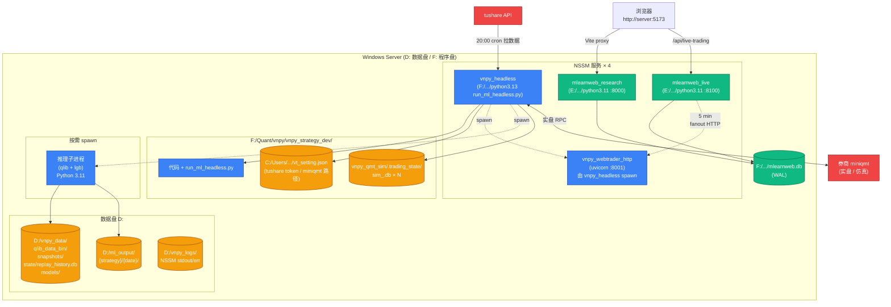

# Windows server 部署指南

把 vnpy_ml_strategy + mlearnweb + 训练管道部署到生产 Windows server, 跑实盘策略.
本文档假定零基础, 给出从空机到生产的**完整 checklist**.

> **状态**: 部分待决议. 跨章节决策点 (凭证管理 / 服务化方案 / 备份策略) 详见
> [`docs/deployment_windows.md`](../../docs/deployment_windows.md) §6 待决议清单.

---

## 0. 部署拓扑总览

### 图 0.1 Windows server 部署拓扑



**端口 / 路径占用**:
| 端口 | 服务 | 说明 |
|---|---|---|
| 2014 / 4102 | vnpy_webtrader RPC (zmq) | 内部, 不对外 |
| 8001 | vnpy_webtrader HTTP REST | mlearnweb fanout 入口 |
| 8000 | mlearnweb research | /api/training-records 等 |
| 8100 | mlearnweb live | /api/live-trading |
| 5173 | mlearnweb 前端 (Vite) | 浏览器访问入口 |

⚠️ 当前 8001 写死, 多机部署需要 reverse proxy 或防火墙限制 (P2-3 待修).

---

## 1. 服务器规格

| 资源 | 最小要求 | 推荐 | 原因 |
|---|---|---|---|
| CPU | 4 核 | 8 核 | 推理子进程 lightgbm 多线程; vnpy + mlearnweb 主进程 |
| RAM | 16 GB | 32+ GB | qlib 推理峰值 4-5 GB; 多策略并发时 N×5GB; 还要留给 OS / IO 缓存 |
| 磁盘 | 200 GB SSD | 500 GB SSD | qlib_data_bin (30GB+) / snapshots (年量 ~20GB) / ml_output / logs / 备份 |
| 网络 | 中国大陆 | 同 | tushare API / 券商 miniqmt RPC / mlearnweb 前端访问 |
| OS | Windows 10/11 Pro / Server 2019+ | Server 2022 | miniqmt 不支持 Linux; PowerShell 5.1+ 需要 |

⚠️ **盘符约定**: 默认 `D:` 数据盘 (qlib bin / snapshots / ml_output / state),
`F:` 程序盘 (vnpy 工程). 改动需同步改 [`run_ml_headless.py`](../../run_ml_headless.py)
中 env 默认值 + 各 setting 路径.

---

## 2. 部署 checklist (按顺序)

> **⚡ 快速通道 (P2-2 一键 IaC bootstrap)**: 如果你只是想最快速度跑起来一个**模拟模式**
> 推理服务器 (sim gateway, 不连真券商), 直接看 [§2.0 一键 bootstrap](#20-一键-bootstrap-推荐) — 单条命令把
> 数据目录 / Python 依赖 / NSSM / NTP / 备份计划任务全装好. 实盘 (live + miniqmt)
> 仍需走 Step 4c + Step 10 手动填凭证.

### 2.0 一键 bootstrap (推荐)

前置 — 这两个**必须**人工先装 (脚本不会装二进制):

| 工具 | 装法 |
|---|---|
| Python 3.13 (vnpy) + 3.11 (推理) | `winget install Python.Python.3.13` 等; 详见 Step 1 |
| NSSM | `choco install nssm` 或下 https://nssm.cc/ |
| 7zip (可选, 备份压缩用) | `choco install 7zip` |

然后:

```powershell
# 1. 拉代码 (两个仓库)
cd F:\Quant\vnpy
git clone --recursive <vnpy-strategy-dev-repo-url> vnpy_strategy_dev
cd vnpy_strategy_dev

# 2. 拷配置文件并填值
copy .env.example .env.production
notepad .env.production   # 至少改: TUSHARE_TOKEN, QMT_ACCOUNT, QMT_CLIENT_PATH

copy config\strategies.example.yaml config\strategies.production.yaml
notepad config\strategies.production.yaml   # 改 bundle_dir 等

# 3. 先跑前置检查 (不动任何状态, 看每条 OK / FAIL)
.\deploy\bootstrap.ps1 -Check

# 4. 全部就绪后 (Administrator), 一键 apply:
.\deploy\bootstrap.ps1 -Apply

# 自定义跳过某些步骤:
.\deploy\bootstrap.ps1 -Apply -SkipNtp -SkipBackupSchedule
```

bootstrap.ps1 干了 7 件事:
1. 前置检查 (Python 解释器 / NSSM / 7zip / .env / yaml / vt_setting.json)
2. 创建数据目录 (`${QS_DATA_ROOT}/{snapshots,state,models,...}`, `${ML_OUTPUT_ROOT}`, `${LOG_ROOT}`, `${BACKUP_ROOT}`)
3. pip install 关键依赖 (vnpy + 推理两套环境)
4. (可选 -SkipNtp 关闭) 调 `configure_ntp.ps1` 配 NTP
5. (可选 -SkipServices 关闭) 调 `install_services.ps1` 装 NSSM 服务
6. (可选 -SkipBackupSchedule 关闭) schtasks 创建每日 02:00 备份任务
7. (可选 -SkipDryRun 关闭) 跑 `import run_ml_headless` dry-run 验证 .env / yaml 配置链

⚠️ **bootstrap 不会**自动:
- 改 `vt_setting.json` 里 tushare token / SMTP 凭据 (Step 4c 手填)
- 拷 bundle (Step 8 训练机 rsync)
- 装 miniqmt 客户端 (Step 10 券商私有流程)
- 跑第一次 daily_ingest (Step 7 上线前手动验证一次)

bootstrap 完成后, 跳到 Step 7 + Step 8 + Step 10 手工补这几项.

### Step 1. 安装 Python 双版本

| Python | 版本 | 用途 | 安装路径 (本仓库默认) |
|---|---|---|---|
| vnpy 主 Python | 3.13 | vnpy 主进程 / 撮合 / 策略 | `F:/Program_Home/vnpy/python.exe` |
| 推理 Python | 3.11 | qlib + lightgbm + mlflow | `E:/ssd_backup/.../python-3.11.0-amd64/python.exe` |

```powershell
# vnpy 主 Python (3.13)
# 从 https://www.python.org/downloads/windows/ 装到 F:\Program_Home\vnpy
# 或用 vnpy 官方虚拟环境

# 推理 Python (3.11)
# 装到 E:\ssd_backup\... 或自定义, 然后 setx
setx INFERENCE_PYTHON "E:\ssd_backup\Pycharm_project\python-3.11.0-amd64\python.exe" /M
```

### Step 2. 拉代码

```powershell
# vnpy 工程 (主仓库 + ml_data_build submodule)
cd F:\Quant\vnpy
git clone --recursive <vnpy-strategy-dev-repo-url> vnpy_strategy_dev
cd vnpy_strategy_dev
git submodule update --init --recursive

# qlib 工程 (跨工程依赖, vendor + 训练侧)
cd F:\Quant\code
git clone --recursive <qlib-strategy-dev-repo-url> qlib_strategy_dev
cd qlib_strategy_dev
git submodule update --init --recursive
```

### Step 3. 安装依赖

```powershell
# vnpy 主进程依赖
cd F:\Quant\vnpy\vnpy_strategy_dev
.\install.bat F:\Program_Home\vnpy\python.exe

# 推理子进程依赖 (qlib + lightgbm + mlflow + sklearn + pandas + pyarrow)
E:\ssd_backup\...\python.exe -m pip install -r F:\Quant\code\qlib_strategy_dev\requirements.txt
# 包括: pyqlib, lightgbm, mlflow, scikit-learn 等

# mlearnweb (后端 + 前端)
cd F:\Quant\code\qlib_strategy_dev\mlearnweb
E:\ssd_backup\...\python.exe -m pip install -r backend/requirements.txt
cd frontend
npm install
npm run build
```

### Step 4. 配置 .env.production (P0-1/P0-2 凭证 + 路径外置)

**4a. 拷贝 .env.example → .env.production** (后者在 .gitignore, 不会被提交):

```powershell
cd F:\Quant\vnpy\vnpy_strategy_dev
copy .env.example .env.production
notepad .env.production
```

**4b. 填实际值**:

```bash
# .env.production 关键字段
TUSHARE_TOKEN=<你的 tushare token>
QMT_ACCOUNT=<券商资金账号>
QMT_CLIENT_PATH=E:/迅投极速交易终端 睿智融科版/userdata_mini

QS_DATA_ROOT=D:/vnpy_data
ML_OUTPUT_ROOT=D:/ml_output
VNPY_MODEL_ROOT=D:/vnpy_data/models
INFERENCE_PYTHON=E:/ssd_backup/Pycharm_project/python-3.11.0-amd64/python.exe

ML_DAILY_INGEST_ENABLED=1                              # 实盘必须 1
STRATEGIES_CONFIG=config/strategies.production.yaml   # 默认值
```

**4c. 设 vt_setting.json 也读 env** (vnpy 框架本身的 datafeed.password 还要填):

```powershell
notepad C:\Users\$env:USERNAME\.vntrader\vt_setting.json
# 改成 (datafeed.password 取 env, 但 vt_setting.json 不支持 ${} 语法,
# 需要部署脚本启动期注入或直接填具体值)
```

⚠️ **加固建议** (上线后 ~2 周升级到 Windows Credential Manager / DPAPI 加密):
- 当前 .env.production 存硬盘, 文件 ACL 限定到运行账户
- 不要 commit (`.gitignore` 已配)
- 不要复制到代码评审工具 / 截屏 / 邮件

### Step 5. 配置数据目录

> 跑了 `bootstrap.ps1 -Apply` 时这步**已完成**, 跳过. 仅手工部署需要.

```powershell
# 数据根 (统一 D:, 路径与 .env.production 一致)
mkdir D:\vnpy_data
mkdir D:\vnpy_data\snapshots\merged
mkdir D:\vnpy_data\snapshots\filtered
mkdir D:\vnpy_data\stock_data
mkdir D:\vnpy_data\state           # [A1+A2] replay_history.db + sim_<gateway>.db 集中
mkdir D:\vnpy_data\models          # bundle 部署目录
mkdir D:\vnpy_data\jq_index        # 聚宽成分股 CSV
mkdir D:\ml_output                 # 策略每日产物
mkdir D:\vnpy_logs                 # [P1-2] loguru rotation 写入
mkdir D:\backups                   # [P1-6] daily_backup.ps1 输出
```

⚠️ **[A2] 状态文件统一到 `D:\vnpy_data\state\`**:
- `replay_history.db` — vnpy 端本地回放权益历史 (A1/B2)
- `sim_<gateway>.db` × N — 模拟柜台状态 (持仓 / 资金 / 订单 / 成交)
- `sim_<gateway>.lock` — [P0-5] PID-stamped lockfile

旧路径 `vnpy_qmt_sim/.trading_state/` **已废弃**. 升级时:
```powershell
mkdir D:\vnpy_data\state -Force
move F:\Quant\vnpy\vnpy_strategy_dev\vnpy_qmt_sim\.trading_state\sim_*.db D:\vnpy_data\state\
# .lock 文件可不动 (重启时自动重建); 改完重启即生效
```

⚠️ **不再需要 setx Machine env** — 所有路径 由 .env.production 提供, 由
`run_ml_headless.py` 启动期 `load_dotenv()` 加载.

### Step 6. 准备聚宽成分股 CSV

CSI300 成分股动态变化, 需要带历史调入调出的 CSV. 默认路径
`D:/vnpy_data/jq_index/hs300_*.csv`. 由聚宽 / Wind / Tushare pro index_member
导出. 详见 [`vnpy_tushare_pro/ml_data_build/data_source.py:OfflineIndexDataSource`](../../vnpy_tushare_pro/ml_data_build/data_source.py).

### Step 7. 首次拉数据 + dump qlib bin

```powershell
# 手动跑一次 daily ingest (而不是等 20:00 cron)
F:\Program_Home\vnpy\python.exe -c "
from vnpy_tushare_pro import TushareDatafeedPro
dp = TushareDatafeedPro()
dp.daily_ingest_pipeline.set_filter_chain_specs({
    'csi300_no_suspend_min_90_days_in_csi300': {
        'schema_version': 1,
        'universe': 'csi300',
        'filter_id': 'csi300_no_suspend_min_90_days_in_csi300',
        'filter_chain': [
            {'name': 'no_suspend',  'class': 'SuspendFilter',          'params': {}},
            {'name': 'min_90_days', 'class': 'NewStockFilter',         'params': {'min_days': 90}},
            {'name': 'in_csi300',   'class': 'IndexConstituentFilter', 'params': {'index_code': '000300.SH'}},
        ],
        'training_filter_parquet_basename': 'csi300_custom_filtered.parquet',
    }
})
result = dp.daily_ingest_pipeline.ingest_today('20260430')
print(result)
"
# 期望: stages_done = ['fetch', 'filter', 'by_stock', 'dump']
# 检查 D:/vnpy_data/qlib_data_bin/calendars/day.txt 末尾日期
```

### Step 8. rsync bundle 到部署机

训练机产出 bundle 后:
```bash
# 训练机 (qlib_strategy_dev)
rsync -avz qs_exports/rolling_exp/<run_id>/ user@deploy_host:D:/vnpy_data/models/<run_id>/
# 或用 SCP / WinSCP
```

bundle 含: `params.pkl, task.json, manifest.json, filter_config.json` (5 个文件).

### Step 9. 配置 strategies.production.yaml (P0-2 路径外置)

```powershell
# 9a. 拷贝 example → production (后者在 .gitignore, 不会被提交)
copy F:\Quant\vnpy\vnpy_strategy_dev\config\strategies.example.yaml ^
     F:\Quant\vnpy\vnpy_strategy_dev\config\strategies.production.yaml
notepad F:\Quant\vnpy\vnpy_strategy_dev\config\strategies.production.yaml
```

**9b. 改三处**:

```yaml
# config/strategies.production.yaml

# 1. gateways: 选实盘 / 模拟 / 双轨 (详见 ../docs/dual_track.md §3)
gateways:
  - kind: live          # 实盘 (改这一行 sim → live)
    name: QMT
    base: qmt_live      # ${QMT_ACCOUNT} / ${QMT_CLIENT_PATH} 自动从 .env 取

# 2. strategies[*].setting_override.bundle_dir: 指向 Step 8 拷过来的目录
strategies:
  - strategy_name: csi300_live
    strategy_class: QlibMLStrategy
    gateway_name: QMT
    setting_override:
      bundle_dir: "${VNPY_MODEL_ROOT}/<run_id_from_step_8>"
      topk: 7
      n_drop: 1
      trigger_time: "21:00"

# 3. (可选) 加双轨影子策略 — 详见 dual_track.md §3 模式 C
```

⚠️ **不再改 run_ml_headless.py 任何代码** — `STRATEGIES` / `GATEWAYS` /
`STRATEGY_BASE_SETTING` 都从 yaml 读, 切环境直接换 yaml 文件. 测试 / 生产 /
影子配置可同时存在 (`strategies.staging.yaml` / `strategies.production.yaml`),
通过 env `STRATEGIES_CONFIG` 切换.

### Step 10. 配置 miniqmt (实盘必须)

```
1. 安装迅投极速交易终端 (券商提供, 比如 国金 / 国泰君安)
2. 客户端登录后, userdata_mini 目录会被创建, 默认 E:\迅投极速交易终端\userdata_mini
3. 把路径填到 run_ml_headless.py QMT_SETTING.客户端路径
4. QMT_SETTING.资金账号 填券商账户号
```

实盘 + 模拟双轨时这步必须. 全模拟 (kind=sim) 跳过.

### Step 11. 启动 vnpy 主进程

```powershell
# 前台跑 (开发 / 测试)
F:\Program_Home\vnpy\python.exe F:\Quant\vnpy\vnpy_strategy_dev\run_ml_headless.py

# 期望日志:
# [headless] add_gateway kind=live name=QMT class=QmtGateway
# [headless] connecting gateway QMT...
# [headless] webtrader RPC server started on tcp://127.0.0.1:2014 / 4102
# [headless] webtrader HTTP server (uvicorn) spawned pid=... on http://127.0.0.1:8001
# [headless] DailyIngestPipeline.filter_chain_specs 已注入 1 个 filter_id
# [headless] adding strategy csi300_live (QlibMLStrategy) -> gateway=QMT
# [headless] 1 个策略已就绪: ['csi300_live']
```

### Step 12. 启动 mlearnweb

```powershell
# 默认双进程 (research:8000 + live:8100) + 前端 (5173)
cd F:\Quant\code\qlib_strategy_dev
.\start_mlearnweb.bat E:\ssd_backup\...\python.exe
# 浏览器打开 http://localhost:5173
```

### Step 13. 配置 mlearnweb 节点

```yaml
# F:/Quant/code/qlib_strategy_dev/mlearnweb/backend/vnpy_nodes.yaml
nodes:
  - node_id: local
    base_url: http://127.0.0.1:8001
    username: vnpy
    password: vnpy
    enabled: true
    mode: live          # 默认安全偏 sim, 实盘机改 live
```

mode 字段决定前端 mode badge 颜色 (live 红 / sim 绿). 改动需重启 mlearnweb live_main.

### Step 13b. 配置告警邮件 (P1-3 Plan A)

vnpy 端 + mlearnweb 端各自独立发邮件 (互补兜底):

**vnpy 端 — 走 vnpy 框架自带 EmailEngine, 凭据放 vt_setting.json**:

```powershell
notepad C:\Users\$env:USERNAME\.vntrader\vt_setting.json
# 加 / 改字段:
#   "email.server":   "smtp.gmail.com"
#   "email.port":     465
#   "email.username": "your_alert@gmail.com"
#   "email.password": "<app password>"  # Gmail 必须用 app password, 不是登录密码
#   "email.sender":   "your_alert@gmail.com"
#   "email.receiver": "you@example.com"
```

vnpy_ml_strategy.services.alerter 启动时自动监听:
- `EVENT_DAILY_INGEST_FAILED` — 20:00 拉数据 / dump qlib bin 失败 (vnpy_tushare_pro 触发)
- `EVENT_ML_METRICS_ALERT` — 21:00 推理 status='failed' 时 (engine.publish_metrics 触发)

去重: 60 min 内同 (event_kind, identifier) 只发 1 封.

**mlearnweb 端 — 走 Python smtplib, 凭据放 backend/.env (P0-1 凭证外置)**:

```powershell
notepad F:\Quant\code\qlib_strategy_dev\mlearnweb\backend\.env
# 加 / 改字段 (.env.example 有完整模板):
#   SMTP_SERVER=smtp.gmail.com
#   SMTP_PORT=465
#   SMTP_USERNAME=your_alert@gmail.com
#   SMTP_PASSWORD=<app password>
#   SMTP_SENDER=your_alert@gmail.com
#   SMTP_RECEIVER=you@example.com
#   SMTP_USE_SSL=true
#
#   WATCHDOG_PROBE_INTERVAL_SECONDS=60
#   WATCHDOG_OFFLINE_THRESHOLD=3       # 连续 3 次 offline 才发邮件 (~3 min 防抖)
```

watchdog_service 启动时自动周期 probe `vnpy_nodes.yaml` 里所有节点 `/api/v1/node/health`:
- 节点连续 N 次 offline → 发 `[mlearnweb 告警] vnpy 节点离线` 邮件 (一次)
- 节点恢复 online → 发 `[mlearnweb 恢复] vnpy 节点重新上线` 邮件 (一次)

⚠️ **两端都不强制要求 SMTP**: 凭据缺失时只 log warn, 业务流不阻断. 但生产建议都填.
两端凭据可以**共用一个发件人 / 应用密码**, 区别仅在配置文件位置不同.

⚠️ **TODO 长期升级**: 接 Uptime Kuma (自托管, 免费) / Healthchecks.io (海外 SaaS) 让外部
监控同时 ping vnpy 主进程 + mlearnweb, 才能覆盖"两端都挂"的场景. 详见
[operations.md §1.3 告警体系](operations.md).

### Step 14. 服务化 (Windows Service)

详见 [operations.md §服务化](operations.md). 推荐 NSSM:

```powershell
# 安装 NSSM
choco install nssm  # 或下 https://nssm.cc/

# 注册 vnpy_headless 服务
nssm install vnpy_headless F:\Program_Home\vnpy\python.exe F:\Quant\vnpy\vnpy_strategy_dev\run_ml_headless.py
nssm set vnpy_headless AppStdout D:\vnpy_logs\vnpy_headless.log
nssm set vnpy_headless AppStderr D:\vnpy_logs\vnpy_headless.err
nssm start vnpy_headless

# 同样注册 mlearnweb_research / mlearnweb_live
```

---

## 3. 部署后验收 checklist

### 3.1 vnpy 端

- [ ] `F:\Program_Home\vnpy\python.exe run_ml_headless.py` 启动无 raise
- [ ] [`docs/deployment_a1_p21_plan.md §六 验证 cmd`](../../docs/deployment_a1_p21_plan.md) 全跑过
- [ ] `D:/vnpy_data/state/replay_history.db` 在跑回放后有数据 (查询: `sqlite3 ... "SELECT COUNT(*) FROM replay_equity_snapshots"`)
- [ ] `D:/ml_output/{strategy}/{T}/selections.parquet` 21:00 后存在
- [ ] sim_db 在 `vnpy_qmt_sim/.trading_state/sim_<gateway>.db` 存在 (sim 模式)
- [ ] miniqmt connected (live 模式, 检查日志 `gateway.connected=True`)

### 3.2 mlearnweb 端

- [ ] http://localhost:5173/live-trading 看到所有策略卡片
- [ ] 卡片右上角 mode badge (live 红 / sim 绿) 与 vnpy_nodes.yaml mode 一致
- [ ] 详情页权益曲线非空, 时间戳更新中
- [ ] http://localhost:5173/ TrainingRecordsPage 看到 deployment chip 关联训练记录
- [ ] mlearnweb 后端 8000 / 8100 端口 listening, 无 ERROR 日志

### 3.3 数据流

- [ ] T 日 20:00 cron 自动跑 daily_ingest, calendar 推进到 T
- [ ] T 日 21:00 cron 自动推理, selections.parquet 生成
- [ ] T+1 日 09:26 cron 自动 rebalance, send_order 发出
- [ ] 真券商成交回报到 on_trade, vnpy_qmt_sim 撮合产生 sim_trades 行
- [ ] mlearnweb sync_loop 拉到数据, 前端实时更新

---

## 4. 部署相关已知不足 (deployment_windows.md 详述)

- **凭证明文**: vt_setting.json tushare token 明文; miniqmt 资金账号写在 setting
- **路径硬编码**: run_ml_headless.py 多处 F:/E:/D: 绝对路径
- **日志无 rotation**: loguru 默认 / NSSM stdout 都不滚动
- **监控告警空白**: 20:00 ingest 失败 / 21:00 推理 raise / 09:26 拒单全静默
- **服务化未自动化**: deploy/install_services.ps1 还没写, 当前手动 NSSM
- **备份策略空**: bundle / mlearnweb.db / sim_db 都没备份
- **NTP 时钟漂移**: A 股 09:26 时间窗严, 默认 Windows NTP 不一定可靠
- **跨工程 mlearnweb.db 历史耦合** ← 已修 (A1/B2)
- **trigger_time 错峰** ← 已加硬校验 (P1-1)
- **实盘/模拟混部** ← 已实现 (P2-1)

详见 [`docs/deployment_windows.md`](../../docs/deployment_windows.md) §1-3 (P0/P1/P2 分级).

---

## 5. 进一步阅读

- [operations.md](operations.md) — 监控 / 故障排查 / 升级
- [`docs/deployment_windows.md`](../../docs/deployment_windows.md) — 部署评估
- [`docs/deployment_a1_p21_plan.md`](../../docs/deployment_a1_p21_plan.md) — A1+P2-1 实施 + 验证
- [dual_track.md](dual_track.md) — 双轨架构 (实盘 + 影子)
