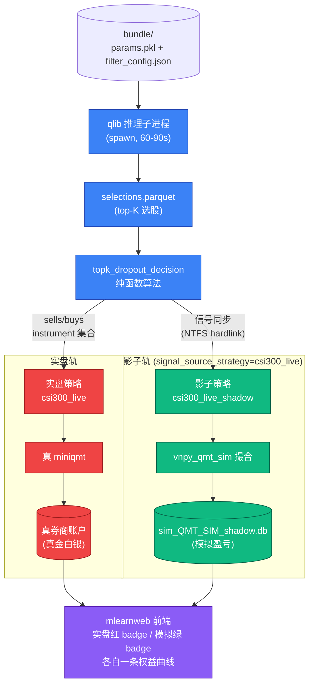
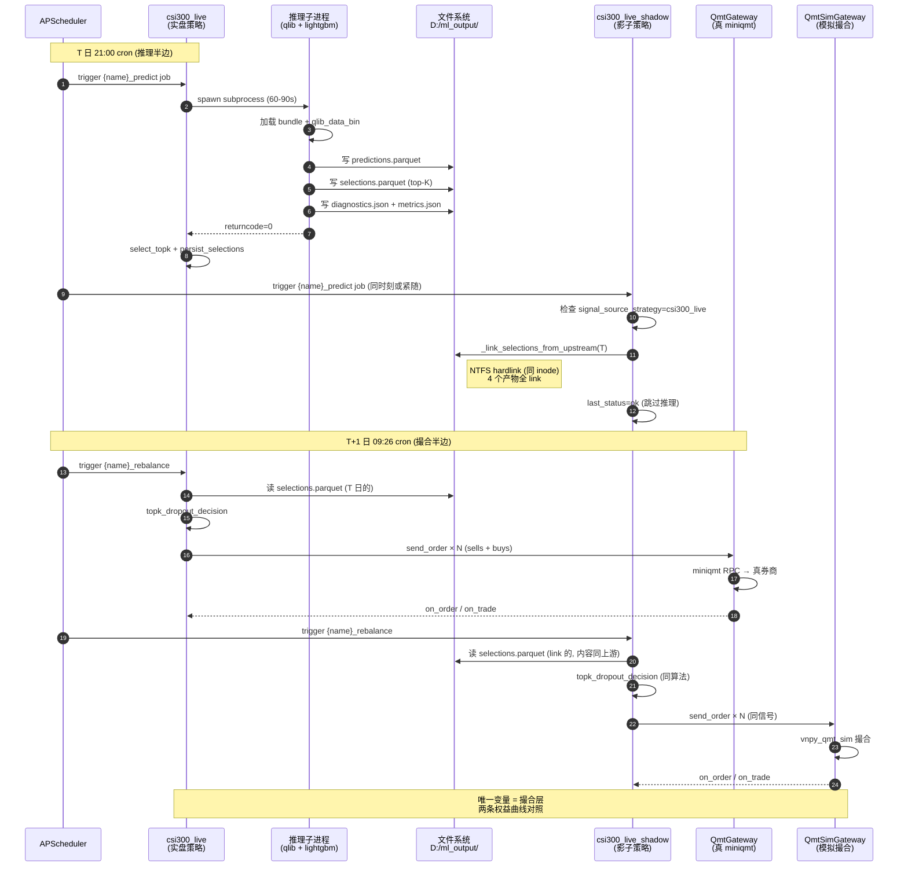
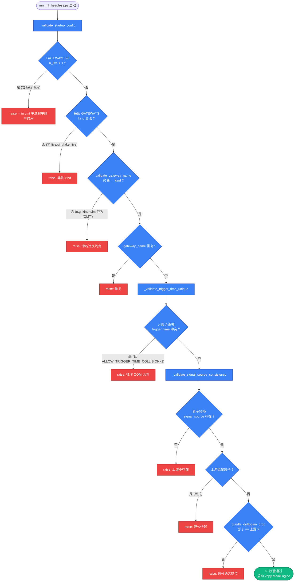
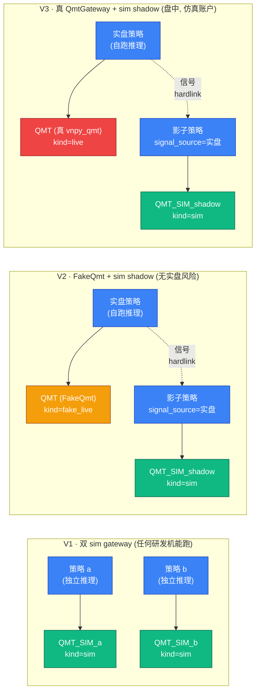

# 实盘 / 模拟双轨架构

> ⭐ **核心文档** — vnpy_ml_strategy 最重要的架构特性. 本文是实盘 / 模拟双轨的
> **完整设计 + 使用指导**, 涵盖原理 / 配置 / 三层验证 (V1 V2 V3) / 故障排查.

---

## 0. 一句话讲清

**双轨架构 = 同一进程内, 同一份策略信号, 两个 gateway 各自撮合, 两条权益曲线
对比.**

### 图 0.1 双轨架构核心图



**唯一变量 = 撮合层** (gateway). 信号 / 算法 / 决策完全相同, 两条曲线之间的差就是
"模拟柜台总误差" — 可定量评估, 可持续监控.

---

## 1. 为什么需要双轨

### 1.1 单纯实盘的问题

- **无法定量评估模拟柜台真实度**: vnpy_qmt_sim 多年积累的撮合规则
  (T+1, 涨跌停, 100 股整数, 手续费, 印花税, 部分成交...) 与真券商有多接近?
  如果只跑实盘, 你永远不知道.

- **回测 vs 实盘差距大时, 无法定位是模型问题还是撮合问题**: 实盘亏损可能因为
  (a) 模型实际泛化差, (b) 撮合滑点, (c) 拒单. 三者无法剥离.

- **新模型 / 参数 A/B 测试只能等长周期**: 想验证 "topk=7 vs topk=5" 哪个好,
  必须各跑 3-6 个月实盘? 浪费机会成本.

### 1.2 单纯模拟的问题

- **不能体现真实成交滑点**: vnpy_qmt_sim 默认假设无滑点 / 全成交, 与现实差距大.

- **没有真券商接口校验**: connect / send_order RPC 链路是否真能走通, 模拟环境
  永远不知道.

### 1.3 双轨的解法

让 **实盘 + 影子 同信号同时跑**, 唯一变量 = 撮合层.

| 对比维度 | 实盘策略 | 影子策略 | 差异源 |
|---|---|---|---|
| 推理 | 21:00 跑 1 次 | 不跑, link 上游 selections | 0 (同信号) |
| 决策 | topk_dropout_decision | 同 | 0 (同算法) |
| 09:26 rebalance | 真 QMT 发单 | sim 发单 | **gateway 路由** |
| 撮合 | miniqmt | vnpy_qmt_sim | **真撮合 vs 模拟撮合** |
| 成交价 | 真券商成交 | 用当日 open (raw_open) | **滑点差异** |
| 拒单 | 真实拒单 | 模拟拒单率 (默认 0) | **拒单差异** |

⇒ **两条权益曲线的差就是"模拟柜台的总误差"**, 可定量评估 / 持续监控.

---

## 2. 设计原理

### 2.1 关键解耦: 信号 vs 撮合

vnpy_ml_strategy 在三处实现了"信号 / 撮合"解耦, 让双轨架构成为可能:

#### (a) 算法解耦: `topk_dropout_decision()` 纯函数

```python
# vnpy_ml_strategy/topk_dropout_decision.py
def topk_dropout_decision(
    pred_score: pd.Series,           # 完整 instrument × score
    current_holdings: List[str],     # 持仓 ts_code
    *,
    topk: int, n_drop: int,
    is_tradable: Callable,           # ← 撮合细节通过 callback 注入, 算法不知
) -> Tuple[List[str], List[str]]:    # → (sell_codes, buy_codes)
```

不依赖 qlib Exchange / Position. 训练 / 回放 / 实盘都调它, 算法严格一致 (Phase 6
e2e bit-equal 测试保证).

#### (b) 数据解耦: `selections.parquet` 文件契约

策略每日推理产物:
```
${ML_OUTPUT_ROOT}/{strategy_name}/{yyyymmdd}/
├── predictions.parquet  ← 全量 (instrument, score)
├── selections.parquet   ← top-K 选股 + weight
├── diagnostics.json     ← rows / status / model_run_id
└── metrics.json         ← ic / psi / pred_mean ...
```

任何策略可以 **跳过推理**, 直接 link 上游 selections.parquet 后从 09:26
rebalance 开始流程. 这就是影子策略的核心机制.

#### (c) 路由解耦: `gateway` 是策略 setting 字段

```python
# vnpy_ml_strategy/template.py
def send_order(self, vt_symbol, direction, ..., gateway=None):
    gw = gateway or self.gateway
    return self.signal_engine.main_engine.send_order(req, gateway_name=gw)
```

策略不关心 gateway 是 live 还是 sim, MainEngine 按 `gateway_name` 路由到对应实例.

### 2.2 影子策略机制

`MLStrategyTemplate.signal_source_strategy` 参数:
- 空 (默认) → 自己跑推理
- 非空 → 跳过推理 + persist, 调 `_link_selections_from_upstream(day)`

```python
# vnpy_ml_strategy/template.py:_link_selections_from_upstream
def _link_selections_from_upstream(self, day: date) -> None:
    src = output_root / self.signal_source_strategy / day_str
    dst = output_root / self.strategy_name / day_str
    for fname in ("selections.parquet", "predictions.parquet",
                  "diagnostics.json", "metrics.json"):
        if (src / fname).exists():
            os.link(src / fname, dst / fname)  # NTFS hardlink → 同 inode
```

**为什么 NTFS hardlink 而不是 copy**:
- 零额外存储 (同 inode)
- 上游产物覆盖 = 影子产物自动同步
- 跨盘 fallback 到 `shutil.copy2`

### 图 2.2 信号同步时序



### 2.3 启动期一致性硬校验

`run_ml_headless._validate_signal_source_consistency()`:

```python
for s in STRATEGIES:
    sso = s["setting_override"].get("signal_source_strategy")
    if not sso:
        continue
    upstream = STRATEGIES[sso]
    # ↓ 三个字段必须严格相等 ↓
    assert upstream.bundle_dir == s.bundle_dir
    assert upstream.topk == s.topk
    assert upstream.n_drop == s.n_drop
    # 链式依赖也禁止
    assert not upstream.signal_source_strategy
```

任一不一致 → `ValueError` 拒绝启动, 避免"信号语义错位"在生产中悄悄发生.

### 图 2.3 启动期硬校验流程



### 2.4 命名 validator 双轨支持

```python
# vnpy_common/naming.py
def classify_gateway(name: str) -> Literal['live', 'sim']:
    if name.startswith("QMT_SIM"):  return "sim"
    if name == "QMT":               return "live"
    raise ValueError(f"违反命名约定: {name}")
```

GATEWAYS 中每条自己的 `kind` 字段决定走哪条命名分支:

| kind | 类 | 命名 expected_class |
|---|---|---|
| `live` | `vnpy_qmt.QmtGateway` | live |
| `sim` | `vnpy_qmt_sim.QmtSimGateway` | sim |
| `fake_live` | `vnpy_ml_strategy.test.fakes.FakeQmtGateway` | live (开发桩) |

启动期: `n_live > 1 → ValueError` (miniqmt 单进程单账户约束).

---

## 3. 三种典型配置

### 模式 A · 全模拟双策略 (默认, 当前 run_ml_headless.py 配置)

```python
GATEWAYS = [
    {"kind": "sim", "name": "QMT_SIM_csi300",   "setting": dict(QMT_SIM_BASE)},
    {"kind": "sim", "name": "QMT_SIM_csi300_2", "setting": dict(QMT_SIM_BASE)},
]
STRATEGIES = [
    {"strategy_name": "csi300_lgb_headless",   "gateway_name": "QMT_SIM_csi300",
     "setting_override": {"bundle_dir": "...f6017...", "topk": 7, "n_drop": 1, "trigger_time": "21:00"}},
    {"strategy_name": "csi300_lgb_headless_2", "gateway_name": "QMT_SIM_csi300_2",
     "setting_override": {"bundle_dir": "...c38e6c...", "topk": 7, "n_drop": 1, "trigger_time": "21:15"}},
]
```

- 两策略各跑各自推理, 各自独立 sim_db, 用不同 bundle 比较谁好
- 适用: 多模型 A/B 评估

### 模式 B · 实盘单策略 (生产环境)

```python
GATEWAYS = [{"kind": "live", "name": "QMT", "setting": QMT_SETTING}]
STRATEGIES = [{
    "strategy_name": "csi300_live", "gateway_name": "QMT",
    "setting_override": {"bundle_dir": "...", "topk": 7, "n_drop": 1, "trigger_time": "21:00"},
}]
```

- 真金白银, 严肃运维 (监控 / 告警 / 备份必备, 见 [operations.md](operations.md))

### 模式 C · 实盘 + 同信号影子 (双轨核心)

```python
GATEWAYS = [
    {"kind": "live", "name": "QMT",                    "setting": QMT_SETTING},
    {"kind": "sim",  "name": "QMT_SIM_csi300_shadow",  "setting": dict(QMT_SIM_BASE)},
]
STRATEGIES = [
    {
        "strategy_name": "csi300_live",
        "gateway_name": "QMT",
        "setting_override": {
            "bundle_dir": "...", "topk": 7, "n_drop": 1, "trigger_time": "21:00",
        },
    },
    {
        "strategy_name": "csi300_live_shadow",
        "gateway_name": "QMT_SIM_csi300_shadow",
        "setting_override": {
            "bundle_dir": "...",  # ← 必须与 csi300_live 一致
            "topk": 7, "n_drop": 1,  # ← 必须与 csi300_live 一致
            "signal_source_strategy": "csi300_live",  # ← 关键: 复用上游 selections
            # trigger_time 不写 (影子不跑推理, 直接 link)
        },
    },
]
```

启动后:
- 21:00 csi300_live 跑推理 → `D:/ml_output/csi300_live/T/selections.parquet`
- 21:00 csi300_live_shadow 也触发 cron, 但因 `signal_source_strategy=csi300_live`, 跳过推理
  → 立即 link 上游产物 → `D:/ml_output/csi300_live_shadow/T/selections.parquet` (hardlink)
- 09:26 两策略都触发 rebalance, 各自读自己的 selections.parquet (内容相同)
  → 各自 send_order 到不同 gateway
- mlearnweb 前端两条曲线: 实盘 (红 badge) + 模拟 (绿 badge)

---

## 4. 三层验证 V1 / V2 / V3

不依赖真实盘环境也能验证双轨架构. 三层递进:

### 图 4.0 V1/V2/V3 三模式对比



**三层递进**:
| 层 | 实盘环境 | 测试 | 验证范围 | 用例数 |
|---|---|---|---|---|
| V1 | 不需要 | `test_dual_gateway_routing.py` | 多 Gateway 路由 / DB 隔离 / 命名 validator | 5 |
| V2 | 不需要 | `test_dual_track_with_fake_live.py` | + 启动期校验 + 信号同步 byte-equal | 9 |
| V3 | 需要券商仿真账户 + 盘中 | `run_dual_track_demo.py --mode v3` | + 真 RPC connect/send_order/回报 | 5 (TODO) |

V1+V2 已经覆盖**架构 + 代码**所有 bug 风险, V3 仅是"接口契约层最后一公里".

### 4.1 V1 · 双 sim gateway 验证多 Gateway 路由架构

**目标**: 验证多 Gateway 架构的核心路由逻辑 — 与 gateway 类型无关. **sim+sim
跑通就证明 live+sim 也能跑通**.

**测试**: [`vnpy_ml_strategy/test/test_dual_gateway_routing.py`](../test/test_dual_gateway_routing.py)
(5 用例)

| 用例 | 覆盖风险 |
|---|---|
| `test_dual_sim_gateway_db_isolated` | R3: 持仓+资金 SQLite 物理隔离 |
| `test_send_order_routes_to_correct_gateway` | R2: send_order 路由正确 (sim_orders 表只在目标 gw) |
| `test_naming_validator_dual_sim` | R4: 命名 validator 双 sim 各自合规 |
| `test_event_engine_isolation_no_cross_event` | R1: EventEngine 同时挂两 gateway 不串味 |
| `test_dual_sim_concurrent_settle_isolation` | R5: settle_end_of_day 隔离 |

**运行**:
```bash
F:/Program_Home/vnpy/python.exe -m pytest \
  vnpy_ml_strategy/test/test_dual_gateway_routing.py -v
# 期望: 5 passed
```

**典型场景**: 不需要装 vnpy_qmt, 任何研发机都能跑.

### 4.2 V2 · FakeQmtGateway 验证 live+sim 双轨启动流

**目标**: 用 `FakeQmtGateway` (default_name="QMT", 命名走 live, 内核为
QmtSimGateway) 替代真 miniqmt, 验证启动流程 + signal_source_strategy 信号同步.

**为什么需要 V2**: V1 都是 sim, 没有走过命名 validator 的 live 分支.
`run_ml_headless._validate_startup_config` 中 "n_live > 1 raise" / "QMT 名分配
sim kind raise" 等校验, 必须 V2 才能覆盖.

**测试**: [`vnpy_ml_strategy/test/test_dual_track_with_fake_live.py`](../test/test_dual_track_with_fake_live.py)
(9 用例)

| 用例 | 覆盖 |
|---|---|
| `test_naming_validator_dual_track` | live + sim 各自命名分支 |
| `test_validate_startup_config_dual_track_passes` | `[fake_live, sim]` 混部启动通过 |
| `test_validate_rejects_two_live_gateways` | 双 live raise (miniqmt 单账户) |
| `test_signal_source_consistency_passes_when_aligned` | 一致性 4 字段对齐通过 |
| `test_signal_source_consistency_rejects_bundle_mismatch` | bundle_dir 不一致 raise |
| `test_signal_source_consistency_rejects_topk_mismatch` | topk 不一致 raise |
| `test_signal_source_consistency_rejects_chain_dependency` | 链式依赖 raise |
| `test_signal_source_byte_equal` | **核心**: 影子 link 后 selections.parquet **md5 == 上游 md5** |
| `test_fake_qmt_gateway_drop_in_replaceable` | FakeQmt 接口 drop-in 替换 |

**运行**:
```bash
F:/Program_Home/vnpy/python.exe -m pytest \
  vnpy_ml_strategy/test/test_dual_track_with_fake_live.py -v
# 期望: 9 passed
```

**典型场景**: 研发机 + qlib 数据, 但还没接入真券商. V2 给出启动 / 信号同步层
面的 100% 信心.

### 4.3 V3 · 真券商仿真账户 (盘中验证)

**目标**: 用券商提供的 miniqmt 仿真账户跑真 `vnpy_qmt.QmtGateway`, 验证:
- connect 阶段成功 (gateway.connected=True)
- send_order 经 RPC 发到券商, broker 回 OrderID
- on_order / on_trade 回报路由到 QlibMLStrategy 正确
- 双轨混部时 sim shadow 与真 QmtGateway 互不干扰
- mlearnweb 前端实盘 badge (live 红色) 正确显示

**前置**: 用户已开通仿真账户. 仿真柜台**仅交易时段** (09:30-15:00 工作日) 可用.

**测试方法**: 把模式 C 配置中 GATEWAYS 第一项 `kind="live"` 实际生效, `setting`
填仿真账号 + 客户端路径:

```python
GATEWAYS = [
    {"kind": "live", "name": "QMT", "setting": {
        "资金账号": "YOUR_PAPER_ACCOUNT",
        "客户端路径": r"E:\迅投极速交易终端 睿智融科版\userdata_mini",
    }},
    {"kind": "sim",  "name": "QMT_SIM_csi300_shadow", "setting": dict(QMT_SIM_BASE)},
]
```

**TODO 验收清单** (盘中执行, 记录结果到 [`docs/deployment_a1_p21_plan.md`](../../docs/deployment_a1_p21_plan.md) §三.2):
- [ ] V3.1 真 QmtGateway connect 成功 (gateway.connected=True)
- [ ] V3.2 send_order 经 RPC 发到券商, broker 回 OrderID 正常
- [ ] V3.3 on_order / on_trade 回报路由到 QlibMLStrategy 正确
- [ ] V3.4 双轨混部时 FakeQmt 路径与真 QmtGateway 路径互不干扰
- [ ] V3.5 mlearnweb 前端实盘 badge (live 红色) 正确显示

---

## 5. 使用指导 (Step-by-step)

### 5.1 一键演示脚本 (V1 / V2 / V3 都支持)

仓库提供 [`run_dual_track_demo.py`](../../run_dual_track_demo.py) 一键脚本, 选好
`--mode` 即可跑:

```bash
# V1: 双 sim, 验证多 Gateway 路由
F:/Program_Home/vnpy/python.exe run_dual_track_demo.py --mode v1

# V2: FakeQmt (live) + sim shadow, 验证启动 + 信号同步
F:/Program_Home/vnpy/python.exe run_dual_track_demo.py --mode v2

# V3: 真 QmtGateway (live) + sim shadow, 盘中跑 (需先配置 QMT_SETTING)
F:/Program_Home/vnpy/python.exe run_dual_track_demo.py --mode v3
```

脚本特性:
- 启动前自动清理状态 (`reset_sim_state.py --all`)
- 自动 spawn webtrader uvicorn (8001 端口)
- 自动配置 `signal_source_strategy` 影子链路
- 提示如何启动 mlearnweb 端 (`start_mlearnweb.bat`)
- 跑完后给出验证 cmd (sim_db 行数检查 / selections.parquet md5 比对 / 前端访问入口)

### 5.2 手动配置 (在 run_ml_headless.py 中)

如果不想用 demo 脚本, 直接改 `run_ml_headless.py` 顶部的 `GATEWAYS` + `STRATEGIES`
两个数组:

```python
# 1. 选模式
USE_MODE = "C"   # A 全模拟双策略 / B 实盘单策略 / C 实盘+影子双轨

# 2. GATEWAYS
if USE_MODE == "A":
    GATEWAYS = [
        {"kind": "sim", "name": "QMT_SIM_csi300",   "setting": dict(QMT_SIM_BASE_SETTING)},
        {"kind": "sim", "name": "QMT_SIM_csi300_2", "setting": dict(QMT_SIM_BASE_SETTING)},
    ]
elif USE_MODE == "B":
    GATEWAYS = [{"kind": "live", "name": "QMT", "setting": QMT_SETTING}]
elif USE_MODE == "C":
    GATEWAYS = [
        {"kind": "live", "name": "QMT",                    "setting": QMT_SETTING},
        {"kind": "sim",  "name": "QMT_SIM_csi300_shadow",  "setting": dict(QMT_SIM_BASE_SETTING)},
    ]

# 3. STRATEGIES (按模式配)
# ... 详见 §3
```

### 5.3 启动顺序 (生产 / 研发都一样)

```bash
# 1. 清旧状态 (可选, 干净起点)
F:/Program_Home/vnpy/python.exe scripts/reset_sim_state.py --all

# 2. 启 vnpy 主进程
F:/Program_Home/vnpy/python.exe run_ml_headless.py
# 或 demo:
F:/Program_Home/vnpy/python.exe run_dual_track_demo.py --mode c

# 3. 启 mlearnweb 双 uvicorn + 前端
cd /f/Quant/code/qlib_strategy_dev
start_mlearnweb.bat E:/ssd_backup/Pycharm_project/python-3.11.0-amd64/python.exe

# 4. 浏览器访问
http://localhost:5173/live-trading
# 期望: 看到两个策略, 各自一条曲线, mode badge 区分实盘/模拟
```

### 5.4 验证 checklist

启动 ~5 分钟后 (sync_loop 至少跑 1 次):

```bash
# (a) sim_db 物理隔离
sqlite3 F:/Quant/vnpy/vnpy_strategy_dev/vnpy_qmt_sim/.trading_state/sim_QMT_SIM_csi300_shadow.db \
  "SELECT COUNT(*) FROM sim_trades"

# (b) 信号同步字节级 (模式 C)
python -c "
import hashlib
days = ['20260427', '20260428', '20260429', '20260430']
for d in days:
    a = open(f'D:/ml_output/csi300_live/{d}/selections.parquet', 'rb').read()
    b = open(f'D:/ml_output/csi300_live_shadow/{d}/selections.parquet', 'rb').read()
    print(d, 'EQUAL' if hashlib.md5(a).hexdigest() == hashlib.md5(b).hexdigest() else 'DIFFER (BUG)')
"
# 期望: 全部 EQUAL

# (c) mlearnweb.db 拉到 replay 数据 (回放模式)
sqlite3 F:/Quant/code/qlib_strategy_dev/mlearnweb/backend/mlearnweb.db \
  "SELECT strategy_name, COUNT(*) FROM strategy_equity_snapshots WHERE source_label='replay_settle' GROUP BY strategy_name"
# 期望: 两策略各自有行

# (d) 前端 mode badge
# 浏览器: http://localhost:5173/live-trading → 卡片右上角红/绿 Badge
```

---

## 6. 关键决策 + 常见问题

### Q1: 影子策略为什么不也用真 miniqmt 而要用 sim?

A: 因为 miniqmt 单进程单账户 — 同时挂两个真 QmtGateway 会冲突. 即使券商支持
多账户, 也是单实例多 connect. 影子用 sim 是为了 **撮合层独立** 而不是账户层.

### Q2: 为什么不让影子也跑自己的推理 (异步信号)?

A: 推理是 deterministic 的 — 同 bundle / 同 lookback / 同 live_end 算出的
pred_score 相同. 但浪费 ~5GB 内存 + 90s 子进程时间, 没收益. 同步信号 (link) 唯
一缺点是上游推理失败时影子也跑不了, 但上游失败时实盘也无信号, 影子跟着停才是
对的.

### Q3: 上游推理失败影响影子吗?

A: 是. `_link_selections_from_upstream` 检测 src 不存在 → `last_status='empty'`
不 raise. 09:26 rebalance 看到无 selections.parquet → 不下单. 当日影子停摆,
等次日上游恢复.

### Q4: 影子的 mlearnweb 监控指标 (ic / psi) 哪来?

A: 影子 `_link_selections_from_upstream` 也 link 上游 `metrics.json`. 但
mlearnweb 端 `ml_snapshot_loop` 是按 strategy_name 拉的, 影子的 metrics 来源是
"link 自上游". 历史层面看到的 ic 与上游一致 (本来就是同信号).

### Q5: 双 live 配置可不可以? 比如多账户多策略?

A: 当前 `_validate_startup_config` 限制 `n_live ≤ 1` (miniqmt 单进程单账户约束).
真要多账户, 需要 (a) 跨进程: 每账户单独跑 run_ml_headless.py 进程, mlearnweb
fanout 看作多节点; (b) miniqmt 多账户支持: 看券商 SDK 文档, 目前主流不支持.

### Q6: sim gateway 的撮合规则与真券商有多接近?

A: 见 [`docs/a_share_sim_logic.md`](../../docs/a_share_sim_logic.md). 已实现:
T+1 持仓隔离 / 涨跌停拒单 / 100 股整数倍 LONG-only / 手续费 / 印花税 / 部分成交
率 / 拒单率 / 订单超时 / pct_chg mark-to-market (含除权) / 跨日持久化.
未实现: 集合竞价细节 / 大单冲击成本.

### Q7: V3 必须做吗?

A: V1 + V2 已经覆盖**架构层面 + 代码层面**所有 bug. V3 仅是**接口契约层面**
最后一公里 — connect/send_order/on_order RPC 真能走通. 如果上线前确实没机会跑
V3, 做完 V1+V2 上实盘后**第一周强监控** + 准备紧急回滚预案即可.

### Q8: 切回单实盘怎么做?

A: 改 GATEWAYS 删影子那条, STRATEGIES 删影子策略. 如果想保留历史 sim_db /
ml_output, 就让它们留着 — 不会被新启动覆盖 (各自 strategy_name 隔离).

---

## 7. 进一步阅读

- [`docs/deployment_a1_p21_plan.md`](../../docs/deployment_a1_p21_plan.md) §三 — P2-1 完整决策依据
- [`vnpy_ml_strategy/template.py`](../template.py) `_link_selections_from_upstream` 实现
- [`run_ml_headless.py`](../../run_ml_headless.py) `_validate_startup_config` / `_validate_signal_source_consistency`
- [`vnpy_ml_strategy/test/fakes/fake_qmt_gateway.py`](../test/fakes/fake_qmt_gateway.py) FakeQmt 替身实现
- [operations.md](operations.md) §故障排查 — 双轨场景下常见问题诊断
