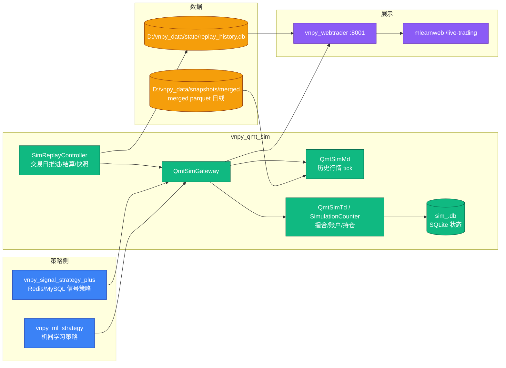

# vnpy_qmt_sim 工程文档

`vnpy_qmt_sim` 是 vn.py 工程内的 **A 股模拟柜台 App**。它提供与真实 QMT
网关相同的下单、成交、持仓、账户事件形态，同时用本地历史行情和 SQLite 状态
实现可重复的模拟撮合、日终结算和历史回放。

它的定位不是策略本身，而是策略验证基础设施：

- 实盘策略可以直接切换 gateway 到 `QMT_SIM` 做近实盘验证。
- 聚宽/Redis/MySQL 信号策略可以按历史信号日推进模拟柜台。
- 机器学习策略可以在同一套模拟柜台上做 batch 历史回放。
- WebTrader/mlearnweb 可以读取模拟账户、持仓、成交和权益曲线。

---

## 顶层全景图



---

## 文档索引

| 角色 | 推荐文档 | 内容 |
|---|---|---|
| 策略开发者 | [architecture.md](architecture.md) | 组件职责、下单/撮合/结算/回放原理 |
| 回放链路维护者 | [plan/sim_replay_controller_plan.md](plan/sim_replay_controller_plan.md) | 本轮通用回放控制器重构方案 |
| 测试人员 | [../test](../test) | `SimReplayController` 单元测试 |
| 跨工程对接 | [architecture.md §数据流](architecture.md#数据流) | WebTrader/mlearnweb/replay_history 关系 |

---

## 核心代码结构

```text
vnpy_qmt_sim/
├── gateway.py              QmtSimGateway: vn.py Gateway 入口
├── md.py                   QmtSimMd: 历史行情转 TickData
├── td.py                   QmtSimTd / SimulationCounter: 委托、成交、账户、持仓
├── persistence.py          QmtSimPersistence: sim_<gateway>.db 持久化
├── history_positions.py    WebTrader 查询模拟持仓辅助
├── bar_source/
│   ├── base.py             SimBarSource / BarQuote 协议
│   ├── registry.py         行情源注册
│   └── merged_parquet_source.py  merged parquet 日线行情源
├── replay/
│   ├── controller.py       SimReplayController: 通用回放控制器
│   ├── snapshot.py         replay_history.db 权益快照
│   └── acceptance.py       重构前后结果捕获/对比工具
├── docs/
│   ├── README.md
│   ├── architecture.md
│   └── plan/
└── test/
    └── test_sim_replay_controller.py
```

---

## 快速使用

### 1. 作为普通模拟柜台启动

```python
main_engine.add_gateway(QmtSimGateway, gateway_name="QMT_SIM")
main_engine.connect({
    "模拟资金": 1000000.0,
    "行情源": "merged_parquet",
    "merged_parquet_merged_root": "D:/vnpy_data/snapshots/merged",
    "merged_parquet_reference_kind": "today_open",
    "启用持久化": "是",
    "持久化目录": "D:/vnpy_data/state",
}, "QMT_SIM")
```

### 2. 聚宽 Redis/MySQL 近实盘回放

策略侧使用 `vnpy_signal_strategy_plus.replay_adapter.StockTradeSignalReplayAdapter`
消费 `stock_trade`，控制器按 `remark` 动态推进交易日：

```text
聚宽 -> Redis -> bridge -> MySQL stock_trade -> SignalAdapter -> QMT_SIM
```

### 3. ML 历史回放

`run_ml_headless.py` 仍是 ML 策略入口。sim gateway 策略启动后，
`vnpy_ml_strategy.replay_adapter.MLStrategyReplayAdapter` 会调用
`SimReplayController.run_explicit(start, end, adapter)` 逐交易日回放。

### 4. 验收 capture/compare

```powershell
F:\Program_Home\vnpy\python.exe -m vnpy_qmt_sim.replay.acceptance capture `
  --label pre_refactor `
  --strategies etf_rotation_basic,csi300_lgb_headless,csi300_lgb_headless_2

F:\Program_Home\vnpy\python.exe -m vnpy_qmt_sim.replay.acceptance run `
  --baseline F:\Quant\vnpy\vnpy_strategy_dev\artifacts\replay_acceptance\pre_refactor_20260510_133032 `
  --scenario three_strategy_live_page --compare
```

---

## 维护原则

- `vnpy_qmt_sim` 只关心模拟柜台、行情、撮合、结算和回放时钟。
- 不在 `vnpy_qmt_sim` 里 import 业务策略包，避免反向依赖。
- 策略来源差异由 adapter 处理：Redis/MySQL、CSV、ML 产物都不进入控制器。
- 回放期间必须禁用 gateway 自然日 auto-settle，结束后恢复。
- 每个交易日都要写权益快照，即使没有交易。
