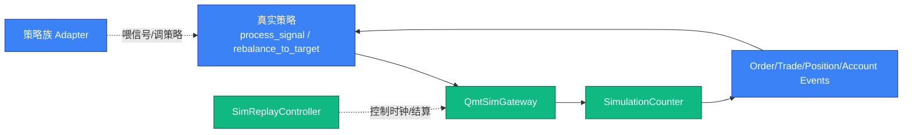
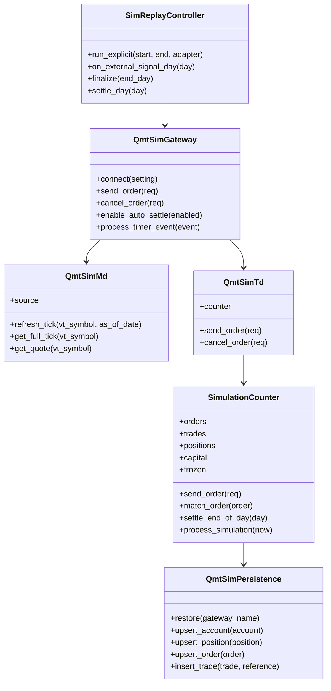
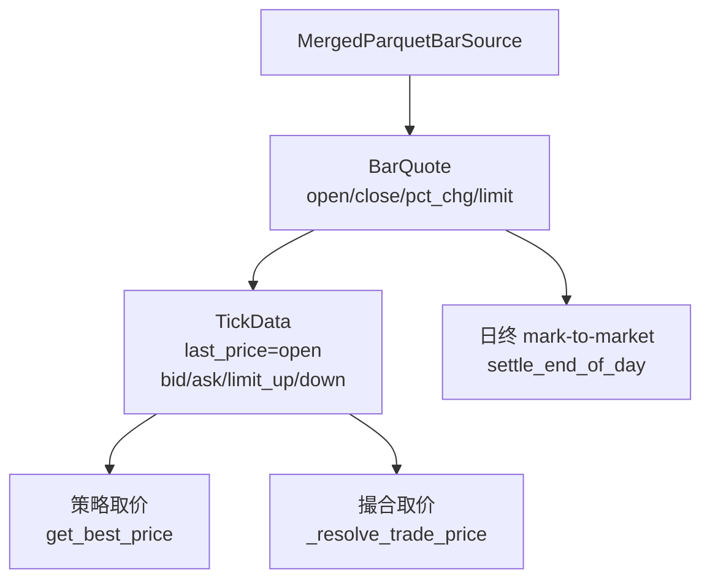
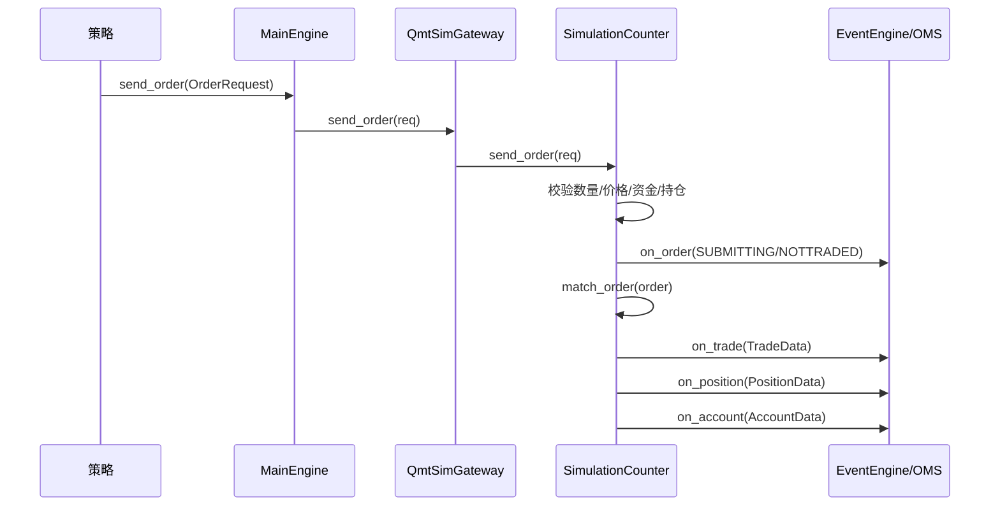
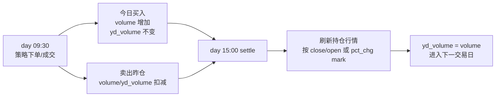
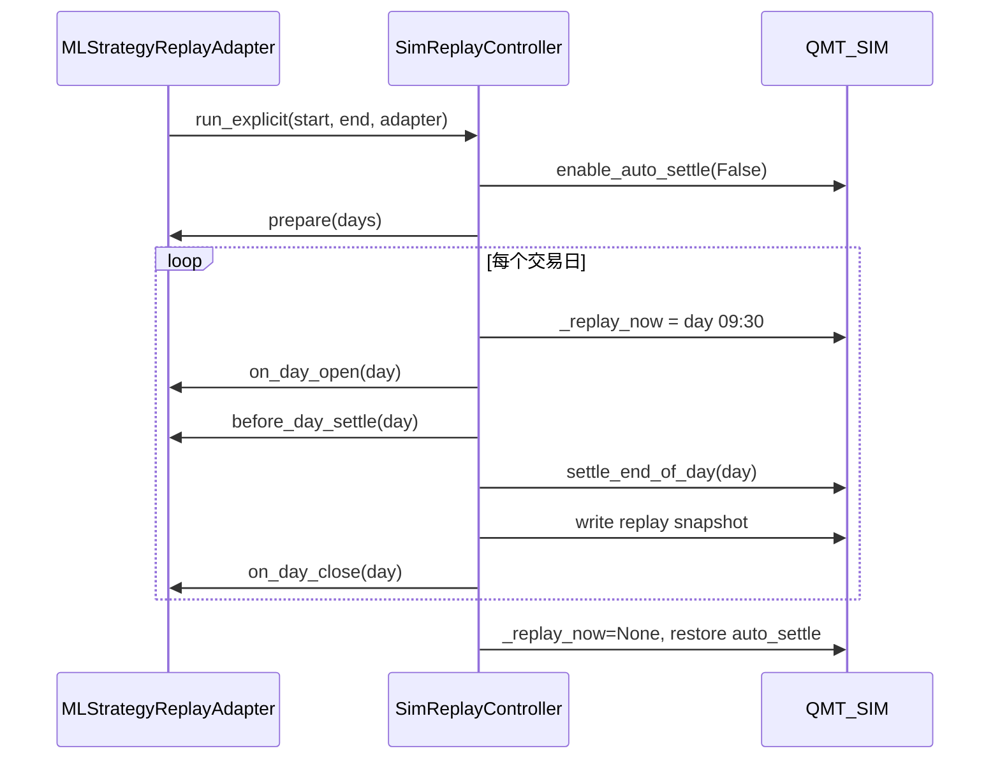
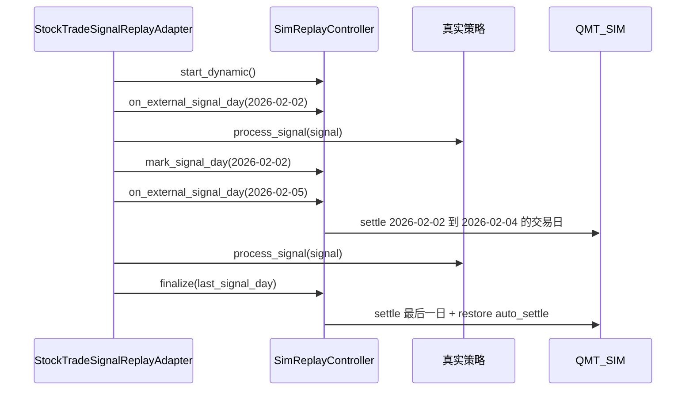

# vnpy_qmt_sim 架构文档

`vnpy_qmt_sim` 是面向 A 股策略开发和验收的模拟柜台。它在 vn.py 的 Gateway
抽象下提供行情、交易、持久化和历史回放能力，使真实策略能够在本地模拟环境中
完成接近实盘的撮合验证。

本文从原理、架构、开发、维护、使用五个角度描述这个 app。

---

## 1. 设计目标

### 1.1 为什么需要 QMT_SIM

真实 QMT 柜台适合最终实盘验证，但不适合反复跑历史链路测试：

- 真实柜台只处理当前交易日，不能自然回放历史交易日。
- 策略回归需要可重复的成交、持仓、账户和权益曲线。
- 聚宽/Redis/MySQL 信号链路、ML replay 链路都需要“只替换柜台即可实盘化”的验证环境。

`QMT_SIM` 的原则是：策略侧尽量不感知自己在测试，网关侧模拟真实柜台事件。

### 1.2 边界



`vnpy_qmt_sim` 负责：

- 行情引用价。
- 委托校验。
- 同步或延迟撮合。
- 账户现金、冻结资金、持仓数量、昨仓/今仓。
- T+1 日终结算。
- SQLite 持久化。
- 回放时钟和权益快照。

策略包负责：

- 信号来源。
- 仓位算法。
- 下单决策。
- 业务字段解释。

---

## 2. 组件架构

### 2.1 组件关系



### 2.2 数据目录

| 数据 | 默认路径 | 说明 |
|---|---|---|
| 模拟柜台状态 | `D:/vnpy_data/state/sim_<gateway>.db` | 账户、持仓、委托、成交 |
| 回放权益 | `D:/vnpy_data/state/replay_history.db` | mlearnweb 权益曲线来源 |
| merged 行情 | `D:/vnpy_data/snapshots/merged` | 开盘价、收盘价、涨跌停、pct_chg |

---

## 3. 行情原理

`QmtSimMd` 把日线数据转换为 vn.py `TickData`。回放时，控制器或 adapter 会显式调用：

```python
gateway.md.refresh_tick("510300.SSE", as_of_date=day)
```

`merged_parquet_reference_kind = today_open` 时，撮合参考价是当日原始 open。



如果历史行情缺失，`QmtSimMd` 会退化为合成 tick。正式验收时应尽量保证
`D:/vnpy_data/snapshots/merged` 覆盖回放区间。

---

## 4. 撮合与账户原理

### 4.1 下单流程



默认是同步成交；也支持通过 `成交延迟毫秒`、`报单上报延迟毫秒`、case tag
模拟延迟成交、拒单、部分成交。

### 4.2 A 股规则

- 买入数量必须是 100 股整数倍。
- 卖出允许零股一次性卖出。
- 卖出检查昨仓 `yd_volume`，今日买入不可当日卖出。
- 买入冻结现金，卖出冻结可用昨仓。
- 成交后更新持仓和现金。

### 4.3 日终结算

`settle_end_of_day(day)` 做两件事：

- 把今日买入转为下一交易日可卖昨仓。
- 用当日行情把持仓 mark-to-market。



---

## 5. 回放控制器

### 5.1 设计原则

`SimReplayController` 只做模拟柜台通用编排：

- 禁用/恢复 gateway auto-settle。
- 设置 `_replay_now`。
- 推进交易日。
- 刷新当前持仓行情。
- 调用 `settle_end_of_day(day)`。
- 写 `replay_history.db`。

它不关心信号来自 Redis、CSV、MySQL 还是 ML 模型。

### 5.2 显式窗口模式

显式窗口模式适合 ML 策略，因为回放开始前可以从配置或 bundle 推导完整区间。



### 5.3 动态信号模式

动态信号模式适合聚宽回测，因为本地事前不知道完整回测区间，只能随着
`stock_trade.remark` 到达逐步推进。



---

## 6. 与策略包的协作

### 6.1 Signal 策略链路

```text
聚宽 / CSV
  -> Redis Stream
  -> redis_to_mysql_bridge
  -> MySQL stock_trade
  -> StockTradeSignalReplayAdapter
  -> 真实 MySQLSignalStrategyPlus.process_signal()
  -> QMT_SIM
```

adapter 负责：

- `stock_trade` 查询和排序。
- `empty`、`amt`、`raw_payload` 原样传给策略。
- 每条信号前刷新对应股票的当日行情。
- 成功处理后标记 `processed=true`。

### 6.2 ML 策略链路

```text
run_ml_headless.py
  -> MLEngine
  -> QlibMLStrategy
  -> MLStrategyReplayAdapter
  -> SimReplayController
  -> QMT_SIM
```

ML adapter 保留原有语义：

- 先 batch predict。
- `day[i-1]` 预测用于 `day[i]` 开盘 rebalance。
- `day[i]` 预测在当天 apply，作为下一交易日依据。
- 每日 settle 后写 replay equity。

---

## 7. 开发指南

### 7.1 新增行情源

实现 `SimBarSource` 协议并注册到 `bar_source.registry`：

```python
class MyBarSource(SimBarSource):
    name = "my_source"

    def get_quote(self, vt_symbol: str, as_of_date: date) -> BarQuote | None:
        ...
```

配置里使用：

```json
{
  "行情源": "my_source",
  "my_source_root": "D:/data"
}
```

### 7.2 新增策略族回放

不要把业务包 import 到 `vnpy_qmt_sim`。新策略族应在自己的包中实现 adapter：

```python
class MyReplayAdapter:
    strategy_name: str
    gateway_name: str

    def prepare(self, days): ...
    def on_day_open(self, day): ...
    def before_day_settle(self, day): ...
    def on_day_close(self, day): ...
```

然后调用：

```python
controller = SimReplayController(gateway, strategy_name=name, is_trade_day=calendar.is_trade_day)
controller.run_explicit(start, end, adapter)
```

### 7.3 持久化字段维护

修改 `SimulationCounter` 的账户、持仓、委托、成交字段时，需要同步检查：

- `persistence.py` schema。
- WebTrader 查询接口。
- acceptance 导出和对比。
- mlearnweb 前端是否依赖字段。

---

## 8. 运维与排障

### 8.1 常见状态文件

```powershell
Get-ChildItem D:\vnpy_data\state\sim_QMT_SIM*.db
Get-ChildItem D:\vnpy_data\state\replay_history.db
```

### 8.2 sim db 被占用

如果出现持久化文件被占用，先确认没有残留 vnpy 进程：

```powershell
Get-Process python | Where-Object { $_.Path -like '*F:\Program_Home\vnpy*' }
```

确认可以清理测试状态后再删除对应 sim db。不要误删正在实盘使用的状态文件。

### 8.3 权益曲线没有无交易日

检查是否通过 `SimReplayController` 运行。如果策略自己消费历史信号但没有调用
controller 的 `settle_day()`，无信号日不会写 replay snapshot。

### 8.4 成交价异常

检查：

- `merged_parquet_merged_root` 是否覆盖回放日期。
- `merged_parquet_reference_kind` 是否为 `today_open`。
- adapter 是否在下单前调用了 `refresh_tick(vt_symbol, as_of_date=day)`。

---

## 9. 测试与验收

单元测试位于：

```text
vnpy_qmt_sim/test/test_sim_replay_controller.py
```

运行：

```powershell
F:\Program_Home\vnpy\python.exe -m pytest vnpy_qmt_sim\test\test_sim_replay_controller.py -q --basetemp .pytest_tmp
```

重构前后验收工具：

```powershell
F:\Program_Home\vnpy\python.exe -m vnpy_qmt_sim.replay.acceptance capture --label pre_refactor
F:\Program_Home\vnpy\python.exe -m vnpy_qmt_sim.replay.acceptance run --baseline <baseline_dir> --compare
```

验收对比关注：

- `sim_orders`
- `sim_trades`
- `sim_positions`
- `sim_accounts`
- `replay_equity_snapshots`
- `strategy_equity_snapshots`
- `stock_trade`
