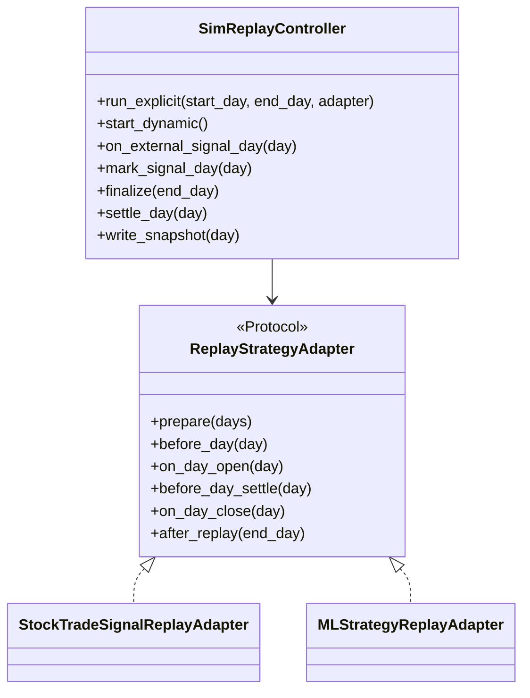
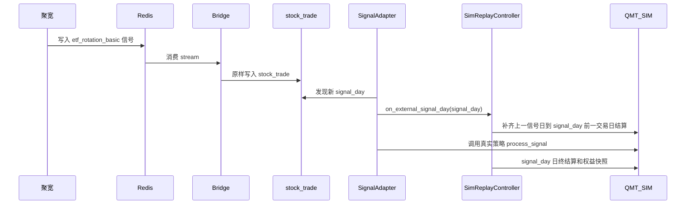

# 通用模拟回放控制器重构方案

## Summary

本方案把历史回放的通用职责下沉到 `vnpy_qmt_sim.replay`，让真实策略不再为测试变形。策略包只提供各自的 adapter：

- `vnpy_signal_strategy_plus`：从 MySQL `stock_trade` 消费 Redis/JQ/CSV 信号。
- `vnpy_ml_strategy`：保留现有 batch predict + 逐日 rebalance 语义。

验收方案单独由 `vnpy_qmt_sim.replay.acceptance` 提供，不嵌入业务策略。

## Architecture



## 重构方案

`vnpy_qmt_sim.replay` 只负责模拟柜台通用能力：

- 交易日推进。
- 禁用/恢复 QMT_SIM auto-settle。
- 设置/清理 `td.counter._replay_now`。
- 按交易日刷新行情。
- 调用 `td.counter.settle_end_of_day(day)`。
- 无信号日也刷新持仓并 mark-to-market。
- 写 `replay_history.db` 权益快照。

`vnpy_qmt_sim.replay` 不直接 import `vnpy_signal_strategy_plus`、`vnpy_ml_strategy`、Redis、CSV、MySQL ORM 或 qlib 模型。

## 日期模式

显式窗口模式用于 ML 回放：

```text
resolve replay window
build trade_days
adapter.prepare(days)
for day in trade_days:
    replay_now = day 09:30
    adapter.on_day_open(day)
    adapter.before_day_settle(day)
    settle_end_of_day(day)
    write equity snapshot
    adapter.on_day_close(day)
```

动态信号模式用于聚宽 Redis/MySQL 回放：



聚宽回测结束后由 adapter/runner 调用 `finalize(end_day)`。若未传 `end_day`，默认使用最后一个已消费信号日。

## Signal Adapter

`StockTradeSignalReplayAdapter` 位于 `vnpy_signal_strategy_plus.replay_adapter`：

- 查询 `stock_trade` 中 `stg == strategy.strategy_name` 且 `processed = false` 的信号。
- 按 `remark asc, id asc` 消费。
- 保留完整 ORM 对象，`empty`、`amt`、`raw_payload` 不丢字段。
- 每条信号前刷新当日 `vt_symbol` 行情。
- 设置 `_replay_now = signal.remark`。
- 调用真实策略 `process_signal(signal)`。
- 成功后标记 `processed = true`。

CSV 链路和 Redis/JQ 链路都通过 adapter 驱动；原测试策略中的回放循环不再直接控制模拟柜台。

## ML Adapter

`MLStrategyReplayAdapter` 位于 `vnpy_ml_strategy.replay_adapter`，从 `MLStrategyTemplate._run_replay_loop` 抽出回放编排：

- 独立策略先批量 `run_inference_range(start, end)`。
- 影子策略 `signal_source_strategy` 不重复推理，只链接上游 selections。
- `day[i-1]` 的 `pred_score` 用于 `day[i]` 开盘调仓。
- `day[i]` 的 predictions 在当日 apply，作为下一交易日依据。
- 每日 settle 后写本地 replay equity snapshot。
- 回放结束后保留 today pipeline catch-up 逻辑。

## 验收方案

验收工具：

```powershell
F:\Program_Home\vnpy\python.exe -m vnpy_qmt_sim.replay.acceptance capture --label pre_refactor --strategies etf_rotation_basic,csi300_lgb_headless,csi300_lgb_headless_2
```

capture 内容：

- `D:\vnpy_data\state\sim_QMT_SIM.db`
- `D:\vnpy_data\state\sim_QMT_SIM_csi300.db`
- `D:\vnpy_data\state\sim_QMT_SIM_csi300_2.db`
- `D:\vnpy_data\state\replay_history.db`
- mlearnweb `strategy_equity_snapshots`
- MySQL `stock_trade`

重构后：

```powershell
F:\Program_Home\vnpy\python.exe -m vnpy_qmt_sim.replay.acceptance run --baseline <pre_refactor_dir> --scenario three_strategy_live_page --compare
```

验收通过标准：

- 三策略最终持仓一致。
- 成交/委托/账户/权益快照导出 digest 一致。
- 权益曲线日期数量一致，无交易日也有权益点。
- `etf_rotation_basic` 不出现 `empty=1` 清仓残留。
- 两个 ML 策略每日 selections/调仓结果一致。

当前重构前 baseline 已捕获到：

`F:\Quant\vnpy\vnpy_strategy_dev\artifacts\replay_acceptance\pre_refactor_20260510_133032`
