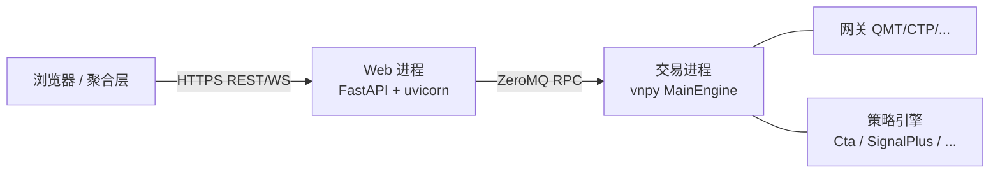

# vnpy_webtrader 工程文档

> 目标读者: 参与 `vnpy_webtrader` 开发、维护、部署的工程师 / AI Agent。
> 文档版本: **v1.2** (2026-04)

`vnpy_webtrader` 是部署在**每一台跑 vnpy 交易进程的机器**上的 Web 服务模块。它把交易进程的能力通过 REST 和 WebSocket 暴露出来,既供聚合中控 ([vnpy_aggregator](../../vnpy_aggregator/)) 调用,也可以直接被脚本/浏览器/任意 HTTP 客户端访问。

---

## 一分钟速览



- **两进程**: Web 进程 (无状态) ↔ 交易进程 (有状态), 通过 ZeroMQ RPC 通讯。
- **通用策略接口**: 抽象层 `StrategyEngineAdapter` 让 REST 路由与具体引擎解耦,未来新增引擎只需写一个 Adapter。
- **事件推送**: 交易进程的事件通过 RPC PUB→Web 进程→WebSocket 传给前端。
- **安全**: OAuth2 Password + JWT,默认只监听 127.0.0.1,由外层 Nginx/Caddy 套 HTTPS。

---

## 文档目录

| 文档 | 主题 | 谁应该读 |
|---|---|---|
| [architecture.md](./architecture.md) | 系统架构, 进程模型, 模块关系图 | 所有新人 |
| [design.md](./design.md) | 详细设计, 类图, 关键序列图, 请求/事件全链路追踪 | 后端开发 |
| [strategy_adapter.md](./strategy_adapter.md) | 策略适配层深度说明, 如何新增一个引擎 Adapter | 想接新策略引擎的开发 |
| [event_and_ws.md](./event_and_ws.md) | 事件系统与 WebSocket 协议, topic 映射表 | 前端/聚合层开发 |
| [deployment.md](./deployment.md) | 部署与配置, 典型拓扑, 安全加固 | 运维 |
| [development.md](./development.md) | 扩展路由/添加引擎/调试/测试 指南 | 二次开发者 |
| [../../docs/api.md](../../docs/api.md) | 面向外部调用者的 REST/WS API 参考 | 前端/第三方集成 |

---

## 目录结构

```
vnpy_webtrader/
├── __init__.py                 # WebTraderApp 入口 (BaseApp 注册)
├── engine.py                   # WebEngine: RPC 服务端 + 事件订阅 + 适配器持有
├── strategy_adapter.py         # 策略引擎适配层 (核心抽象)
├── web.py                      # FastAPI 应用: 交易类 REST + WS + 生命周期
├── deps.py                     # 共享依赖: JWT 鉴权 / RpcClient / 序列化
├── routes_node.py              # /api/v1/node/* 路由
├── routes_strategy.py          # /api/v1/strategy/* 路由
├── ui/
│   └── widget.py               # Qt UI: 启动/停止 Web 进程的管理面板
├── static/
│   └── index.html              # 最小演示页面 (可替换为 SPA 构建产物)
└── docs/                       # 本目录
```

---

## 核心概念速查

| 概念 | 含义 | 哪里看 |
|---|---|---|
| **Node** | 一台跑交易进程的机器, 用 `node_id` 唯一标识 | `deps.NODE_ID` / `/api/v1/node/info` |
| **交易进程** | 持有 `MainEngine`、网关、策略引擎的 Python 进程 | `run_sim.py` |
| **Web 进程** | 跑 FastAPI 的 uvicorn 子进程 | `ui/widget.py:109-116` 拉起 |
| **RPC Server** | 交易进程里的 ZeroMQ REP + PUB 服务 | `WebEngine.server` |
| **RPC Client** | Web 进程里的 ZeroMQ REQ + SUB 客户端 | `deps._rpc_client` |
| **Adapter** | 把具体策略引擎适配成统一接口的抽象层 | `strategy_adapter.py` |
| **Topic** | WS 推送消息的语义化分类 (tick/order/.../strategy) | `web.py:_BASE_TOPIC_MAP` |

---

## 快速上手 (5 分钟)

1. **阅读顺序**: [architecture.md](./architecture.md) → [design.md](./design.md) → [strategy_adapter.md](./strategy_adapter.md)
2. **第一次部署**: 跳到 [deployment.md#单机快速启动](./deployment.md#单机快速启动)
3. **新增策略引擎**: [strategy_adapter.md#新增引擎](./strategy_adapter.md#新增一个自定义引擎的-adapter)
4. **调试 API**: 启动后访问 `http://127.0.0.1:8000/docs` 可用 Swagger UI 交互

---

## 与 `vnpy_aggregator` 的关系

- `vnpy_webtrader` 是**节点**, `vnpy_aggregator` 是**控制面**。
- 一个 aggregator 管 N 个 webtrader 节点。
- 前端原则上只和 aggregator 通讯, webtrader 直接暴露仅供应急/调试/单节点部署。
- 见 [../../vnpy_aggregator/docs/](../../vnpy_aggregator/docs/)。
