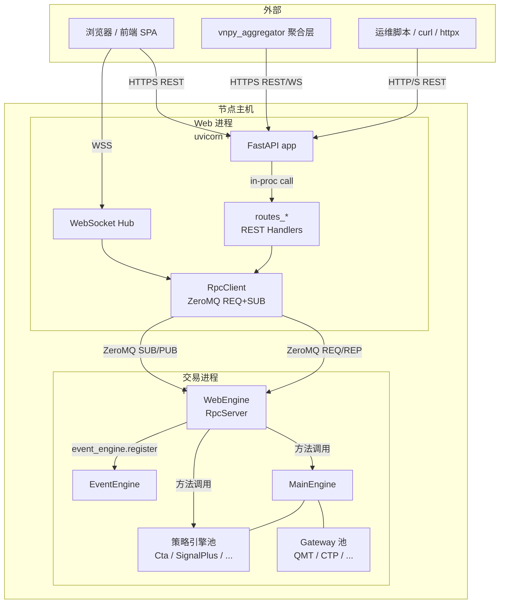
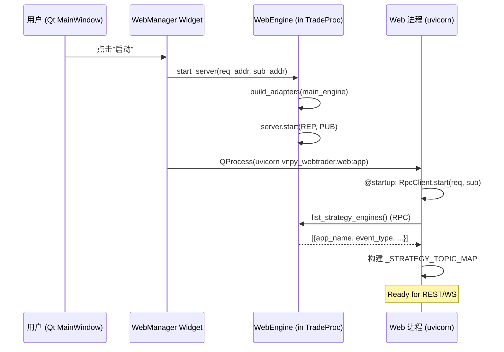
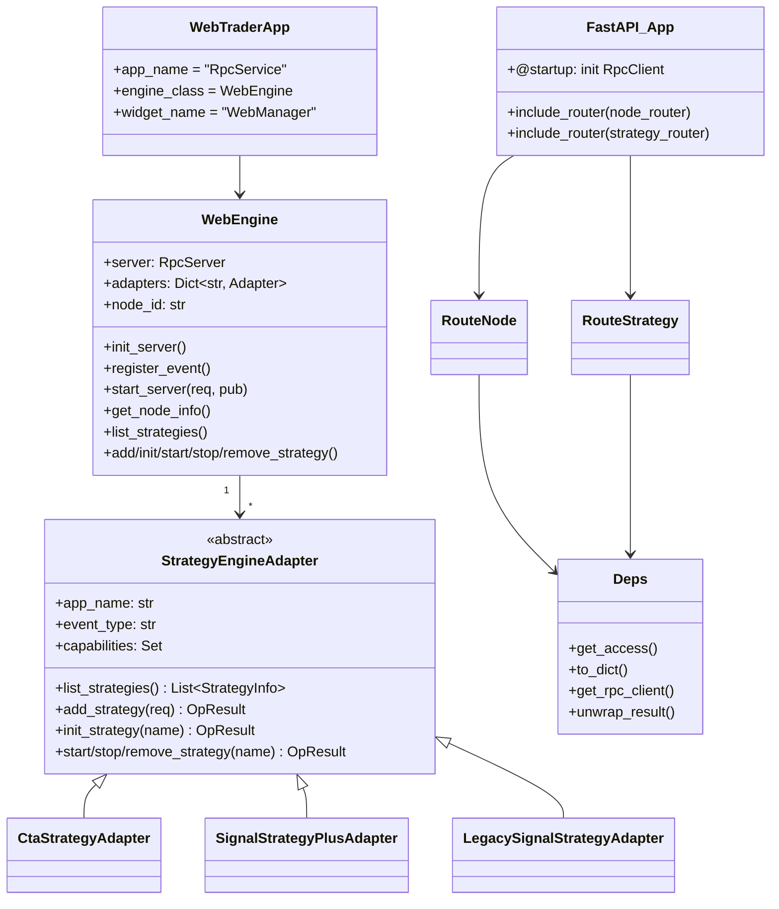
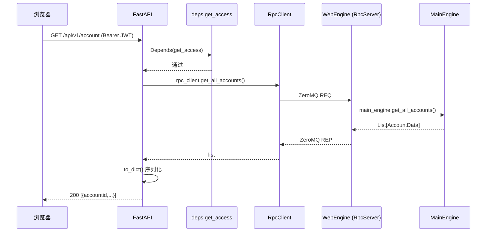
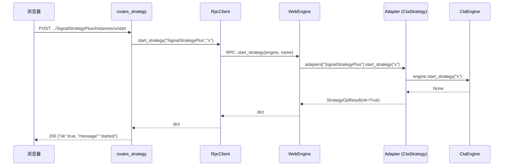
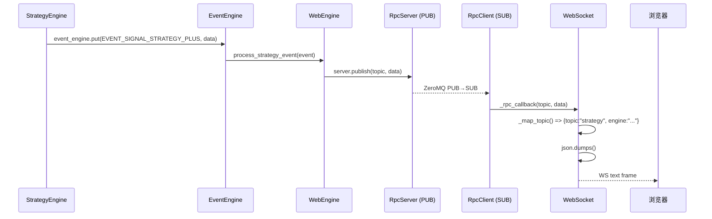

# 架构说明

## 1. 设计目标与约束

`vnpy_webtrader` 的目标是在**不侵入交易逻辑**的前提下,把一台 vnpy 交易进程的能力暴露给外部调用者,并满足:

| 目标 | 落地手段 |
|---|---|
| 交易进程低延迟 | 交易逻辑线程与 Web I/O 线程物理隔离 (两进程) |
| 安全对外 | Web 进程做 JWT 鉴权, 不直接暴露交易进程 |
| 多策略引擎支持 | `StrategyEngineAdapter` 抽象层, 按 `APP_NAME` 注册 |
| 实时事件推送 | ZeroMQ PUB/SUB + WebSocket, 无需前端轮询 |
| 单机自治可用 | 不依赖聚合层也能独立运行 (直接用浏览器访问) |
| 易扩展 | 新路由/新引擎 Adapter 都是插件式增量, 核心不改 |

---

## 2. 上下文视图 (谁调我, 我调谁)

要点:

- **进程边界 = 安全边界**: 交易进程不开任何对外端口,所有外部流量先到 Web 进程。
- **RPC 是唯一耦合**: Web 进程只通过 RPC 拿到交易能力,不共享内存。
- **事件单向**: 交易进程 PUB → Web 进程 SUB, 不存在反向推送。

---

## 3. 进程模型

### 3.1 运行态

### 3.2 拓扑

本工程实际运行态可能是下面三种之一:

| 场景 | 说明 | 适用 |
|---|---|---|
| **单机 GUI 模式** | 通过 `run_sim.py` 启动 MainWindow, 用户在 Web 服务面板点"启动" | 开发调试 |
| **单机无头模式** | 启动脚本直接 `web_engine.start_server(...)` + `uvicorn.run(...)` | 生产 (Linux/Windows Server) |
| **多节点 + 聚合层** | 多台机器各跑一个节点, 前置 `vnpy_aggregator` 聚合 | 正式生产 |

---

## 4. 模块组成

### 4.1 静态结构

### 4.2 模块职责

| 模块 | 职责 | 对外契约 |
|---|---|---|
| `__init__.py` | 声明 `WebTraderApp`, 让 `main_engine.add_app` 找到引擎 | `WebTraderApp` 类 |
| `engine.py` | 启动 RPC Server, 订阅事件, 挂载 adapters, 暴露统一策略方法 | RPC 方法签名 |
| `strategy_adapter.py` | 屏蔽不同策略引擎的差异, 产出 `StrategyInfo` / `StrategyOpResult` | 抽象基类 + 注册表 |
| `web.py` | FastAPI 入口, 交易类路由 + WS Hub + lifecycle | HTTP `/api/v1/*`, WS `/api/v1/ws` |
| `deps.py` | 鉴权工具 + RPC 客户端持有 + 序列化 | `Depends(get_access)` |
| `routes_node.py` | 节点自描述路由 | `/api/v1/node/{info,health}` |
| `routes_strategy.py` | 通用策略管理路由 | `/api/v1/strategy/*` |
| `ui/widget.py` | Qt UI, 启停 Web 进程子进程 | MainWindow 内置面板 |

---

## 5. 数据流

### 5.1 REST 请求 (以"查询账户"为例)

### 5.2 策略写请求 (以"启动策略"为例)

### 5.3 事件推送

---

## 6. 技术选型与理由

| 选型 | 替代方案 | 选择理由 |
|---|---|---|
| FastAPI | Flask / Starlette | 自带 OpenAPI、Pydantic 校验、WS 一流支持 |
| ZeroMQ RPC | gRPC / HTTP | vnpy 内置 `vnpy.rpc`, 与 EventEngine 无缝, 零新依赖 |
| JWT (PyJose) | Session Cookie | 无状态, 更适合前后端分离 + 多进程 |
| passlib sha256 | bcrypt / argon2 | passlib 内置, 无需额外编译依赖 |
| 原生 WebSocket | SSE / Socket.IO | 双向, 标准, 跨语言; SSE 单向不够 |
| 两进程分离 | 单进程 | 交易进程 I/O 隔离, Web 进程可独立重启 |

---

## 7. 边界条件与限制

- **QMT Gateway 仅支持 Windows**(依赖 `xtquant`),云端需用 Windows 云主机。非 QMT 网关可以跑 Linux。
- **RPC 超时**: `RpcClient` 默认 30s,若交易进程阻塞会级联 Web 超时。Adapter 的 `init_strategy` 对 Future 也是 30s 超时。
- **WS 无回压**: 当前实现对 WS 不做队列/回压处理,极端高频推送 (万级 tick/秒) 会阻塞事件循环。真要跑 HFT 建议前端不订阅 tick。
- **单机单实例**: 一个交易进程只能对应一个 Web 进程 (端口冲突),多实例需启动多套配置。
- **配置文件位置**: `.vntrader/web_trader_setting.json`,由 `vnpy.trader.utility.get_file_path` 决定, Windows 下是 `%USERPROFILE%\.vntrader\`。

---

## 8. 扩展点 (Extension Points)

| 扩展点 | 入口 | 说明 |
|---|---|---|
| 新增策略引擎 | `strategy_adapter.py` → `ADAPTER_REGISTRY` | 写 Adapter 子类 + 注册 |
| 新增 REST 路由 | 新建 `routes_xxx.py` + `app.include_router` | 复用 `deps.get_access` |
| 新增 WS topic | `web.py:_BASE_TOPIC_MAP` 或 `_STRATEGY_TOPIC_MAP` | 同时在 WebEngine 订阅事件 |
| 替换鉴权方式 | `deps.py` 重写 `get_access` | 例如改成 mTLS / API Key |
| 替换前端 | `static/index.html` | 放 SPA 构建产物即可 |

详见 [development.md](./development.md)。
