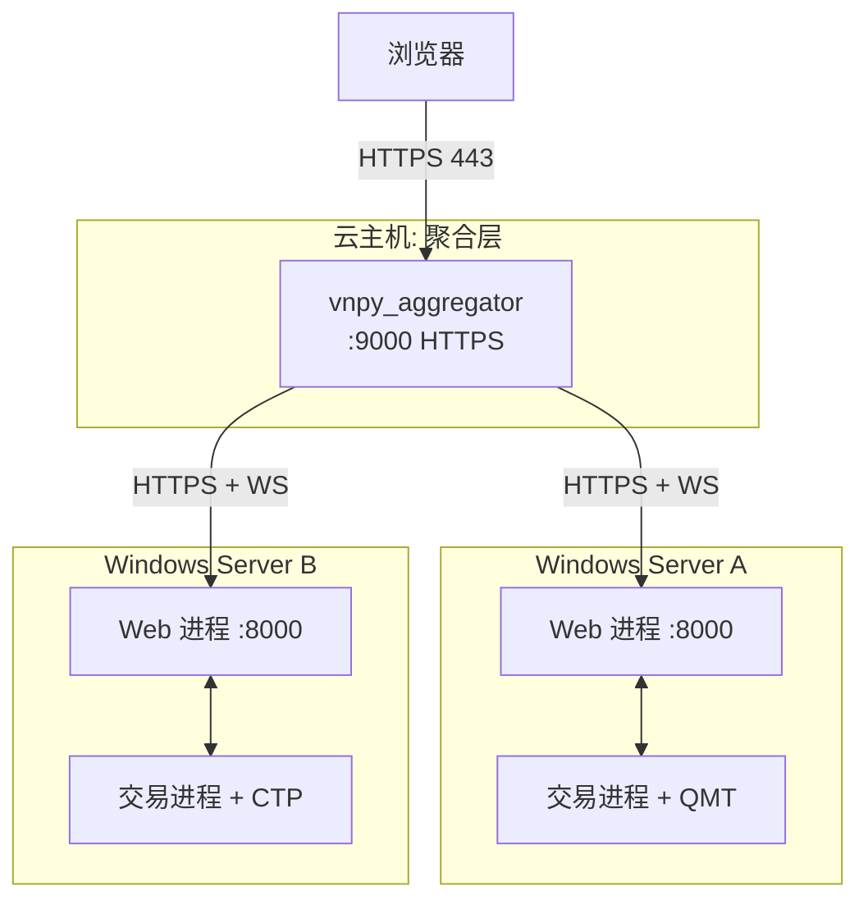

# 部署与运维

---

## 1. 前置要求

| 项目 | 版本 / 说明 |
|---|---|
| OS | QMT 网关必须 Windows Server/10/11; 其他网关可 Linux |
| Python | 3.10+ (vnpy 4.0 要求) |
| VeighNa | 4.0.0 以上 |
| 依赖包 | `fastapi`, `uvicorn`, `python-jose[cryptography]`, `passlib[bcrypt]`, `pydantic`, `pyzmq` (vnpy.rpc 依赖) |
| 网关 | QMT/CTP/... 按需安装对应 `vnpy_*` |
| 反向代理 (可选) | Nginx 1.20+ / Caddy 2.x (HTTPS+WS) |

---

## 2. 配置文件

路径: `<VNPY_TRADER_DIR>/.vntrader/web_trader_setting.json`(Windows 下 `%USERPROFILE%\.vntrader\web_trader_setting.json`)

完整字段示例:

```json
{
  "username": "vnpy",
  "password": "请改成强密码",
  "req_address": "tcp://127.0.0.1:2014",
  "sub_address": "tcp://127.0.0.1:4102",
  "host": "127.0.0.1",
  "port": "8000",
  "node_id": "bj-qmt-01",
  "display_name": "北京QMT节点",
  "secret_key": "请改成随机 32 字节串",
  "token_expire_minutes": 30
}
```

### 2.1 字段说明

| 字段 | 作用 | 默认 |
|---|---|---|
| `username` / `password` | HTTP/WS 登录凭据 | `vnpy`/`vnpy` |
| `req_address` | 交易进程 RpcServer REP 监听, Web 进程连它 | `tcp://127.0.0.1:2014` |
| `sub_address` | 交易进程 RpcServer PUB 监听, Web 进程 SUB 它 | `tcp://127.0.0.1:4102` |
| `host` | FastAPI 监听地址 | `127.0.0.1` |
| `port` | FastAPI 监听端口 | `8000` |
| `node_id` | 节点唯一 id (聚合层识别用) | `unnamed` 或环境变量 `VNPY_NODE_ID` |
| `display_name` | 面向用户的节点显示名 | 同 `node_id` |
| `secret_key` | JWT 签名密钥 | 环境变量 `VNPY_WEB_SECRET` 优先 |
| `token_expire_minutes` | JWT 过期时间 | `30` |

### 2.2 安全硬性要求 (生产必做)

1. `secret_key` 改成 `python -c "import secrets; print(secrets.token_urlsafe(48))"` 的输出,或使用环境变量 `VNPY_WEB_SECRET` 覆盖。
2. `password` 改成强密码。
3. `host` 改成 `127.0.0.1`(不对外),由反向代理暴露 443。
4. 配置文件权限 `chmod 600 web_trader_setting.json`(Linux) / NTFS 取消 Everyone 读取。

---

## 3. 三种部署拓扑

### 3.1 单机 GUI 模式 (开发调试)

```
┌─ run_sim.py (MainWindow)
│  ├─ add_gateway(QmtSimGateway)
│  ├─ add_app(SignalStrategyPlusApp)
│  └─ add_app(WebTraderApp)   ← 菜单里会出现 "Web服务"
└─ [Web服务] 面板填参数 → 点"启动"
       └─ QProcess uvicorn 子进程: http://127.0.0.1:8000
```

步骤:

```bash
# Windows
"F:\Program_Home\vnpy\python.exe" run_sim.py
# 在弹出的 MainWindow 里菜单 "功能" → "Web服务" → 填参数 → 启动
```

好处:操作可视化,方便策略研究员自己启停。
坏处:不能无人值守;关 GUI 就全停。

### 3.2 单机无头模式 (生产常用)

不启动 Qt GUI,用一个独立脚本拉起交易进程 + Web 进程:

```python
# run_headless.py
import threading
from vnpy.event import EventEngine
from vnpy.trader.engine import MainEngine
from vnpy_qmt import QmtGateway
from vnpy_signal_strategy_plus import SignalStrategyPlusApp
from vnpy_webtrader import WebTraderApp

event_engine = EventEngine()
main_engine = MainEngine(event_engine)
main_engine.add_gateway(QmtGateway)
main_engine.add_app(SignalStrategyPlusApp)
main_engine.add_app(WebTraderApp)

# 连接 gateway (按你的配置)
main_engine.connect({"用户名": "...", "密码": "..."}, "QMT")

# 启动 RPC 服务
web_engine = main_engine.get_engine("RpcService")
web_engine.set_node_info("bj-qmt-01", "北京QMT节点")
web_engine.start_server("tcp://127.0.0.1:2014", "tcp://127.0.0.1:4102")

# 启动 Web 子进程 (或者用 uvicorn 库直接同进程跑)
import uvicorn
uvicorn.run("vnpy_webtrader.web:app", host="0.0.0.0", port=8000)
```

⚠️ QMT gateway 初始化依赖 Windows GUI 事件循环的某些特性,实测需要保持进程有 GUI 消息泵。常见做法是仍然 `create_qapp()` 但不 `showMaximized()`:

```python
from vnpy.trader.ui import create_qapp
qapp = create_qapp()        # 创建 QApplication 但不显示窗口
# ... main_engine 初始化 ...
web_engine.start_server(...)

# 在单独线程跑 uvicorn, 主线程跑 qapp.exec()
threading.Thread(target=lambda: uvicorn.run(...), daemon=True).start()
qapp.exec()
```

### 3.3 多节点 + 聚合层 (正式)



每个 Node 独立部署,聚合层另开一台机器。见 [../../vnpy_aggregator/docs/](../../vnpy_aggregator/docs/)。

---

## 4. 前置 HTTPS (Nginx / Caddy)

### 4.1 Nginx

```nginx
server {
    listen 443 ssl http2;
    server_name node1.example.com;

    ssl_certificate     /etc/letsencrypt/live/node1.example.com/fullchain.pem;
    ssl_certificate_key /etc/letsencrypt/live/node1.example.com/privkey.pem;

    # 建议加 IP 白名单 (聚合层 IP)
    allow 10.0.0.5;
    deny  all;

    location /api/v1/ws {
        proxy_pass http://127.0.0.1:8000;
        proxy_http_version 1.1;
        proxy_set_header Upgrade $http_upgrade;
        proxy_set_header Connection "upgrade";
        proxy_read_timeout 86400;
    }

    location / {
        proxy_pass http://127.0.0.1:8000;
        proxy_set_header Host $host;
        proxy_set_header X-Forwarded-For $remote_addr;
    }
}
```

### 4.2 Caddy (自动证书, 推荐)

```
node1.example.com {
    @aggregator {
        remote_ip 10.0.0.5
    }
    handle @aggregator {
        reverse_proxy 127.0.0.1:8000
    }
    respond 403
}
```

---

## 5. 运行时监控

### 5.1 日志

- Web 进程 uvicorn 日志: 由 Qt 里的 QProcess 捕获, 在"Web服务"面板文本框里显示
- 交易进程日志: 走 `LogEngine`,写到 `.vntrader/log/vt_YYYYMMDD.log`
- 建议加一个日志轮转 (例 `logrotate.d`)

### 5.2 健康检查

聚合层每 10 秒调 `GET /api/v1/node/health`:

```json
{"status":"ok", "uptime":12345.6, "event_queue_size":3, "gateway_status":{"QMT":true}}
```

可以加一条运维规则:`event_queue_size > 1000` 或 `gateway_status.QMT == false` 时告警。

### 5.3 进程自动重启 (Windows)

推荐用 [NSSM](https://nssm.cc/) 包装成 Windows 服务:

```powershell
nssm install vnpy-trader "F:\Program_Home\vnpy\python.exe" "F:\Quant\vnpy\vnpy_strategy_dev\run_headless.py"
nssm set vnpy-trader AppStdout "F:\logs\vnpy-trader-stdout.log"
nssm set vnpy-trader AppStderr "F:\logs\vnpy-trader-stderr.log"
nssm start vnpy-trader
```

### 5.4 Linux 系统服务 (非 QMT 场景)

```ini
# /etc/systemd/system/vnpy-trader.service
[Unit]
Description=vnpy trader node
After=network.target

[Service]
User=vnpy
Environment=VNPY_WEB_SECRET=<your_secret>
Environment=VNPY_NODE_ID=sh-ctp-02
ExecStart=/opt/vnpy/python/bin/python /opt/vnpy/strategy_dev/run_headless.py
Restart=always
RestartSec=5

[Install]
WantedBy=multi-user.target
```

---

## 6. 单机快速启动

**最小验证路径**(无聚合层,单机自用):

```bash
# 1. 编辑配置
cat > "$HOME/.vntrader/web_trader_setting.json" <<EOF
{
  "username": "vnpy",
  "password": "changeme",
  "req_address": "tcp://127.0.0.1:2014",
  "sub_address": "tcp://127.0.0.1:4102",
  "host": "127.0.0.1",
  "port": "8000",
  "node_id": "local-dev"
}
EOF

# 2. 启动 GUI
"F:/Program_Home/vnpy/python.exe" run_sim.py
# → 菜单"功能"→"Web服务"→点"启动"

# 3. 访问 Swagger
# http://127.0.0.1:8000/docs

# 4. 拿 token
curl -X POST -d "username=vnpy&password=changeme" http://127.0.0.1:8000/api/v1/token

# 5. 看账户
TOKEN=eyJ...  # 上一步返回的 access_token
curl -H "Authorization: Bearer $TOKEN" http://127.0.0.1:8000/api/v1/account
```

---

## 7. 故障排查

| 症状 | 可能原因 | 排查手段 |
|---|---|---|
| `http://127.0.0.1:8000/docs` 不通 | Web 进程没起来 | 看 MainWindow 日志面板是否有 Python 异常 |
| 401 Unauthorized | token 过期 / 密码错 | 重新 `POST /token` |
| 403 (Nginx) | 白名单没命中 | 看 nginx access log 的 `remote_addr` |
| `get_all_accounts` 返回空数组 | Gateway 未连接 | `GET /api/v1/node/health` 看 `gateway_status` |
| WS 连上立即断开 | token 错或 `VNPY_WEB_SECRET` 两边不一致 | 看 uvicorn 日志 `WS 1008` |
| `list_strategy_engines` 返回空 | 交易进程没 add_app 策略引擎, 或 `start_server` 前调了 build_adapters | 确认启动顺序 |
| 策略 `init_strategy` 超时 30s | 策略 `on_init` 里有长 IO (例如连 MySQL) | 增加超时或改异步 Future;已知 Signal 策略 MySQL 连不上会直接返回 False |
| 发送消息时 WS 广播慢 | 某个客户端网络差拖慢所有人 | 见 `event_and_ws.md#无回压策略` |

---

## 8. 升级策略

目前没有正式的迁移工具,升级步骤:

1. 停止 Web 进程 ("Web服务"面板点"停止"或 kill uvicorn)
2. 拉取新代码 `git pull`
3. 如有新依赖 `pip install -r requirements.txt`
4. 启动 Web 进程

**注意**: 交易进程**不需要重启**,因为 WebEngine/Adapter 的更改会在 `start_server` 时重新 `build_adapters`,新的 RPC 注册会覆盖旧的。

**例外**: 如果修改了 `strategy_adapter.py` 的 `default_capabilities` 或 `event_type`, 需要完整重启交易进程才能让新的事件订阅生效。
