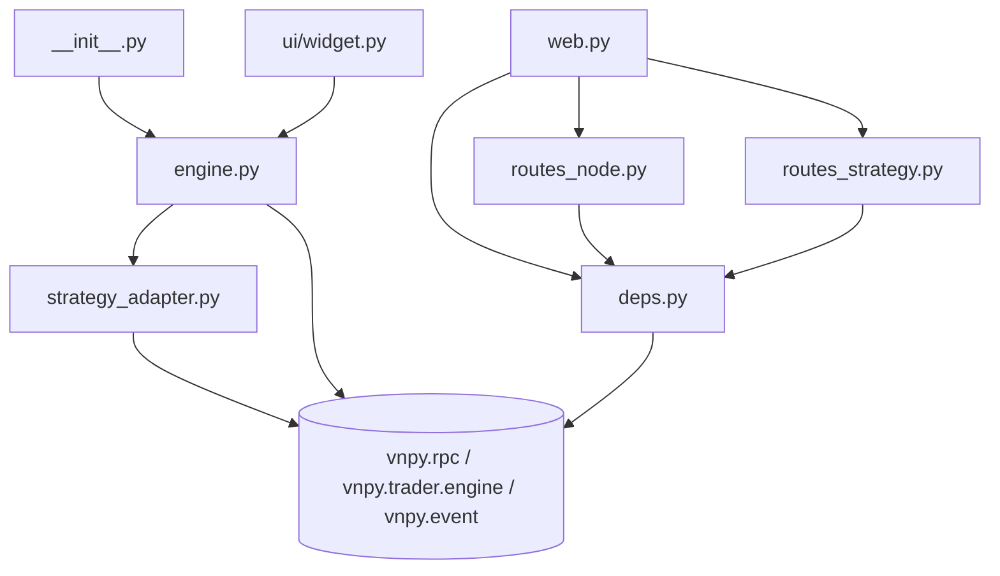
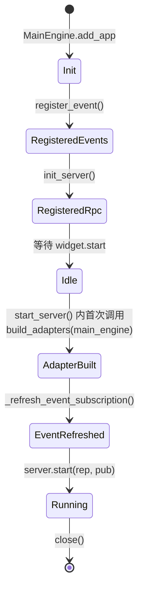
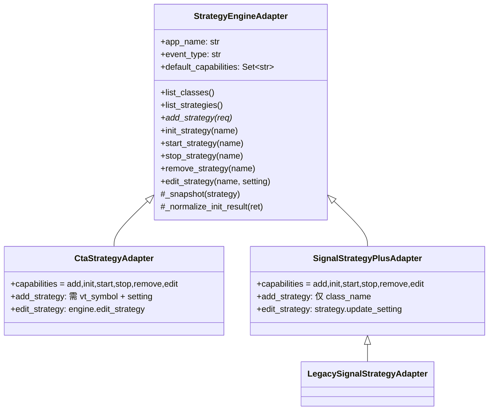
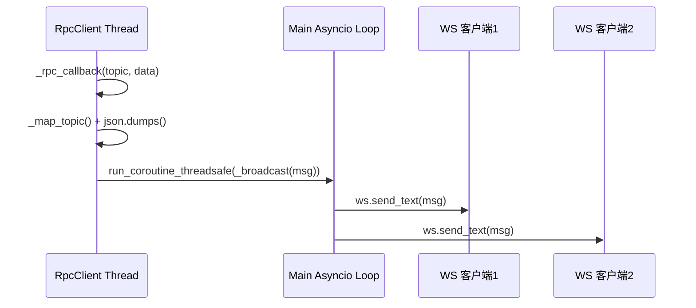
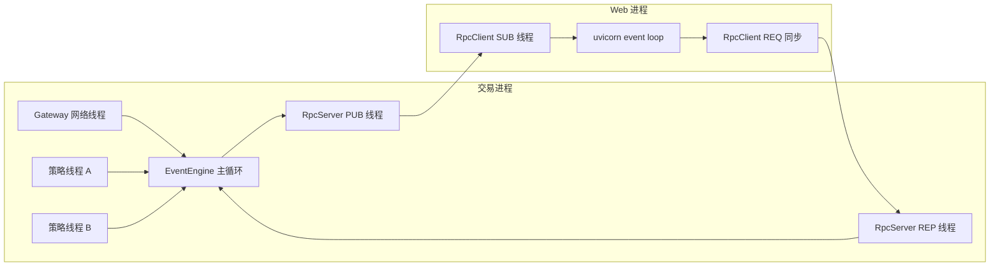

# 详细设计

本章是"打开引擎盖"的视角,覆盖类、模块、方法、数据结构的内部实现细节,配合源码阅读。

配套代码路径都是相对仓库根 (`f:/Quant/vnpy/vnpy_strategy_dev/`)。

---

## 1. 模块依赖拓扑



两个关键规则:

- `deps.py` 不依赖 `engine.py` 或 `web.py` → 避免循环
- `strategy_adapter.py` 不依赖 `web.py` / `routes_*` → 纯业务逻辑可单测

---

## 2. 关键类详细说明

### 2.1 `WebEngine` ([engine.py](../engine.py))

交易进程里的 `BaseEngine` 子类,生命周期由 `MainEngine.add_app(WebTraderApp)` 托管。

#### 2.1.1 状态

```python
self.server: RpcServer                                 # ZeroMQ REP+PUB
self.adapters: Dict[str, StrategyEngineAdapter]        # app_name -> adapter
self.node_id: str                                      # 节点身份
self.display_name: str
```

#### 2.1.2 启动时序



**注意**: `adapters` 在 `start_server()` 时才构建,而不是 `__init__`。因为 `add_app` 的顺序 (`SignalStrategyPlusApp` 可能在 `WebTraderApp` 之后),太早构建会漏掉后续加入的引擎。

#### 2.1.3 RPC 方法注册表

```
# MainEngine 透传 (与旧版 vnpy_webtrader 1.1 兼容)
connect / subscribe / send_order / cancel_order
get_contract / get_order
get_all_ticks / get_all_orders / get_all_trades / get_all_positions / get_all_accounts / get_all_contracts

# 节点元信息
get_node_info / get_node_health

# 策略管理 (本版本新增)
list_strategy_engines / list_strategy_classes / get_strategy_class_params
list_strategies / get_strategy
add_strategy / init_strategy / start_strategy / stop_strategy / remove_strategy / edit_strategy
init_all_strategies / start_all_strategies / stop_all_strategies
```

#### 2.1.4 事件订阅

| 事件类型 | 注册时机 | 处理函数 | 下游 topic |
|---|---|---|---|
| `EVENT_TICK` 等 5 个基础 | `register_event()`(构造时) | `process_generic_event` | 原 topic 直接 PUB |
| `EVENT_LOG` | 同上 | `process_log_event` | `eLog` |
| `EVENT_CTA_STRATEGY` / `EVENT_SIGNAL_STRATEGY_PLUS` / ... | `start_server` 内动态 | `process_strategy_event` | 原 topic, Web 进程负责语义化 |

所有事件最终都通过 `server.publish(topic, data)` 进入 ZeroMQ PUB socket。

---

### 2.2 `StrategyEngineAdapter` ([strategy_adapter.py](../strategy_adapter.py))

抽象基类,吸收各引擎的方法签名差异。

#### 2.2.1 类继承与能力集



#### 2.2.2 能力集 (Capabilities) 设计

`capabilities: Set[str]` 是这个设计的核心,作用:

1. **REST 层校验**: `WebEngine._call_op()` 判断能力集,不支持的操作直接返回 HTTP 501。
2. **前端 UI 动态渲染**: 前端读 `describe()` 返回的 capabilities 动态启用/禁用按钮。
3. **新引擎零成本接入**: 只声明自己支持哪些操作,不需要的操作基类有默认"不支持"实现。

示意:

```python
default_capabilities = {"add","init","start","stop","remove"}
# edit 默认不在里面; 子类自己覆盖加 "edit"
```

#### 2.2.3 `_normalize_init_result`

处理 `init_strategy` 跨引擎返回类型差异的核心:

```python
def _normalize_init_result(self, ret: Any) -> StrategyOpResult:
    if isinstance(ret, Future):        # CtaEngine
        fret = ret.result(timeout=30)
        ...
    if ret is False:                   # SignalEnginePlus 有时返回 False
        return StrategyOpResult(False, ...)
    return StrategyOpResult(True, "inited")   # None / True / 其它
```

**注意**: 同步等待 Future 会阻塞当前 RPC 线程最多 30 秒。这是有意的设计,让 REST 调用方拿到确定结果,避免"调用成功但策略其实初始化失败"的模糊状态。若未来要支持异步轮询,可以在 Adapter 加一个 `init_strategy_async` 返回 task_id。

#### 2.2.4 数据类

```python
@dataclass
class StrategyInfo:          # 对外快照 (REST/WS 都用它)
    engine: str              # app_name
    name: str
    class_name: str
    vt_symbol: Optional[str] # 没有 vt_symbol 的策略置 None
    author: Optional[str]
    inited: bool
    trading: bool
    parameters: Dict
    variables: Dict

@dataclass
class StrategyOpResult:      # 写操作返回
    ok: bool
    message: str
    data: Any = None         # 可放 http_status 提示外层错误映射

@dataclass
class AddStrategyRequest:    # 创建请求全集
    engine: str
    class_name: str
    strategy_name: str
    vt_symbol: Optional[str]
    setting: Dict
```

---

### 2.3 FastAPI 应用 ([web.py](../web.py))

#### 2.3.1 生命周期钩子

```python
@app.on_event("startup")
def _startup():
    client = RpcClient()
    client.callback = _rpc_callback
    client.subscribe_topic("")                      # 订阅所有 topic
    client.start(REQ_ADDRESS, SUB_ADDRESS)
    set_rpc_client(client)
    # 探测策略引擎清单, 构建 event topic -> app_name
    for item in client.list_strategy_engines():
        _STRATEGY_TOPIC_MAP[item["event_type"]] = item["app_name"]
```

这里用 `subscribe_topic("")` 是 ZeroMQ 的空字符串前缀订阅,含义是**接收所有 topic**。每个消息回调通过 `_rpc_callback(topic, data)` 进入 Web 进程。

#### 2.3.2 WebSocket 管理

- `active_websockets: List[WebSocket]` 进程级列表,新连接 append / 断开 remove / 发送失败自动清理。
- `_broadcast(msg)` 广播到所有连接,异常连接标记 dead 后批量清理。
- `event_loop: asyncio.AbstractEventLoop = asyncio.get_event_loop()` 保留主循环引用,因为 `_rpc_callback` 在 RpcClient 的子线程里被调用,必须 `run_coroutine_threadsafe` 回到主循环。



#### 2.3.3 Topic 映射

```python
_BASE_TOPIC_MAP = {
    EVENT_TICK: "tick",       # 前缀匹配, 兼容 "eTick.600000.SSE"
    EVENT_ORDER: "order",
    EVENT_TRADE: "trade",
    EVENT_POSITION: "position",
    EVENT_ACCOUNT: "account",
    EVENT_LOG: "log",
}
_STRATEGY_TOPIC_MAP: Dict[str, str] = {}  # 启动时填充
```

`_map_topic(raw)` 返回 `(wire_topic, engine)`:

- 命中 `_BASE_TOPIC_MAP` → `(wire, "")`
- 命中 `_STRATEGY_TOPIC_MAP` → `("strategy", app_name)`
- 都不命中 → `(raw, "")` (保底)

---

### 2.4 `deps.py`

共享工具模块,所有路由 `from .deps import get_access`。

#### 2.4.1 配置加载

启动时从 `.vntrader/web_trader_setting.json` 读取一次,运行期不热更新。字段:

| 字段 | 默认 | 来源优先级 |
|---|---|---|
| `username` / `password` | `vnpy`/`vnpy` | 配置文件 |
| `req_address` / `sub_address` | `tcp://127.0.0.1:2014/4102` | 配置文件 |
| `node_id` | `unnamed` | 配置文件 → 环境变量 `VNPY_NODE_ID` |
| `secret_key` | `change-me` | 环境变量 `VNPY_WEB_SECRET` → 配置文件 |
| `token_expire_minutes` | `30` | 配置文件 |

**生产强制**: `VNPY_WEB_SECRET` 必须通过环境变量注入, 否则默认 `change-me` 极易被利用。

#### 2.4.2 `unwrap_result`

WebEngine 里所有策略写方法返回 envelope `{ok, message, data}`。路由层的 `unwrap_result`:

```
if ok: 返回 data
else:  抛 HTTPException(status=data.http_status or 400, detail=message)
```

这样 REST 调用方看到的直接是正确/错误的 HTTP 语义,无需再看 `ok` 字段。

---

## 3. 请求全链路 (debug 级)

以 "`POST /api/v1/strategy/engines/SignalStrategyPlus/instances/multistrategy-v5.2.1/start`" 为例:

### 3.1 调用栈

```
uvicorn worker
  └─ FastAPI app
       └─ routes_strategy.start_strategy(engine, name, access=Depends(get_access))
            ├─ deps.get_access(token) → JWT decode → True
            └─ get_rpc_client().start_strategy(engine, name)
                  └─ RpcClient (ZeroMQ REQ)  ─ 跨进程 ─→
                                                          TradeProc RpcServer
                                                            └─ WebEngine.start_strategy(engine, name)
                                                                 └─ self._call_op("start", name)
                                                                      └─ adapters[engine].start_strategy(name)
                                                                            └─ SignalEnginePlus.start_strategy(name)
                                                                                  └─ strategy.on_start() (含建表/拉线程)
                                                                                  └─ put_strategy_event(strategy)
                                                                                        └─ event_engine.put(EVENT_SIGNAL_STRATEGY_PLUS, data)
                                                                 ← StrategyOpResult(True, "started")
                  ← dict
            ← dict
       ← JSON response
```

### 3.2 事件回波

紧接着 `event_engine.put(...)` 触发:

```
EventEngine worker thread
  └─ WebEngine.process_strategy_event(event)
       └─ server.publish("EVENT_SIGNAL_STRATEGY_PLUS", data) (PUB)
              ─ 跨进程 ─→
                           RpcClient (SUB)
                             └─ web._rpc_callback(topic, data)
                                  └─ _map_topic → ("strategy", "SignalStrategyPlus")
                                  └─ json.dumps({topic, engine, node_id, ts, data})
                                  └─ run_coroutine_threadsafe(_broadcast(msg))
                                        └─ for ws: ws.send_text(msg)
                                              ─ WS ─→
                                                       浏览器
```

---

## 4. 错误处理与状态码

| 错误场景 | 产生位置 | HTTP 状态 | 前端表现 |
|---|---|---|---|
| 无 Authorization 头 | `deps.get_access` | 401 | 跳登录 |
| JWT 过期 | 同上 (JWTError) | 401 | 跳登录 |
| 策略引擎未注册 | `WebEngine._get_adapter` → `_err` → `unwrap_result` | 404 | Toast"引擎不存在" |
| 策略实例不存在 | `Adapter._exists` | 400 或 404(配合 `_err`) | Toast |
| Capability 不支持 | `WebEngine._call_op` 的 `capabilities` 检查 | 501 | 按钮本应已禁用 |
| RPC client 未就绪 | `deps.get_rpc_client` | 503 | 顶栏告警 |
| RPC 调用超时 | `RpcClient` 内 timeout exception | 502/500 | 顶栏告警 |
| 策略层抛异常 | `Adapter.try/except` | 400 + message | Toast 显示堆栈摘要 |

---

## 5. 线程与并发模型



- **交易进程**: `EventEngine` 有自己的主循环线程,所有事件串行,策略回调在这个线程里执行。RpcServer 的 REP 线程独立,处理 RPC 调用时可能回调 MainEngine 方法。
- **Web 进程**: uvicorn asyncio loop 是主线程,RpcClient 的 SUB 回调在子线程触发,必须 `run_coroutine_threadsafe` 回到 loop 才能操作 WS。
- **策略开发者无需关心锁**: 因为写路径 (REST → RPC → RpcServer REP → main_engine) 进入的是 REP 线程,但 `engine.start_strategy` 等最终触发的 `event_engine.put(...)` 是进队列的,具体 `on_start` 由 EventEngine 主循环执行。MainEngine 方法自身是线程安全的 (OmsEngine 用简单字典, vnpy 约定同一实例不并发调用)。

---

## 6. 与 vnpy 现有机制的关系

- **不改 vnpy 核心**: `WebEngine` 只是一个普通的 `BaseEngine`,和 `OmsEngine` `LogEngine` 同级。
- **不改策略引擎**: `StrategyEngineAdapter` 不要求策略引擎实现任何新接口,只利用已有的 `get_all_strategy_class_names` / `get_strategy_class_parameters` / `strategies` 字典 / `get_parameters` / `get_variables` / `inited` / `trading`。
- **事件系统**: 完全复用 `EventEngine.register/put`, 不引入新队列。
- **日志系统**: `EVENT_LOG` 直接订阅转发,与 `LogEngine` 不冲突。

---

## 7. 进一步阅读

- 具体 Adapter 实现细节 → [strategy_adapter.md](./strategy_adapter.md)
- WS 协议与 topic 映射 → [event_and_ws.md](./event_and_ws.md)
- 部署运维 → [deployment.md](./deployment.md)
