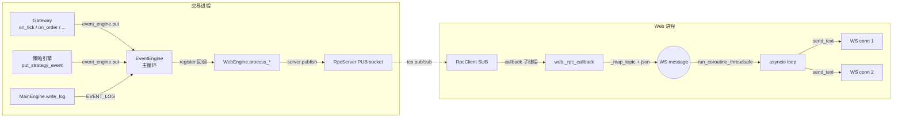
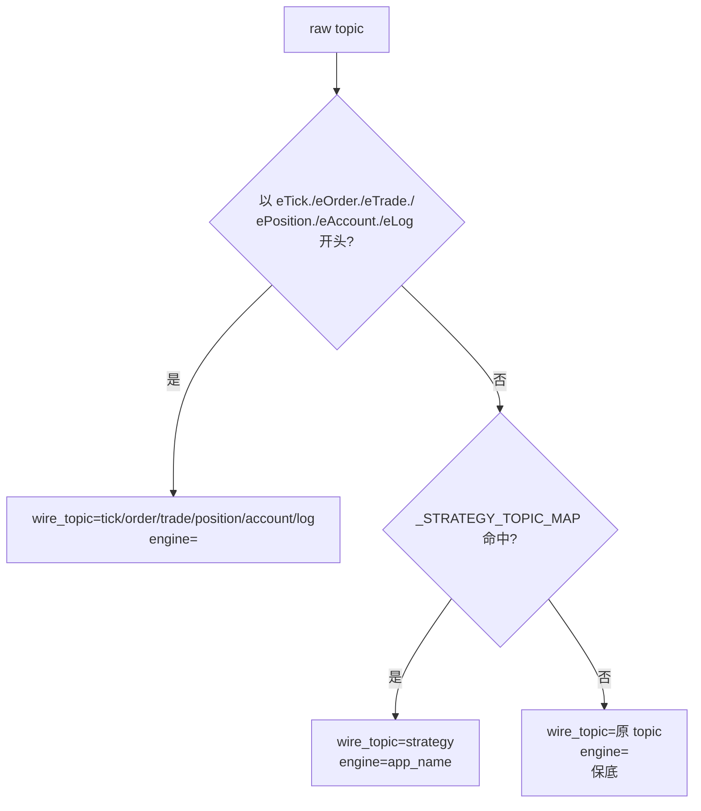

# 事件系统与 WebSocket 协议

本章解释 "交易进程发生一件事 → 浏览器收到一条 WS 消息" 的完整链路,以及 topic/payload 的精确定义。

---

## 1. 整体数据流



---

## 2. 事件类型清单

### 2.1 基础事件 (vnpy 原生)

| 事件常量 | 数值前缀 | 发起者 | 频率 (A股) |
|---|---|---|---|
| `EVENT_TICK` | `eTick.` | Gateway.on_tick | 0-10 Hz/合约 |
| `EVENT_ORDER` | `eOrder.` | Gateway / MainEngine | 按下单频率 |
| `EVENT_TRADE` | `eTrade.` | Gateway | 按成交频率 |
| `EVENT_POSITION` | `ePosition.` | Gateway | 持仓变化时 |
| `EVENT_ACCOUNT` | `eAccount.` | Gateway | 账户资金变化时 |
| `EVENT_LOG` | `eLog` | MainEngine / 各引擎 | 任意 |

**注意**: 前 5 个有点号后缀 (symbol),因此 WebEngine 用 `topic.startswith(EVENT_TICK)` 识别,而不是等于。

### 2.2 策略事件 (每个引擎自定义)

| 事件常量 | 引擎 | 发起时机 |
|---|---|---|
| `eCtaStrategy` | `CtaEngine` | add/init/start/stop/remove/edit 后 |
| `EVENT_SIGNAL_STRATEGY_PLUS` | `SignalEnginePlus` | 同上 |
| `eSignalStrategy` | `SignalEngine` (旧) | 同上 |

所有策略事件的 `data` 都是策略的 `get_data()` 返回值,字段:

```
{
  strategy_name, class_name, author, vt_symbol(可选),
  inited, trading, parameters, variables
}
```

---

## 3. WebEngine 对事件的处理

`WebEngine.register_event()` 在构造时注册基础事件的回调。策略事件的回调在 `start_server()` 时通过 `_refresh_event_subscription()` 动态追加 (因为此时才调用 `build_adapters`,才知道节点上挂了哪些策略引擎的 Adapter)。

```python
# 构造时
event_engine.register(EVENT_TICK, process_generic_event)
event_engine.register(EVENT_TRADE, process_generic_event)
event_engine.register(EVENT_ORDER, process_generic_event)
event_engine.register(EVENT_POSITION, process_generic_event)
event_engine.register(EVENT_ACCOUNT, process_generic_event)
event_engine.register(EVENT_LOG, process_log_event)

# start_server 时
for adapter in adapters.values():
    event_engine.register(adapter.event_type, process_strategy_event)
```

三个 handler 的实现其实都一样:

```python
def process_generic_event(event):   self.server.publish(event.type, event.data)
def process_log_event(event):       self.server.publish(EVENT_LOG, event.data)
def process_strategy_event(event):  self.server.publish(event.type, event.data)
```

分开命名只是为了调试时能 trace 清楚事件来源。

---

## 4. Web 进程的 RPC → WS 转换

### 4.1 启动时拉引擎清单

```python
@app.on_event("startup")
def _startup():
    client = RpcClient()
    client.callback = _rpc_callback
    client.subscribe_topic("")             # ZMQ 空前缀 = 订阅全部
    client.start(REQ_ADDRESS, SUB_ADDRESS)
    set_rpc_client(client)

    # 拉引擎清单, 构建 topic -> app_name 映射
    for item in client.list_strategy_engines():
        _STRATEGY_TOPIC_MAP[item["event_type"]] = item["app_name"]
```

### 4.2 `_rpc_callback` (RpcClient 子线程里)

```python
def _rpc_callback(topic: str, data: Any) -> None:
    if not active_websockets:
        return
    wire_topic, engine = _map_topic(topic)
    msg = {
        "topic": wire_topic,
        "node_id": NODE_ID,
        "ts": time.time(),
        "data": to_dict(data) if hasattr(data, "__dict__") else data,
    }
    if engine:
        msg["engine"] = engine
    payload = json.dumps(msg, ensure_ascii=False, default=str)
    asyncio.run_coroutine_threadsafe(_broadcast(payload), event_loop)
```

### 4.3 `_map_topic` 规则



---

## 5. WS 消息协议

### 5.1 消息结构

统一的 JSON 对象,字段如下:

```json
{
  "topic": "strategy",
  "engine": "SignalStrategyPlus",
  "node_id": "bj-qmt-01",
  "ts": 1715000000.123,
  "data": { "...": "..." }
}
```

| 字段 | 类型 | 出现条件 | 含义 |
|---|---|---|---|
| `topic` | string | 总是 | 语义化 topic, 见下表 |
| `engine` | string | 仅 topic=strategy 时 | 策略所在引擎 `app_name` |
| `node_id` | string | 总是 | 本节点身份 (从 `deps.NODE_ID`) |
| `ts` | float | 总是 | 服务器生成消息的 Unix 时间戳 (秒, 带小数) |
| `data` | object/array | 总是 | 具体 payload |

### 5.2 topic 枚举

| topic | data 结构 | 举例 |
|---|---|---|
| `tick` | `TickData` dict | `{"symbol":"600000","last_price":10.5,...}` |
| `order` | `OrderData` dict | `{"vt_orderid":"QMT.1","status":"已成",...}` |
| `trade` | `TradeData` dict | `{"vt_tradeid":"QMT.t1","price":10.5,...}` |
| `position` | `PositionData` dict | `{"vt_symbol":"600000.SSE","volume":100,...}` |
| `account` | `AccountData` dict | `{"accountid":"1","balance":10000,...}` |
| `log` | `LogData` dict | `{"msg":"...","gateway_name":"...","level":"INFO"}` |
| `strategy` | 策略 get_data() | `{"strategy_name":"x","trading":true,"parameters":{...},"variables":{...}}` |

### 5.3 数据序列化规则

`deps.to_dict()` 负责把 vnpy dataclass 转成 JSON:

- `Enum` → `enum.value`
- `datetime` → `isoformat()` 字符串
- 其它 → 原样

如果 Gateway 推了一个 `datetime.date`、`Decimal` 等不支持的类型,`json.dumps(..., default=str)` 会兜底成字符串, 不会让整条消息失败。

---

## 6. 订阅与连接管理

### 6.1 建立连接

客户端:

```
WS ws://.../api/v1/ws?token=<jwt>
```

服务端依次:

1. `get_websocket_access(token)` 解码 JWT,失败 → `close(code=1008)`
2. `ws.accept()`
3. `active_websockets.append(ws)`
4. 进入 `while True: await ws.receive_text()` 阻塞循环(客户端心跳或消息都在这里收)

### 6.2 断开连接

- 客户端关闭或网络中断 → `WebSocketDisconnect` → 从 `active_websockets` 移除
- 服务端广播发送失败 → 在 `_broadcast()` 里批量清理 dead connections

### 6.3 无回压策略

当前实现**不对单个客户端做独立队列**。所有 WS 接收同一份广播,慢客户端会拖累快客户端 (`send_text` 同步等完)。

**容量规划**:

- A股 tick 频率低,单节点 1000 合约 ≤ 1000 msg/s 无压力
- CTP/QMT 大量委托 + 持仓推送时峰值也在 100 msg/s 以下
- 浏览器端 <= 10 条 WS 连接没问题

如果未来要跑 HFT 或多 tab 同步,应该:

1. 给每个 WS 连接一个 `asyncio.Queue`,消息 put 不 await
2. 独立 coroutine 从队列 send
3. 队列满时丢弃最旧的非关键消息 (tick 可丢,account/order 不可丢)

---

## 7. 客户端最佳实践

### 7.1 重连 (浏览器端示意)

```javascript
class WsClient {
  constructor(url, token, onMsg) {
    this.url = url + '?token=' + encodeURIComponent(token)
    this.onMsg = onMsg
    this.retry = 0
    this.connect()
  }
  connect() {
    this.ws = new WebSocket(this.url)
    this.ws.onopen = () => { this.retry = 0 }
    this.ws.onmessage = (e) => {
      try { this.onMsg(JSON.parse(e.data)) } catch(_) {}
    }
    this.ws.onclose = () => {
      const delay = Math.min(30000, 1000 * 2 ** this.retry)
      this.retry += 1
      setTimeout(() => this.connect(), delay)
    }
  }
}
```

### 7.2 按 topic + engine 路由

```javascript
function dispatch(msg) {
  if (msg.topic === 'strategy' && msg.engine === 'SignalStrategyPlus') {
    strategyStore.applyPush(msg)
  } else if (msg.topic === 'account') {
    accountStore.applyPush(msg)
  }
  // ...
}
```

### 7.3 注意 node_id

聚合层 WS 汇流后,前端收到的每条消息都带 `node_id`,需要按 `(node_id, topic, vt_symbol)` 做主键上 upsert,而不是只按 `vt_symbol`。

---

## 8. 调试手段

### 8.1 看原始 topic 流

临时把 `_rpc_callback` 最开头加一行 `print(topic, type(data).__name__)`,就能看到每个事件的原始 topic 和 payload 类型。

### 8.2 直接用 websocat 连 WS

```bash
# 先用 curl 拿 token
TOKEN=$(curl -s -X POST -d "username=vnpy&password=vnpy" \
  http://127.0.0.1:8000/api/v1/token | python -c "import sys,json; print(json.load(sys.stdin)['access_token'])")

# 连 WS
websocat "ws://127.0.0.1:8000/api/v1/ws?token=$TOKEN"
```

### 8.3 只看某 topic

```bash
websocat "ws://..." | jq 'select(.topic=="strategy")'
```

---

## 9. 已知限制

- WS 消息**不持久化**,断线期间的消息客户端看不到。账户/持仓重连后应主动 `GET /api/v1/account` 重新拉一次。
- 不支持**客户端选择性订阅**某些 topic。所有客户端收到所有消息,客户端自己过滤。如果要做服务端过滤,在 `_broadcast` 前根据客户端标记判断即可。
- `ts` 是 Web 进程本地时钟,节点间时钟可能有漂移,聚合层不要直接比较不同节点的 `ts` 做严格排序。
