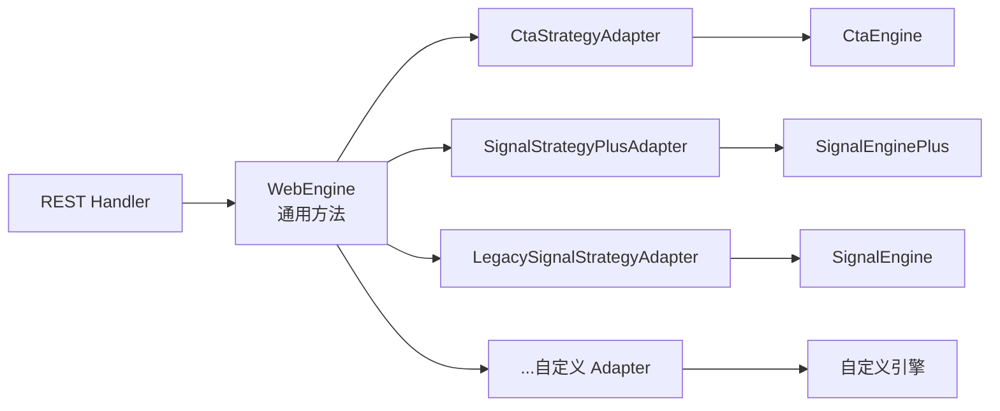
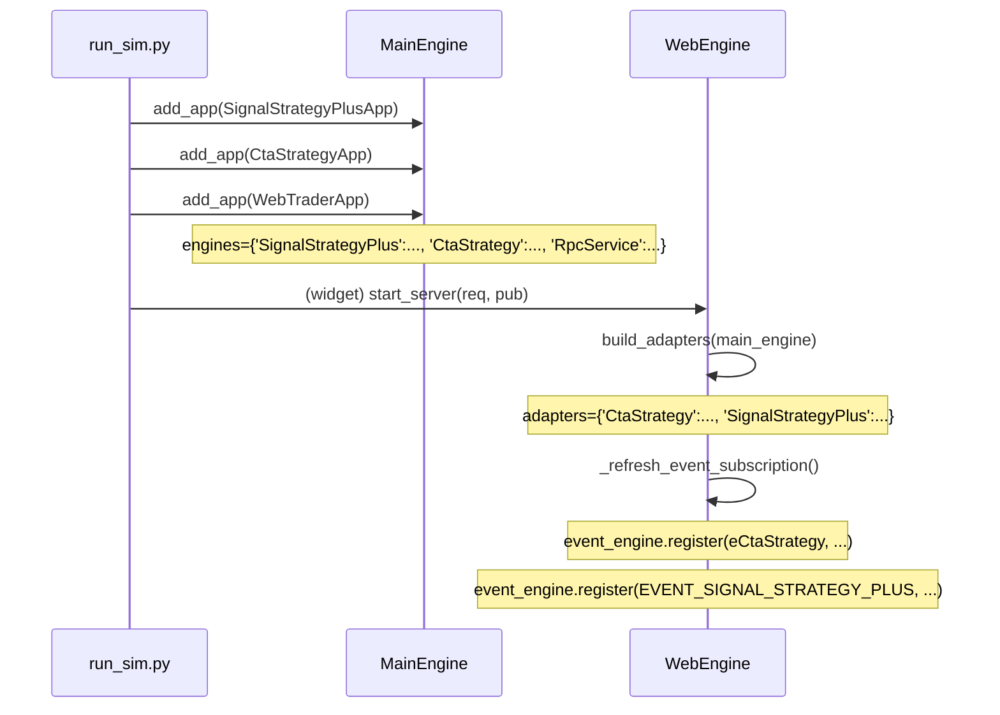

# 策略适配层 (Strategy Engine Adapter)

本章是对 [strategy_adapter.py](../strategy_adapter.py) 的深度说明,解释**为什么这样设计**以及**如何扩展**。

---

## 1. 问题背景

vnpy 生态里至少已有三种"策略引擎" App (本工程里均可见):

| 引擎 | APP_NAME | 方法签名痛点 |
|---|---|---|
| `CtaEngine` | `CtaStrategy` | `add_strategy(class_name, strategy_name, vt_symbol, setting)` 4 个位置参数; `init_strategy` 返回 `Future` |
| `SignalEnginePlus` | `SignalStrategyPlus` | `add_strategy(class_or_name)` 单参数; `init_strategy` 返回 `bool` |
| `SignalEngine` (旧) | `SignalStrategy` | 与 Plus 版本方法名相同但返回 `None` |

如果 REST 路由直接调用引擎,每种引擎都要写一套 handler。未来再加引擎,REST 层还要改。这是典型的**引擎特定逻辑污染 API 层**。

## 2. 解决方案: 适配器模式

在 REST 层和引擎层之间插一个抽象层 (Adapter),REST 层只面对统一接口,Adapter 内部消化差异。



---

## 3. 核心契约

### 3.1 数据类 (Contract Types)

```python
@dataclass
class StrategyInfo:
    """跨引擎统一的策略实例快照."""
    engine: str          # app_name, 比如 "SignalStrategyPlus"
    name: str            # 实例名
    class_name: str      # 策略类 Python 类名
    vt_symbol: Optional[str]
    author: Optional[str]
    inited: bool
    trading: bool
    parameters: Dict[str, Any]
    variables: Dict[str, Any]

@dataclass
class StrategyOpResult:
    """跨引擎统一的写操作结果."""
    ok: bool
    message: str
    data: Any = None     # 可放 {http_status: 501} 告诉 REST 层具体错误码

@dataclass
class AddStrategyRequest:
    """创建策略的'全集字段', 每个 Adapter 按需取用."""
    engine: str
    class_name: str
    strategy_name: str
    vt_symbol: Optional[str] = None
    setting: Dict[str, Any] = field(default_factory=dict)
```

**关键设计决策**:

- **全集字段**: `AddStrategyRequest` 同时带 `vt_symbol` 和 `setting`,即使某引擎不需要。Adapter 内自己决定取哪些。前端不需要知道不同引擎之间的签名差异,只看后端 `capabilities`。
- **写操作统一返回 OpResult**: REST 层用 `unwrap_result()` 把 `ok=false` 映射成 HTTPException,成功时返回 `data`。避免把 envelope 穿透到前端。

### 3.2 抽象基类

```python
class StrategyEngineAdapter:
    app_name: str = ""
    display_name: str = ""
    event_type: str = ""
    default_capabilities: Set[str] = frozenset({"add","init","start","stop","remove"})

    def __init__(self, engine: Any) -> None:
        self.engine = engine
        self.capabilities: Set[str] = set(self.default_capabilities)

    # 元信息
    def describe() -> dict                      # 给 /strategy/engines 用
    # 类与参数
    def list_classes() -> List[str]
    def get_class_params(class_name) -> Dict
    # 实例查询
    def list_strategies() -> List[StrategyInfo]
    def get_strategy(name) -> Optional[StrategyInfo]
    # 写操作 (子类按需 override)
    def add_strategy(req: AddStrategyRequest) -> StrategyOpResult
    def init_strategy(name) -> StrategyOpResult
    def start_strategy(name) -> StrategyOpResult
    def stop_strategy(name) -> StrategyOpResult
    def remove_strategy(name) -> StrategyOpResult
    def edit_strategy(name, setting) -> StrategyOpResult
    # 批量
    def init_all() / start_all() / stop_all() -> StrategyOpResult
```

基类已经给 `init/start/stop/remove/list` 提供了**通用实现** (假设引擎提供 `init_strategy(name)` / `start_strategy(name)` 这样的方法)。子类只有在签名或返回值不一样时才需要覆盖。

---

## 4. 三个内置 Adapter

### 4.1 `CtaStrategyAdapter`

```python
app_name = "CtaStrategy"
event_type = "eCtaStrategy"
default_capabilities = {"add","init","start","stop","remove","edit"}

def add_strategy(req):
    if not req.vt_symbol:
        return OpResult(False, "CtaStrategy 要求 vt_symbol")
    engine.add_strategy(req.class_name, req.strategy_name, req.vt_symbol, req.setting)
```

基类的 `init_strategy` 已经能处理 Future:`_normalize_init_result` 内 `isinstance(ret, Future)` → `ret.result(timeout=30)`。

### 4.2 `SignalStrategyPlusAdapter`

```python
app_name = "SignalStrategyPlus"
event_type = "EVENT_SIGNAL_STRATEGY_PLUS"
default_capabilities = {"add","init","start","stop","remove","edit"}

def add_strategy(req):
    engine.add_strategy(req.class_name)        # 引擎只接受 class_name
    # 引擎根据策略类里硬编码的 strategy_name 存到 strategies[name]
    # 回查并 update_setting
    created = engine.strategies.get(req.strategy_name)
    if req.setting:
        created.update_setting(req.setting)

def edit_strategy(name, setting):
    strategy = engine.strategies[name]
    strategy.update_setting(setting)
    engine.put_strategy_event(strategy)         # 触发 WS 推送
```

特殊点:

- `SignalEnginePlus` 的 `strategy_name` 由策略类自己声明 (类属性),用户传的 `strategy_name` 只用于校验一致性。
- `edit_strategy` 没有引擎方法,Adapter 直接操作策略实例的 `update_setting`。

### 4.3 `LegacySignalStrategyAdapter`

继承自 Plus,只改 `app_name`/`event_type`,是一个轻量的"兼容壳"。

---

## 5. 注册与发现

### 5.1 静态注册表

```python
ADAPTER_REGISTRY: Dict[str, Type[StrategyEngineAdapter]] = {
    "CtaStrategy": CtaStrategyAdapter,
    "SignalStrategyPlus": SignalStrategyPlusAdapter,
    "SignalStrategy": LegacySignalStrategyAdapter,
}
```

### 5.2 启动时发现

```python
def build_adapters(main_engine):
    adapters = {}
    for app_name, adapter_cls in ADAPTER_REGISTRY.items():
        engine = main_engine.engines.get(app_name)
        if engine is None:
            continue       # 引擎没加载就不挂 adapter
        adapters[app_name] = adapter_cls(engine)
    return adapters
```

`WebEngine.start_server()` 在启动 RPC 之前首次调用 `build_adapters`,保证此时 `MainEngine` 已完成所有 `add_app` 调用。



---

## 6. 新增一个自定义引擎的 Adapter

假设你写了一个新 App `MyStrategyApp` → `MyEngine` (APP_NAME `"MyStrategy"`),引擎有:

```python
class MyEngine(BaseEngine):
    strategies: Dict[str, MyStrategy]
    def get_all_strategy_class_names(self) -> list: ...
    def get_strategy_class_parameters(self, cls_name) -> dict: ...
    def add_strategy(self, class_name: str, name: str, config: dict) -> None: ...
    def init_strategy(self, name: str) -> None: ...        # 同步
    def start_strategy(self, name: str) -> None: ...
    def stop_strategy(self, name: str) -> None: ...
    def remove_strategy(self, name: str) -> None: ...
```

步骤:

### 6.1 写 Adapter 子类

**新建文件** `my_strategy_web_adapter.py` (可以放在 `vnpy_webtrader/` 外,任何能被 import 的路径):

```python
from vnpy_webtrader.strategy_adapter import (
    StrategyEngineAdapter, AddStrategyRequest, StrategyOpResult,
    register_adapter,
)

@register_adapter
class MyStrategyAdapter(StrategyEngineAdapter):
    app_name = "MyStrategy"
    display_name = "My 策略"
    event_type = "eMyStrategy"           # 引擎内自定义的事件 type
    default_capabilities = frozenset(
        {"add", "init", "start", "stop", "remove"}
    )

    def add_strategy(self, req: AddStrategyRequest) -> StrategyOpResult:
        # 引擎的 add_strategy 要 (class_name, name, config) 三个参数
        if not req.setting:
            return StrategyOpResult(False, "MyStrategy 要求传 setting")
        try:
            self.engine.add_strategy(req.class_name, req.strategy_name, req.setting)
        except Exception as exc:
            return StrategyOpResult(False, f"创建失败: {exc}")
        if req.strategy_name not in self.engine.strategies:
            return StrategyOpResult(False, "引擎未登记实例")
        return StrategyOpResult(True, "added")
```

### 6.2 确保被 import

两种方式二选一:

1. **直接在启动脚本 import**: 在 `run_sim.py` 里加 `import my_strategy_web_adapter` (装饰器 `@register_adapter` 会自动填入 `ADAPTER_REGISTRY`)。
2. **改 `strategy_adapter.py`** 直接加到 `ADAPTER_REGISTRY` 字典 (不推荐,侵入性强)。

### 6.3 验证

```bash
curl -H "Authorization: Bearer $TOKEN" http://127.0.0.1:8000/api/v1/strategy/engines
```

应能看到:

```json
[
  {"app_name":"MyStrategy","display_name":"My 策略","capabilities":["add","init","remove","start","stop"]}
]
```

### 6.4 写测试

```python
# tests/test_my_adapter.py
from my_strategy_web_adapter import MyStrategyAdapter
from vnpy_webtrader.strategy_adapter import AddStrategyRequest

class FakeMyEngine:
    strategies = {}
    def get_all_strategy_class_names(self): return ["FooStrategy"]
    def get_strategy_class_parameters(self, c): return {"x": 1}
    def add_strategy(self, c, n, conf): self.strategies[n] = type("S",(object,),{
        "strategy_name": n, "inited": False, "trading": False,
        "get_parameters": lambda self: {}, "get_variables": lambda self: {}
    })()
    ...

def test_add_requires_setting():
    adapter = MyStrategyAdapter(FakeMyEngine())
    r = adapter.add_strategy(AddStrategyRequest(
        engine="MyStrategy", class_name="FooStrategy", strategy_name="foo1"
    ))
    assert not r.ok
```

---

## 7. 能力集 (Capabilities) 扩展

Capabilities 是字符串集合,目前已用的:

| Capability | 含义 | 默认提供方 |
|---|---|---|
| `add` | 支持 POST instances | 全部 |
| `init` | 支持 init_strategy | 全部 |
| `start` | 支持 start | 全部 |
| `stop` | 支持 stop | 全部 |
| `remove` | 支持 DELETE | 全部 |
| `edit` | 支持 PATCH 参数 | Cta / SignalPlus |

你可以自定义新 capability,例如 `"backtest"`、`"reload_class"`、`"hot_reload"`:

```python
class MyStrategyAdapter(StrategyEngineAdapter):
    default_capabilities = frozenset({"add","init","start","stop","remove","backtest"})

    def backtest(self, name: str, period: str) -> StrategyOpResult:
        return StrategyOpResult(True, "backtest started")
```

但要 REST 层支持,还需要在 `routes_strategy.py` 里加对应路由,或者让 Adapter 的 `describe()` 返回前端就可以根据能力动态渲染按钮。

---

## 8. 常见陷阱

1. **不要在 Adapter 构造函数里启动线程/做 I/O**。`build_adapters` 是在 `WebEngine.start_server` 时同步调用的,任何阻塞会拖慢 RPC 启动。
2. **不要缓存策略实例引用**。引擎 `remove_strategy` 后 `strategies` 字典会弹出,Adapter 每次 `_get_strategy_obj(name)` 重新查询。
3. **异常一律包进 StrategyOpResult**,不要让异常穿透到 RPC 层——否则 RpcClient 会收到 `RpcError` 而不是我们的业务错误。
4. **`event_type` 要和引擎实际 `put` 的事件 type 字符串完全一致**,否则 WS 订阅不到。例如 `SignalEnginePlus` 事件 type 是 `"EVENT_SIGNAL_STRATEGY_PLUS"`(engine.py:44),Adapter 必须写这个字符串而不是小写。
5. **Future 的 30 秒超时**是基类内置的,如果你的引擎 init 就是会超过 30 秒,override `_normalize_init_result`。

---

## 9. 单元测试

完整测试见 [tests/test_strategy_adapter.py](../../tests/test_strategy_adapter.py),覆盖:

- Signal/Cta 各自的 add/init/start/stop/remove 周期
- Cta vt_symbol 必填校验
- Future 解包
- 已 trading 的策略不能 remove
- 策略不存在的错误路径
- StrategyInfo 快照字段归一
- `build_adapters` 按 app_name 匹配
- edit 路径

跑: `python -m pytest tests/test_strategy_adapter.py -v`。
